# Documento de análisis de requisitos del sistema

## Introducción

# Los Mapas del Reino

Los Mapas Del Reino es un juego de mesa de 2 a 4 jugadores, en el que se juegan con *n+1* dados siendo *n* el número de jugadores.

El objetivo de este juego es conseguir el máximo número de puntos a raíz de las combinaciones hechas en el panel de juego, estas combinaciones se reglan por una serie de criterios que se eligen al principio de la partida con una tirada de 4 dados. Al final del juego, se suman los puntos obtenidos por cada jugador según esos 4 criterios basándose en cómo dibujó los territorios en su mapa. 

En cada turno, el jugador activo lanza los dados y elige qué tipo de territorio dibujar, además de apartar un dado que indica cuántas casillas debe dibujar. Los jugadores pasivos eligen un dado de los restantes y todos dibujan la cantidad de casillas elegidas. Luego el turno pasa al siguiente jugador, que repite el proceso con los dados restantes (menos el que fue apartado).

Hay que destacar que cada jugador tiene un número limitado de usos para cada tipo de territorio según la cantidad de jugadores (3/2/1 usos para 2/3/4 jugadores) y que cuando se agotan no pueden elegir ese tipo en su turno activo. Además, el primer  dibujado por cada jugador en cada turno debe conectarse a uno ya dibujado y los territorios dibujados ese turno deben estar agrupados.

Una ronda termina cuando, tras el último turno, solo queda un dado sin usar. Para comenzar una nueva ronda, se reúnen nuevamente todos los dados (número de jugadores + 1) y el siguiente jugador en turno inicia lanzándolos.

Hay una serie de poderes en el tablero de la partida que tendrán todos los jugadores cuando pasen por ellos, estos son: +/- 1 y el ?, el primero de ellos te suma 1 o -1 a tu elección en la tirada que quiera, asi puede abarcar más o menos celdas a gusto del jugador, el poder de ? suma todas las combinaciones que hay en el tablero hasta el momento y las cuenta y anota en su casilla correspondiente. 

La partida termina cuando uno o más jugadores no puedan dibujar territorios en celdas, aunque utilice los poderes de +/- 1. Esto puede suceder cuando dicho jugador o jugadores tengan celdas disponibles, pero no tantas como el número del dado escogido, o el tablero completo. El turno se desarrolla sin que el jugador en cuestión pueda dibujar nada, y al final de éste, la partida finalizará. 

Una vez finalizada la partida, se calculan los puntos de cada jugador y se muestra el ganador, es decir el jugador que más puntos ha obtenido.

[Enlace al vídeo de explicación de las reglas del juego / partida jugada por el grupo](https://youtu.be/3vbqDzdNn9U)

## Historial de versiones

| Fecha      | Versión | Descripción                                                                |
| ---------- | ------- | -------------------------------------------------------------------------- 
| XX/XX/2024 | 0.1.0   | Primera versión del documento
| XX/XX/2024 | 0.2.0   | Primera versión del documento
| 07/10/2024 | 0.2.1   | Revisión de historia de usuario y mockups 
| 07/07/2025 | 2.0.0   | Corrección de historias de usuario
| 08/07/2025 | 2.1.0   | Revisión de historias de usuario y reglas de negocio

## Tipos de Usuarios / Roles

Jugador: Persona que participa en la partida.

Administrador: Persona que gestiona las partidas y jugadores pero no participa en ellas.

Vamos a englobar jugador y administrador en _usuario_. Por tanto, cuando nombremos a un _usuario_ nos referimos tanto a un administrador como a un jugador.

## Historias de Usuario

A continuación se definen todas las historias de usuario a implementar:

### H1-(ISSUE#42): Registro [https://github.com/gii-is-DP1/DP1-2024-2025--l6-02/issues/42]
Como usuario quiero que el sistema me permita registrarme en el juego para poder tener una cuenta.

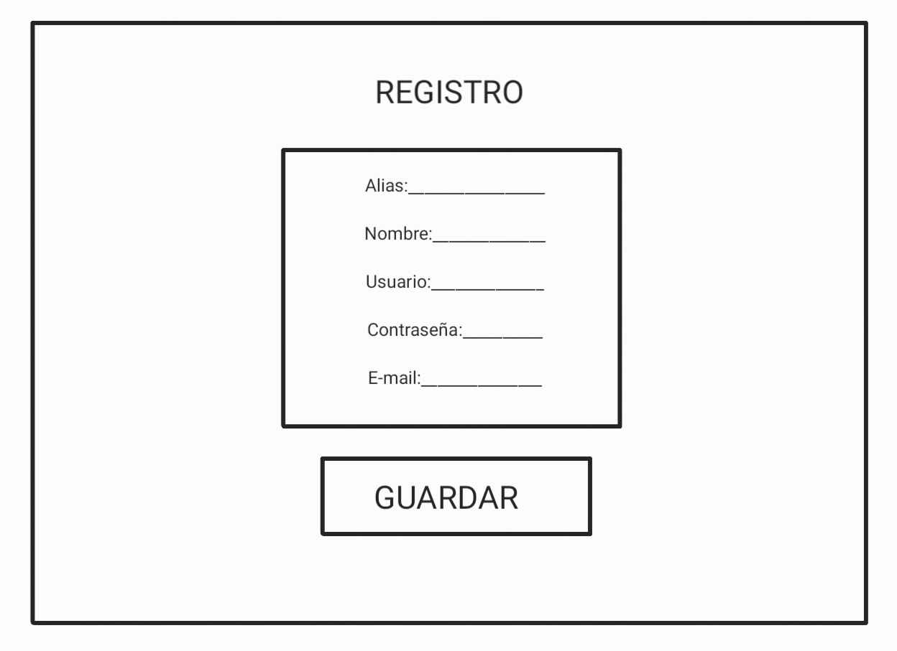

#### H1+E1: Registro válido 
Como usuario quiero que el sistema me permita registrar una cuenta al introducir un nombre de usuario, contraseña y correo válidos.

#### H1-E1: Registro no válido
Como usuario, quiero que el sistema no me permita registar una cuenta cuando al introducir un nombre de usuario, contraseña y correo no válidos y me especifique qué es incorrecto.

### H2-(ISSUE#45): Inicio Sesión [https://github.com/gii-is-DP1/DP1-2024-2025--l6-02/issues/45]
Como usuario, quiero que el sistema me permita poder iniciar sesión con las mismas credenciales con las que me he registrado.

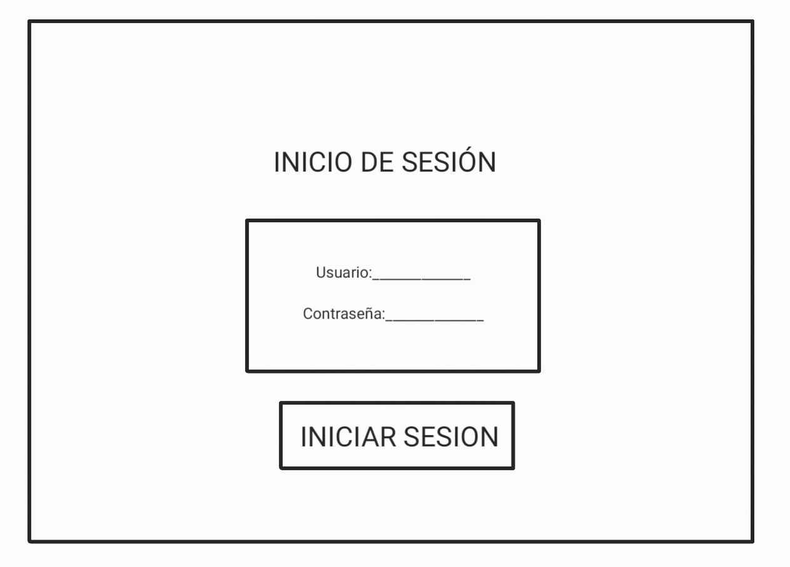

#### H2+E1: Inicio sesión válido 
Como usuario, quiero que cuando introduzca las credenciales correctas el sistema me permita entrar en el juego y me lleve a la pantalla principal.

#### H2-E1: Inicio sesión no válido
Como usuario, quiero que cuando no introduzca las credenciales correctas o me falten datos necesarios para iniciar sesión, el sistema no me permita entrar en el juego y me especifique qué es incorrecto o me indique que el campo es obligatorio.

### H3-(ISSUE#47): Visualizar perfil [https://github.com/gii-is-DP1/DP1-2024-2025--l6-02/issues/47]
Como usuario, quiero que el sistema me permita visualizar mi perfil.

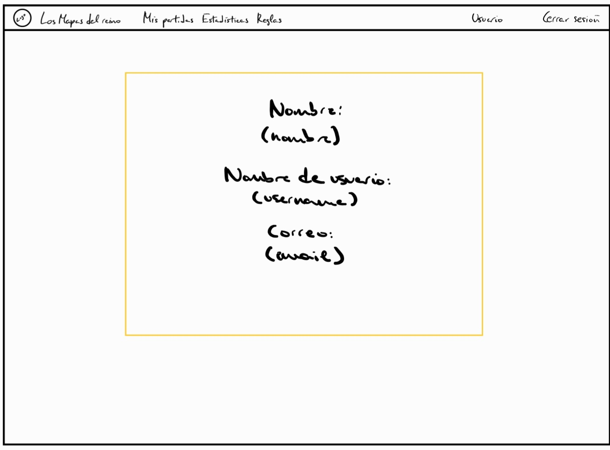

### H3+E1:
Como usuario, quiero que cuando pinche en el boton de mi perfil, me lleve a una pantalla donde aparezcan mis datos.

### H4-(ISSUE#48): Editar perfil [https://github.com/gii-is-DP1/DP1-2024-2025--l6-02/issues/48]
Como usuario, quiero que el sistema me permita editar mis credenciales.

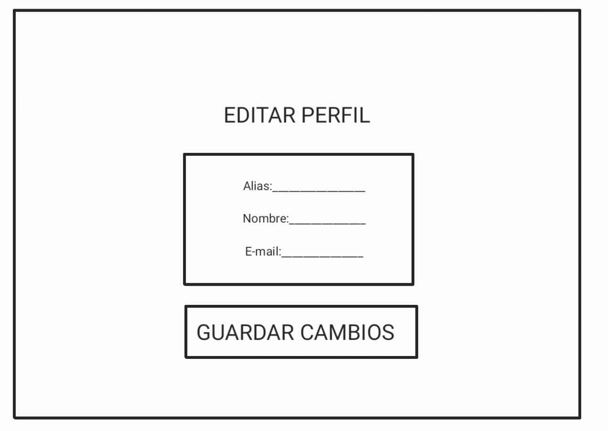

#### H4+E1: Editar perfil con valores válidos
Como usuario quiero que cuando cambie mis credenciales con valores válidos, estas se actualicen de forma correcta.

#### H4-E1: Editar perfil con valores no válidos
Como usuario quiero que cuando cambie mis credenciales con que no sean valores válidos, el juego me avise que hay datos que no pueden tener esos valores y no se actualice ningun campo hasta que todos sean válidos.

### H5: Cerrar sesión
Como usuario, quiero que el sistema me permita poder cerrar mi sesión, si he iniciado sesión previamente para que nadie mas pueda acceder a mi cuenta.

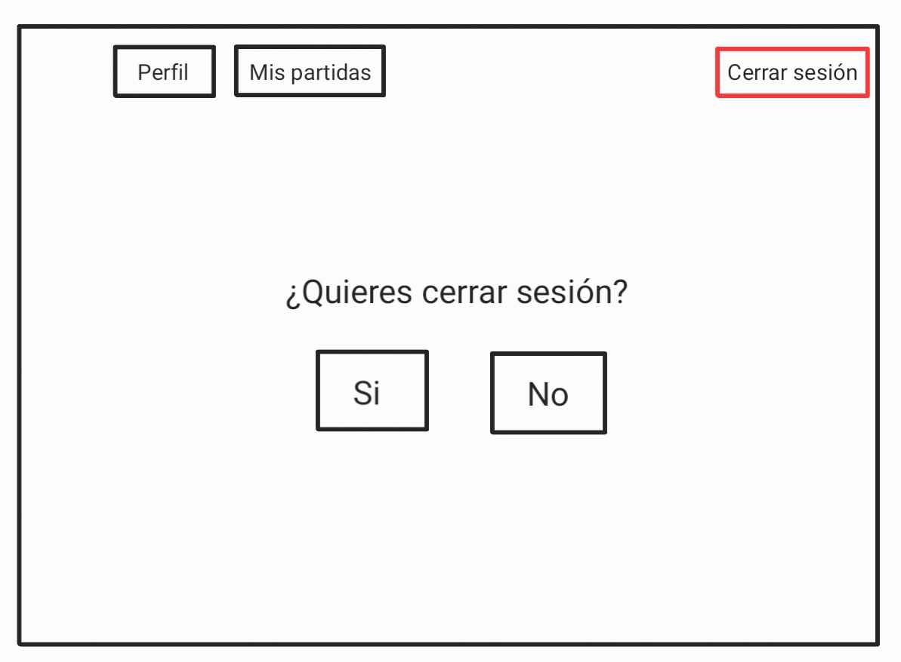

#### H5+E1: Cerrar sesión correctamente
Como usuario, quiero que si pulso sobre el botón de cerrar sesión se cierre correctamente mi sesión para que deje de aparecer en el juego y se me redirija a la pantalla de inicio.

### H6-(ISSUE#54): Consultar usuarios [https://github.com/gii-is-DP1/DP1-2024-2025--l6-02/issues/54]
Como administrador, quiero que el sistema me permita consultar y gestionar la información de los usuarios para llevar un control de todos los usuarios registrados.

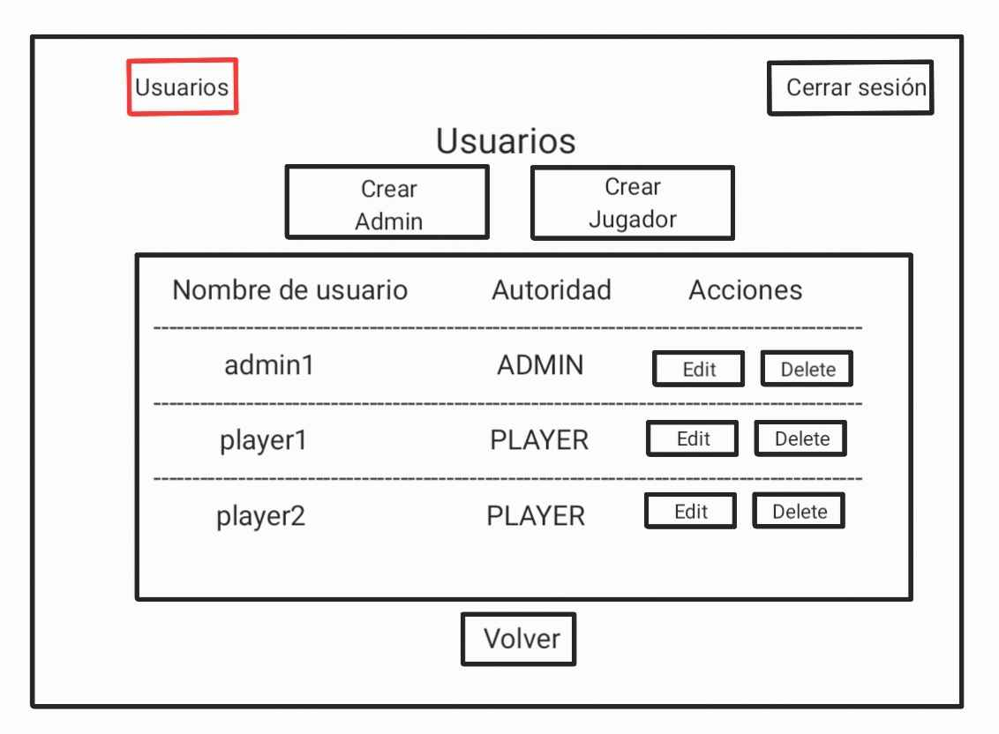

#### H6+E1: Consultar usuarios
Como administrador, quiero que cuando pulse en el boton de jugadores registrados se me redirija a una pantalla con un listado de todos los usuarios que se han registrado.

### H7: Crear usuario [https://github.com/gii-is-DP1/DP1-2024-2025--l6-02/issues/49]
Como administrador, quiero que el sistema me permita poder crear usuarios para realizar pruebas o posibles necesidades futuras.

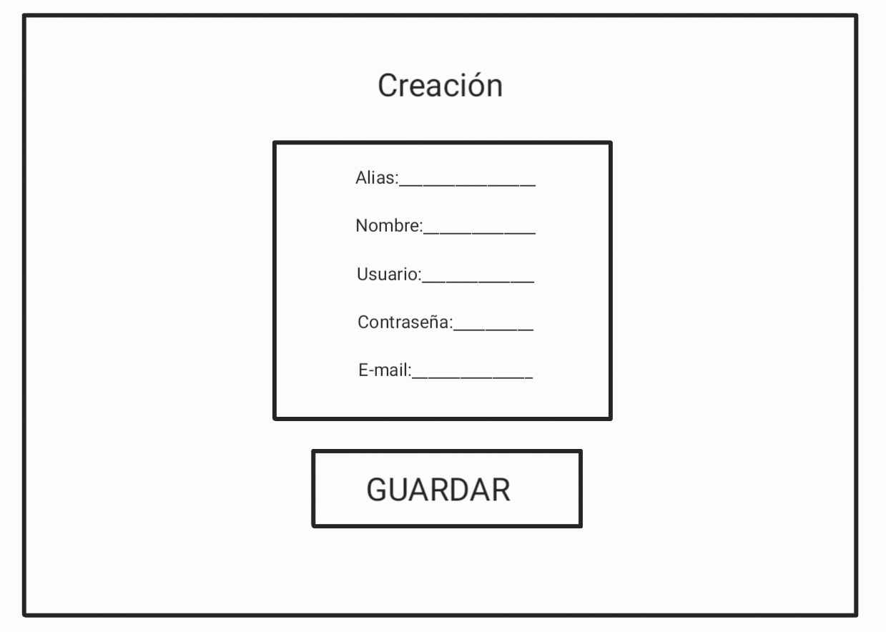

#### H7+E1: Crear usuario correctamenrte
Como administrador, quiero que al crear un jugador o admin con parámetros válidos, deberá crearse de manera correcta.

#### H7-E1: Crear usuario incorrectamente
Como administrador, quiero que al crear un jugador o admin con parámetros no válidos, debera aparecer un error que indique que parámetros son los que impiden la creación del jugador.

### H8-(ISSUE#52): Actualizar usuario [https://github.com/gii-is-DP1/DP1-2024-2025--l6-02/issues/52]
Como administrador, quiero poder actualizar usuarios para mantener la información de la cuenta actualizada y reflejar cambios relevantes en los datos personales de los usuarios.

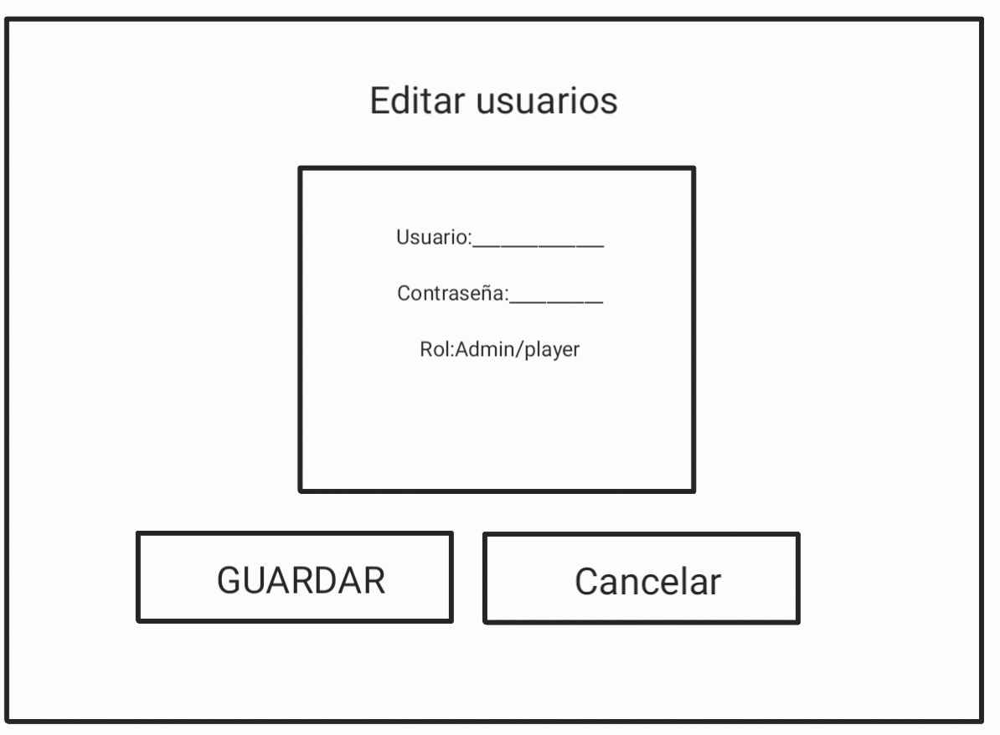

#### H8+E1: Actualizar usuario correctamente
Como administrador, quiero que al actualizar el usuario con nuevos dátos válidos se actualiza correctamente el usuario en la base de datos.

#### H8-E1: Actualizar usuario incorrectamente
Como administrador, quiero que al actualizar el usuario con nuevos dátos inválidos no se actualiza correctamente el usuario.

### H9-(ISSUE#53): Eliminar usuario [https://github.com/gii-is-DP1/DP1-2024-2025--l6-02/issues/53]
Como administrador, quiero que el sistema me permita eliminar usuarios para que pueda mantener la integridad y seguridad de la plataforma.

#### H9+E1: Eliminar usuario correctamente
Como administrador, quiero que al pulsar sobre el botón de eliminar usuario este se elimina correctamente de la base de datos de forma permanente.

#### H9+E2: Eliminar usuario incorrectamente
Como administrador, quiero que al pulsar sobre el botón de eliminar usuario sobre el propio usuario, este no se elimine e indique la razón por la que no se puede eliminar.

### H10-(ISSUE#55): Crear partida [https://github.com/gii-is-DP1/DP1-2024-2025--l6-02/issues/55]
Como jugador, quiero que el sistema me permita crear una partida para poder jugar.

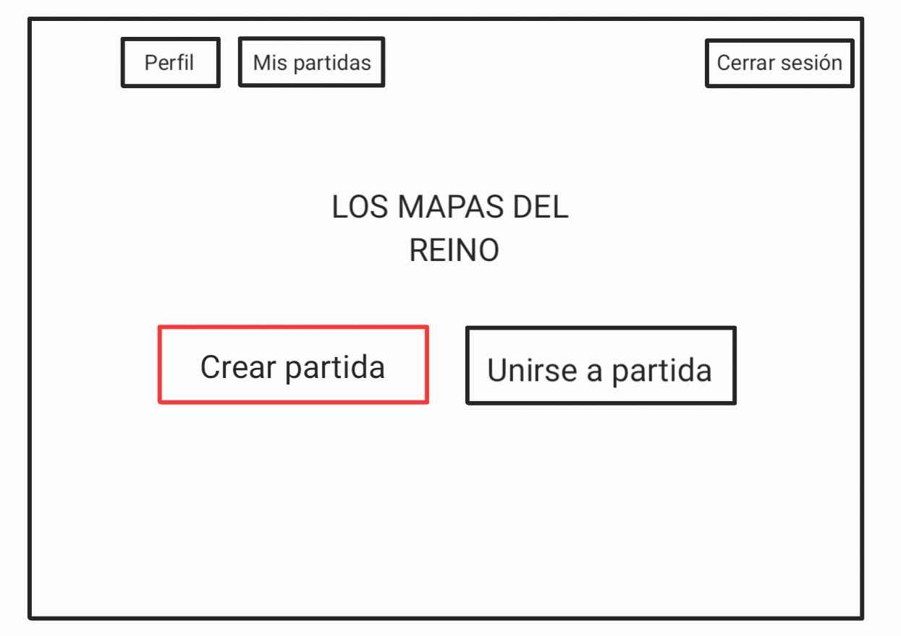

#### H10+E1: Crear partida correctamente
Como jugador, al pulsar sobre el botón de crear partida, aparecerá un lobby en el que yo, como jugador, seré el creador de ella, y el que tendrá la posibilidad de empezar, eliminar o abandonar la partida.

### H11-(ISSUE#): Visualizar mis partidas 
Como jugador, quiero poder visualizar las partidas que he jugado anteriormente para poder llevar el recuento de cuantas partidas he jugado y con quien las he jugado.

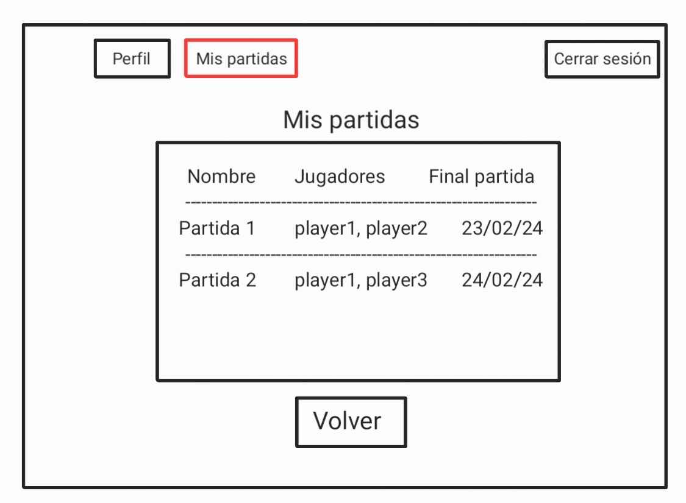

#### H11+E1: Visualizar partidas correctamente
Como jugador, al pulsar sobre el botón de mis partidas se me redirige a una pantalla en la que se me muestran todas las partidas que he jugado con los jugadores, la fecha de inicio y finalización, el creador y el ganador o ganadores.

### H12-(ISSUE#51): Mostrar partidas en espera [https://github.com/gii-is-DP1/DP1-2024-2025--l6-02/issues/51]
Como jugador quiero ver un listado con las partidas disponibles a las que me puedo unir.

### H13-(ISSUE#51): Acceder a la partida [https://github.com/gii-is-DP1/DP1-2024-2025--l6-02/issues/51]
Como jugador, quiero que el sistema me permita unirme a una partida.

#### H13+E1: Acceder a la partida correctamente
Como jugador, quiero que al pinchar en el botón de Unirse a Partida aparezca en el lobby al que me he unido con los jugadores que estaban en el listado y con la opción de abandonar la partida antes de que se inicie.

### H14-(ISSUE#56): Visualizar partidas creadas [https://github.com/gii-is-DP1/DP1-2024-2025--l6-02/issues/56]
Como administrador quiero que el sistema me permita visualizar todas las partidas creadas por los jugadores.

### H14+E1: Visualizar partidas en curso correctamente
Como administrador, al pulsar sobre el botón de "Partidas en curso" se me redirige a una pantalla en la que se muestran todas las partidas que se han creado con los jugadores, el creador de la partida y el estado de la partida.

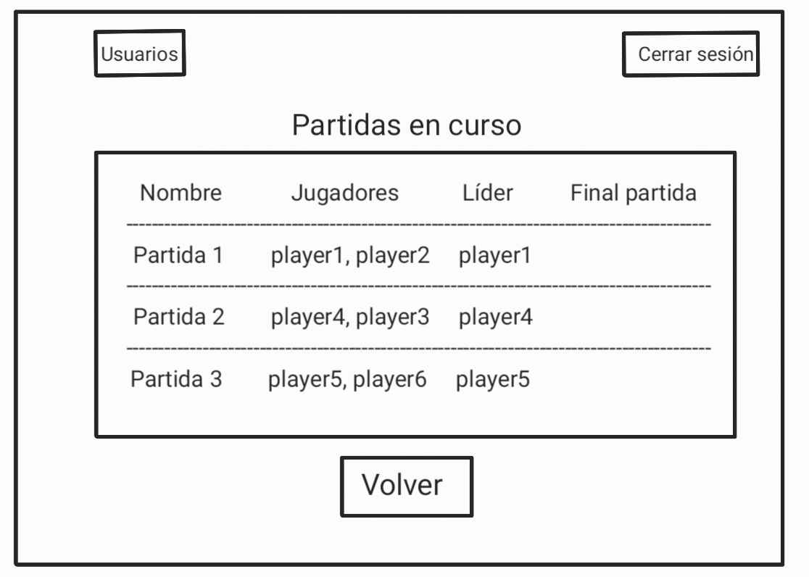

### H14+E2: Visualizar partidas terminadas correctamente
Como administrador, al pulsar sobre el botón de "Partidas terminadas" se me redirige a una pantalla en la que se muestran todas las partidas terminadas con los jugadores, las fechas de creación y finalización, el creador y el ganador o ganadores.

### H15-(ISSUE#58): Colocar casillas [https://github.com/gii-is-DP1/DP1-2024-2025--l6-02/issues/58]
Como jugador, quiero poder colocar casillas para completar el mapa y con estas conseguir el mayor número de puntos posibles.

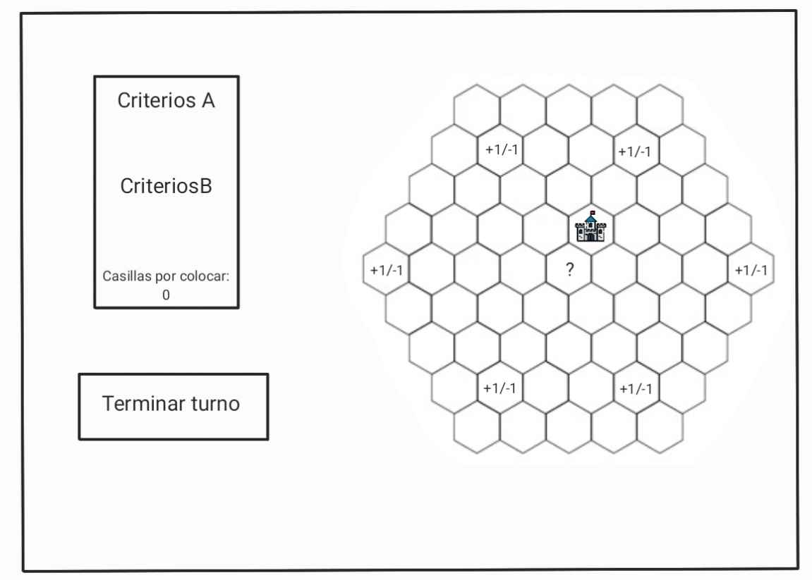

#### H15+E1: Colocar primera casilla de la primera ronda
Como jugador, al colocar la primera casilla de la primera ronda, se me permite colocarla correctamente en cualquier casilla del mapa, actualizando el mismo en la base de datos.

#### H15+E2: Colocar primera casilla del resto de rondas
Como jugador, al colocar el primer territorio del resto de rondas, esta tiene que estar adyacente a alguna de las casillas colocadas previamente, se me permite colocarlo correctamente y se actualiza el mapa en la base de datos.

#### H15+E3: Colocar resto de casillas de cada ronda
Como jugador al colocar el resto de casillas de cada ronda adyacente únicamente a la última casilla previamente colocada en la misma ronda, se me permite colocarla correctamente y se actualiza el mapa en la base de datos.

#### H15+E4: Colocación de casillas incorrecta durante la partida
Como jugador, al colocar una casilla que no es la primera de la primera ronda sin que sea adyacente a la última casilla colocada, se me mostrará un mensaje de error y no se me permitirá colocarla.

#### H15+E5: Colocación de casilla sobre una casilla ya colocada
Como jugador, al colocar una casilla sobre una casilla ya colocada, se me mostrará un mensaje de error y no se me permitirá colocarla.

#### H15+E6: Colocación de cantidad de casillas inviable
Como jugador, en el momento en el que el mapa está lo suficientemente lleno para que sea imposible colocar el número de casillas indicado con anterioridad, no se me permite colocar ni una casilla y se inicia el proceso de final de partida.

### H16-(ISSUE#84): Tirar dados [https://github.com/gii-is-DP1/DP1-2024-2025--l6-02/issues/84]
Como jugador, quiero poder tirar los dados para tomar decisiones durante la partida.

#### H16.1: Determinación de criterios de la partida
Como jugador, quiero poder tirar los dados para determinar cuales van a ser los criterios de la partida.

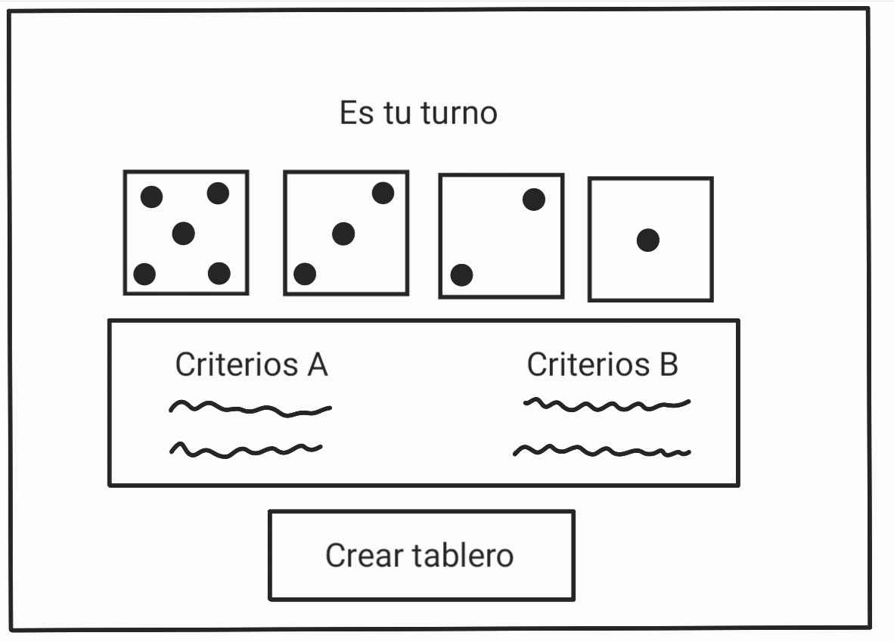

#### H16.1+E1: Determinación correcta de los criterios
Como jugador, quiero que al tirar 4 dados se determinen los 4 criterios de la partida, dos del sector A y dos del sector B, y, si no se repiten los mismos criterios de un tipo, se actualizan en la base de datos correctamente.

#### H16.1+E2: Determinación incorrecta de los criterios
Como jugador, quiero que al tirar 4 dados y se repitan los criterios de un mismo sector me salte un mensaje indicandome que no es posible, que vuelva a tirar el segundo dado para que el criterio sea diferente.

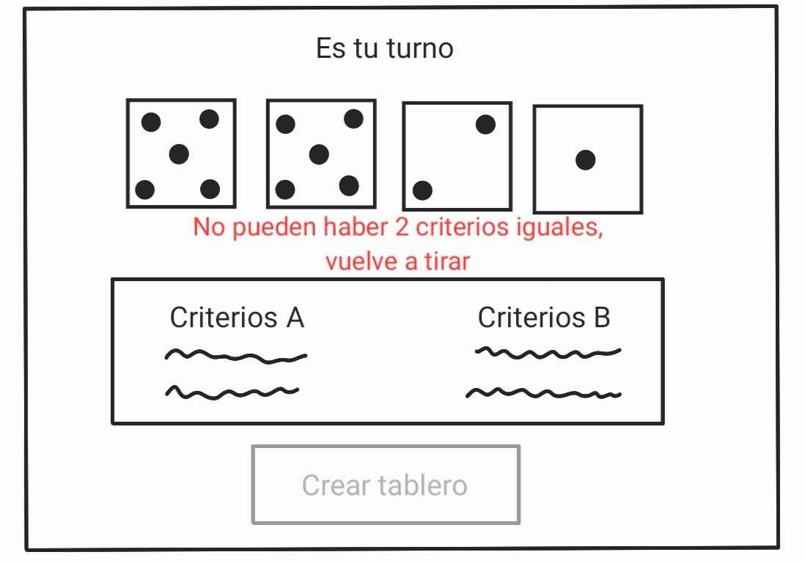

#### H16.2: Determinar número de casillas
Como jugador, quiero poder tirar los dados para determinar el número de casillas que voy a jugar en mi turno.

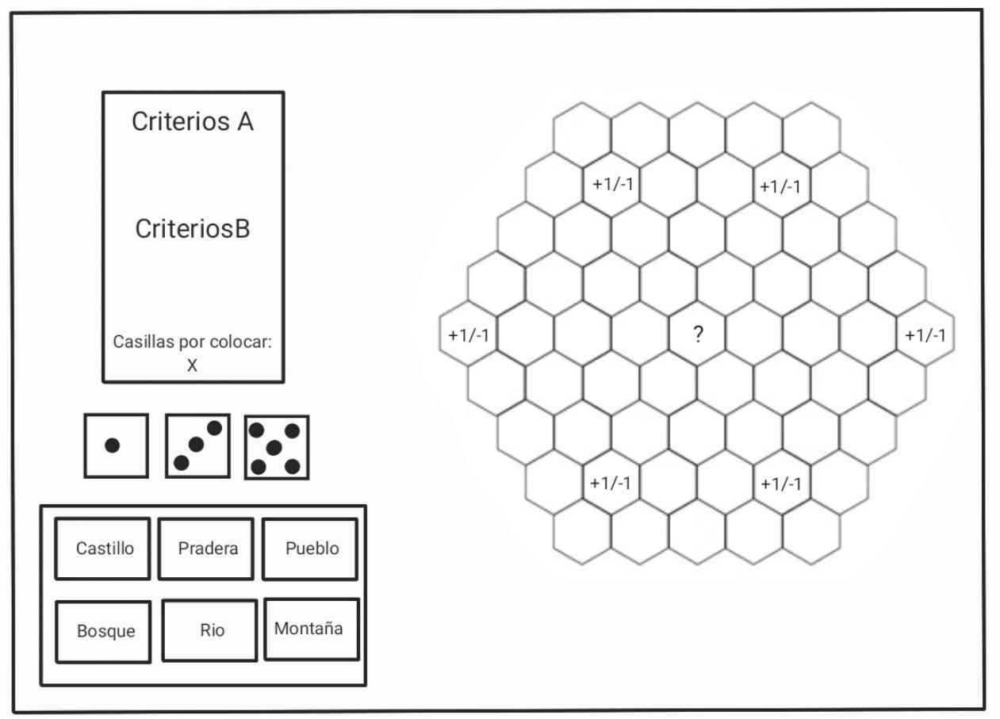

#### H16.2+E1: Determinacion correcta del número de casillas
Como jugador activo, una vez iniciada la partida, al tirar tantos dados como jugadores haya en la partida más uno, determino con el valor de los dados las opciones de cuantas casillas puedo colocar en mi turno.

### H17-(ISSUE#85): Elegir dados [https://github.com/gii-is-DP1/DP1-2024-2025--l6-02/issues/85]
Como jugador, una vez se han tirado los dados, quiero poder elegir el dado que más me convenga para poder dibujar casillas en el mapa.

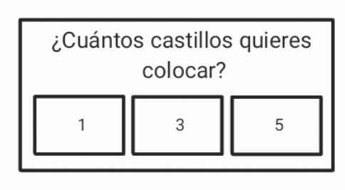

#### H17+E1: Elección de dados correcta (jugador activo)
Como jugador, quiero que si en ese turno soy el jugador activo, puedo elegir cualquiera de los dados de la mesa, y ese es el número de casillas que se me permite colocar.

#### H17+E2: Elección de dados correcta (jugador pasivo)
Como jugador, quiero que si en ese turno soy el jugador pasivo, puedo elegir entre cualquiera de los dados restantes, y ese será el número de casillas que se me permite colocar.

#### H17+E3: Descarte de dado (jugador activo)
Como jugador, quiero que si soy el jugador activo y ya he elegido un dado, dicho dado no aparezca como opción a elegir para los jugadores pasivos.

#### H17+E4: Descarte de dado (jugador pasivo)
Como jugador, quiero que si soy jugador pasivo y otro jugador ya ha elegido el dado que he elegido, no haya problema, y ese será el número de casillas que pueda colocar en ese turno.

### H18-(ISSUE#87): Elegir el tipo de territorio [https://github.com/gii-is-DP1/DP1-2024-2025--l6-02/issues/87]
Como jugador, quiero poder elegir, una vez tirados los dados, el tipo de territorio que quiero colocar en el mapa.

#### H18+E1: Elección de territorio correcta
Como jugador activo, quiero que al seleccionar el tipo de territorio que quiero colocar en el mapa en esa ronda, todas las casillas que coloque en esa ronda sean de ese tipo concreto.

#### H18+E2: Elección de territorio incorrecta
Como jugador pasivo, quiero ser notificado del territorio que ha elegido el jugador activo y solo podré dibujar ese tipo de territorios en mi turno.

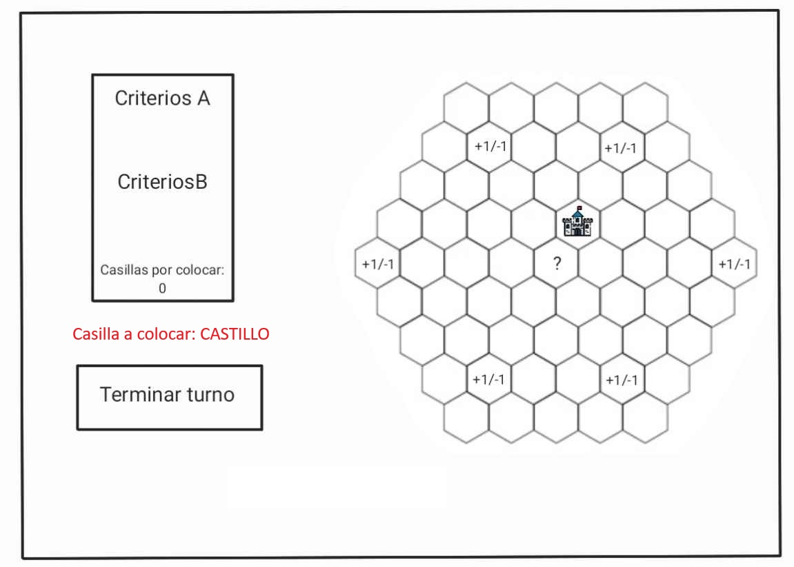

#### H18+E3: Límite alcanzado de tipo de territorio
Como jugador, quiero que si he alcanzado la cantidad posible de territorios que puedo elegir colocar al ser jugador activo, no se me de la opción de volver a elegirla en las rondas que falten de la partida y reciba un mensaje explicatorio. Cada jugador, si es el jugador activo, solo podrá elegir un número determinado de veces un tipo de territorio según el número de jugadores de la partida (3/2/1 veces para 2/3/4 jugadores).

### H19-(ISSUE#103): Casillas especiales [https://github.com/gii-is-DP1/DP1-2024-2025--l6-02/issues/103]
Como jugador, quiero poder hacer uso de casillas especiales para disfrutar de ventajas que puedan ayudar a ganar la partida.

#### H19+E1: Casilla de interrogación
Como jugador, quiero que al dibujar en la casilla de interrogación, se calcule al momento mi puntuación actual en base a los criterios de la partida y dicha puntuación se sume a mi puntuación final.

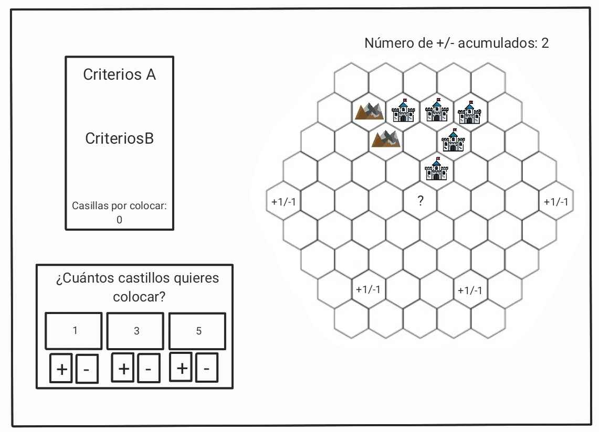

#### H19+E2: Casilla de +1/-1
Como jugador, quiero que al colocar un territorio en la casilla de +1/-1, se me permita añadir o quitar 1 al dado que elija en ese turno.

#### H19+E3: Momento de uso del poder +1/-1
Como jugador, quiero que si intento dibujar la casilla +1/-1 en la última casilla que puedo dibujar en este turno, no me deje dibujarla. Es decir, si he elegido el dado con valor 3, he dibujado 2 casillas e intento dibujar la tercera una casilla +1/-1 no me deje.

### H20-(ISSUE#61): Mostrar Reglas [https://github.com/gii-is-DP1/DP1-2024-2025--l6-02/issues/61]
Como usuario, quiero poder visualizar un enlace en el menú de navegación para poder acceder a las reglas del juego y que me sirva de guía para saber qué puedo hacer en el juego.

### H21-(ISSUE#99): Salir de partida [https://github.com/gii-is-DP1/DP1-2024-2025--l6-02/issues/99]
Como jugador, quiero poder salir de una partida que aún no haya comenzado para poder unirme a otra o simplemente no jugar.

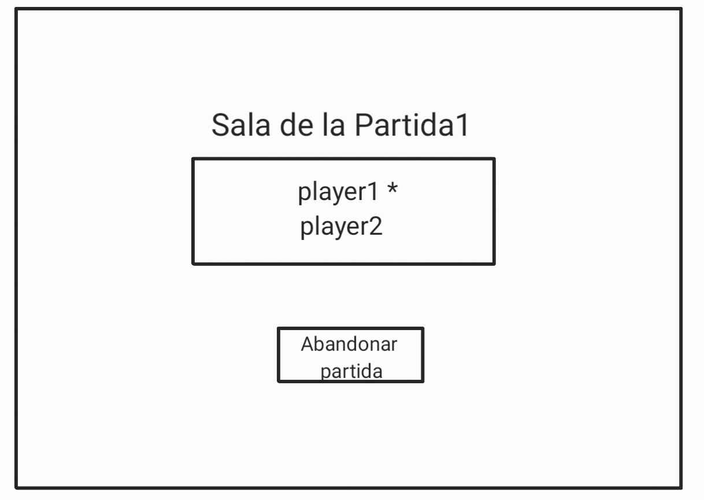

#### H21+E1: Salir de partida no iniciada
Como jugador quiero que si pulso sobre el botón de abandonar partida se me permita abandonar la partida y se me redirija a la pantalla de inicio, quedando eliminado de la lista de jugadores de la partida.

### H22: Eliminar partida
Como jugador, quiero poder eliminar una partida que no se vaya a jugar para no tener partidas innecesarias en la lista.

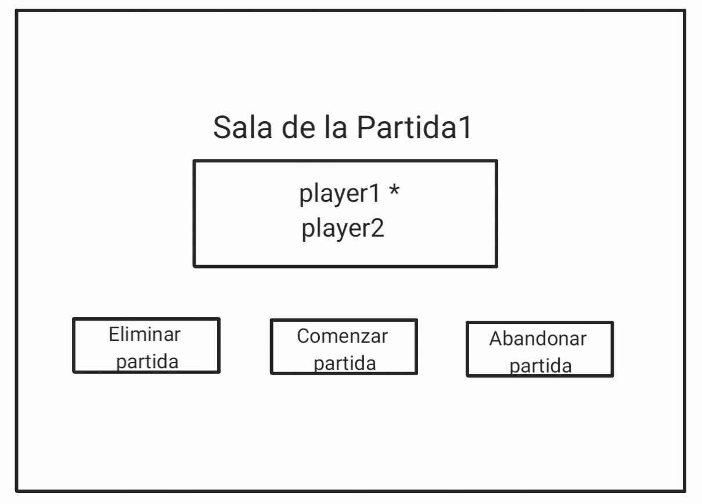

#### H22+E1: Eliminar partida correctamente
Como jugador, al pulsar sobre el botón de eliminar partida se elimina correctamente la partida de la base de datos y se redirige a todos los jugadores la pantalla de inicio.

### H23-(ISSUE#82): Crear tablero [https://github.com/gii-is-DP1/DP1-2024-2025--l6-02/issues/82]
Como jugador, quiero poder crear y ver un tablero único para poder jugar una partida.

#### H23+E1: Crear tablero correctamente
Como jugador, quiero que al tirar los dados que determinan los criterios, puedo crear correctamente mi tablero personal y dar la orden al resto de jugadores para que creen el suyo.

### H24-(ISSUE#93): Pasar turno [https://github.com/gii-is-DP1/DP1-2024-2025--l6-02/issues/93]
Como jugador, quiero poder pasar mi turno una vez que haya colocado todas las casillas que me corresponden en esa ronda.

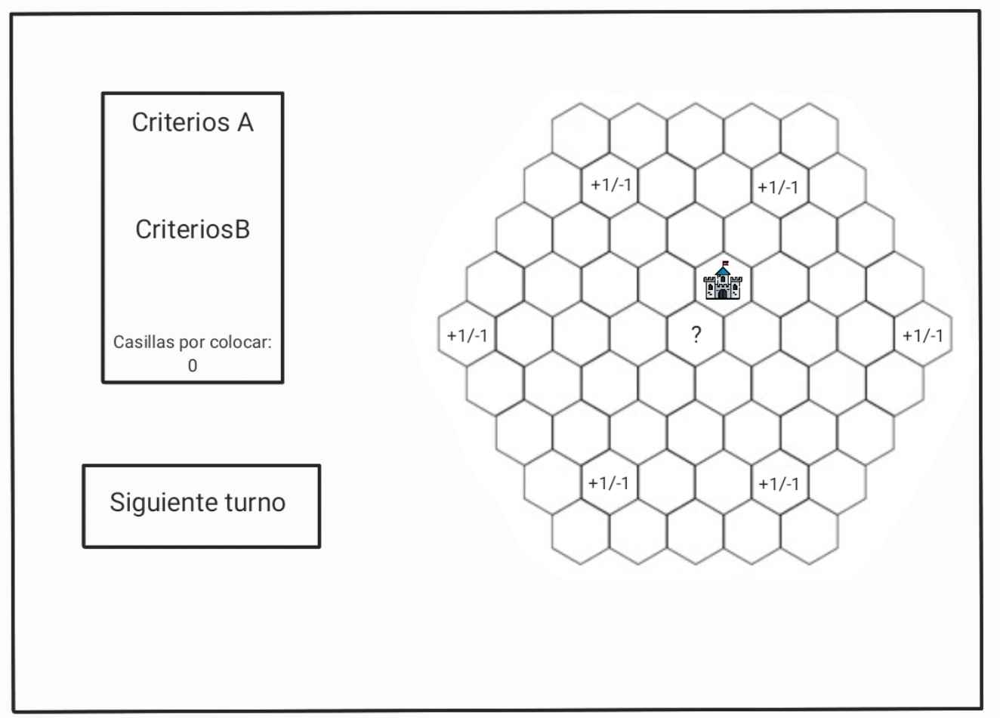

#### H24+E1: Turno finalizado correctamente
Como jugador, quiero que al colocar todas las casillas que me corresponden en un turno se me impida colocar más casillas y se me da la opción de pasar mi turno.

### H25-(ISSUE#115): Avanzar de ronda [https://github.com/gii-is-DP1/DP1-2024-2025--l6-02/issues/115]
Como jugador, quiero poder avanzar de ronda una vez que todos los jugadores hayan terminado su turno y solo quede un dado.

#### H25+E1: Ronda avanzada correctamente
Como jugador, quiero que al colocar todas las casillas que me corresponden en mi turno se me impida colocar más casillas y se me de la opción de terminar mi turno. Si soy el último jugador de la ronda, se pasa a la siguiente y el jugador activo lanzará los dados restantes (número de dados de la ronda anterior menos el que ha apartado el jugador activo). En el caso de que sea el último jugador de la ronda y solo queda 1 dado, se pasa a la siguiente ronda lanzando el jugador activo tantos dados como número de jugadores haya en la partida +1.

### H26-(ISSUE#107): Finalizar partida [https://github.com/gii-is-DP1/DP1-2024-2025--l6-02/issues/107]
Como jugador, quiero poder finalizar la partida una vez que se hayan cumplido las condiciones de finalización de la partida.

#### H26+E1: Finalización de partida
Como jugador, si hay uno o varios jugadores que no han podido colocar los territorios seleccionados y los demás jugadores que si podían ya han terminado su turno, se me permite finalizar la partida cuando el siguiente jugador activo lanza los dados.

### H27-(ISSUE#): Advertencias durante el juego
Como jugador, quiero poder recibir mensajes por parte del juego para saber si estoy haciendo algo incorrecto.

### H28-(ISSUE#): Cálculo de puntuaciones [https://github.com/gii-is-DP1/DP1-2024-2025--l6-02/issues/91]
Como jugador, quiero que se calculen automáticamente mi puntuación al final de la partida y se me muestre en base a los criterios establecidos previamente.

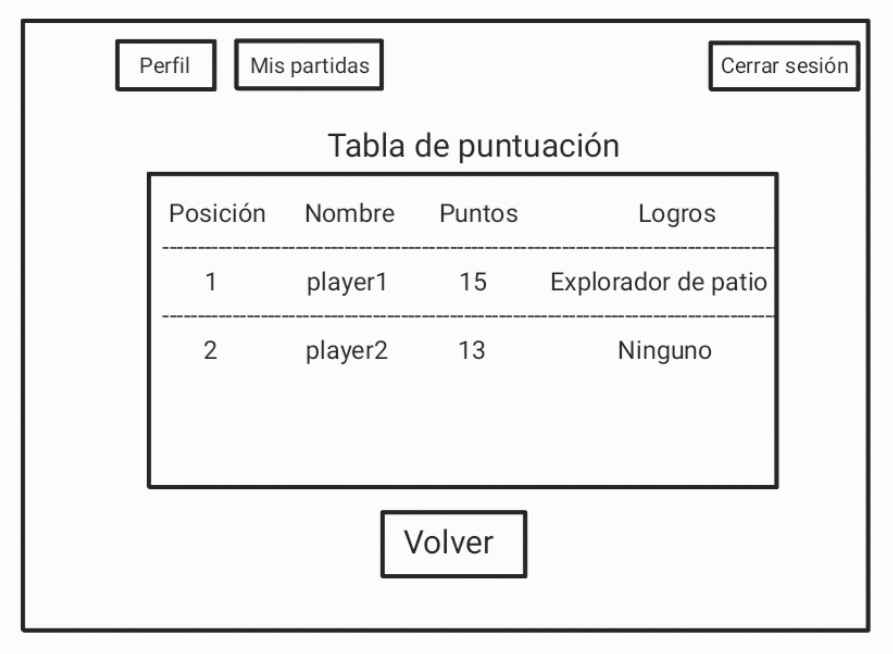

#### H29: Visualizar ganadores
Como jugador, una vez terminada la partida, quiero que me aparezca el ganador o ganadores de la partida en un recuadro final.

#### H30: Modalidades de partida
Como jugador, quiero poder elegir una modalidad de juego al crear una partida lo que determina el tiempo disponible en cada turno. Deseo disponer de los modos lento, estándar y rápido y poder elegir el que prefiero al crear la partida. Cada modo de juego debe influir en el tiempo disponible por turno de cada jugador.

#### H31: Módulo de estadísticas
Como jugador, quiero poder ver las estadísticas de las partidas jugadas por los distintos jugadores.

#### H31+E1: Estadísticas individuales
Como jugador, quiero poder ver el número de partidas que he jugado, las que he ganado así como la media, el máximo, el mínimo y el total de la duración de las partidas. Además, deseo poder visualizar la media, el mínimo y el máximo de jugadores que han participado en las partidas que he jugado.

#### H31+E2: Estadísticas globales
Como jugador, quiero poder ver el número de partidas globales que se han jugado así como la media, el máximo, el mínimo y el total de la duración de las partidas. los jugadores ordenados por número de victoria. Además, deseo poder visualizar la media, el mínimo y el máximo de jugadores que han participado en partidas y por otro lado los jugadores ordenados en un ranking por número de partidas ganadas.

#### H31+E3: Logros personales
Como jugador, quiero poder ver si he cumplido con algún logro personal establecido, como alcanzar un número de partidas ganadas.

#### H32: Reconexión a partida
Como jugador, quiero quesi en mitad de una partida vuelvo al menú de inicio, a mis partidas jugadas, a las estadísticas o a mi perfil, me aparezca en el menu principal un botón para reconectarme a la partida. Cuando pulso en él, se me devuelve al mismo estado en el que se encontraba la partida, manteniéndose el tablero y los dados.

|Mockups (prototipos de baja fidelidad en formato imagen) de la interfaz de usuario del sistema, elaborados en las fases iniciales del proyecto. Estos mockups tienen un carácter orientativo y pueden diferir del diseño final del producto.|
|Decripción de las interacciones concretas a realizar con la interfaz de usuario del sistema para lleva a cabo la historia. |

## Diagrama conceptual del sistema

Se deja un diagrama UML de clases que deja ilustrado de forma más clara las relaciones y atributos de cada clase.
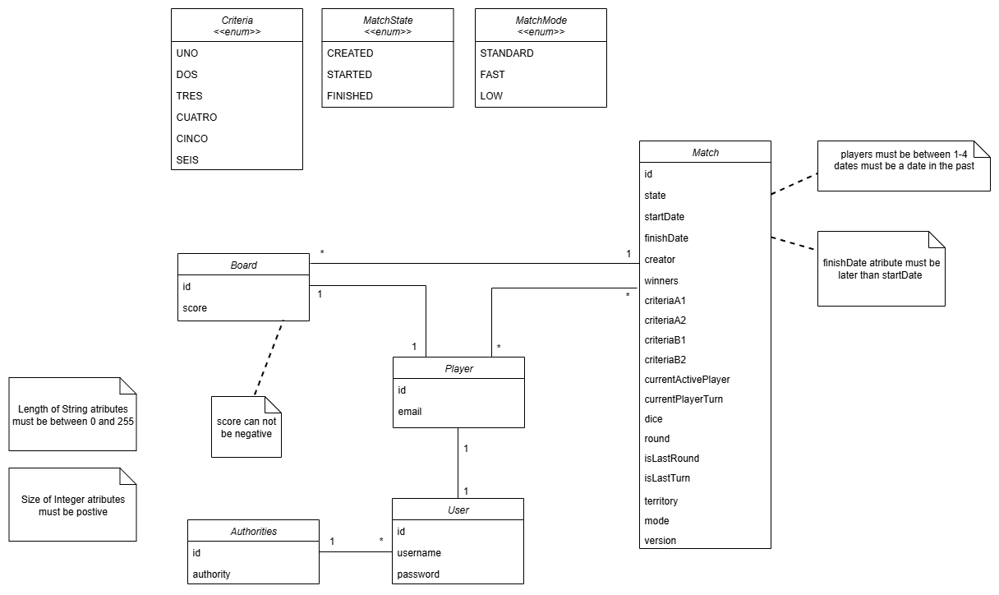

## Reglas de Negocio

### R1 – Inicio de Sesión
Para comenzar a jugar una partida el jugador o jugadores deben iniciar sesión en el sistema.

### R2 - Número de jugadores
El número de jugadores debe ser entre 2 a 4.

### R3 - Número de dados
El número de dados utilizados será el número de jugadores + 1.

### R4 - Usos para cada tipo de territorio
De acuerdo al número de jugadores, cada uno dispone de una cantidad limitada de usos para cada tipo de territorio (3/2/1 para 2/3/4 jugadores).

### R5 - Elección de criterios al inicio
Para poder empezar la partida, es necesario que se elijan los criterios que los jugadores deberán seguir para obtener la mayor cantidad de puntos posible. Esta acción se realizará de manera aleatoria mediante un lanzamiento de dados. No es posible empezar a jugar hasta que los cuatro criterios hayan sido determinados.

### R6 - Criterios repetidos
Si en la elección de criterios de una sección, sale un resultado de dado repetido, se tirará el dado otra vez para elegir un criterio diferente.

### R7 - Posibilidad de lanzar los dados para la elección de criterios
Solo el creador tiene la posibilidad de lanzar los dados para la selección de criterios. Esto es, los demás jugadores no tendrán la opción de llevar a cabo la acción de lanzamiento de dados para obtener los criterios.

### R8 – Criterio 1 Sección A
El criterio 1 de la sección A otorgará 2 PV por cada castillo rodeada por seis territorios cualesquiera.

### R9 – Criterio 2 Sección A
El criterio 2 de la sección A otorgará 3 PV por cada pradera que conecte con una montaña y un río y 1 PV extra si también conecta con un bosque.

### R10 – Criterio 3 Sección A
El criterio 3 de la sección A otorgará 2 PV por cada bosque que haya en el grupo más pequeño de bosques, siempre que haya al menos dos grupos.

### R11 – Criterio 4 Sección A
El criterio 4 de la sección A otorgará 2 PV por cada línea donde aparezcan pradera y río entendiendo como líneas las filas horizontales y las diagonales.

### R12 – Criterio 5 Sección A
El criterio 5 de la sección A otorgará 5 PV por cada grupo pueblos considerándose un solo pueblo también un grupo.

### R13 – Criterio 6 Sección A
El criterio 6 de la sección A otorgará 1 PV por cada montaña en los bordes del mapa.

### R14 – Criterio 1 Sección B
El criterio 1 de la sección B otorgará 1 PV por cada montaña contenida en el grupo más grande de montañas, siempre que haya al menos dos grupos de montañas.

### R15 – Criterio 2 Sección B
El criterio 2 de la sección B otorgará 1 PV por cada pradera que conecte al menos con un pueblo y 3 PV extra si también conecta con dos castillos, entendiéndose conectar como estar en celdas colindantes.

### R16 – Criterio 3 Sección B
El criterio 3 de la sección B otorgará 10 PV por conectar dos caras opuestas del mapa mediante bosques.

### R17 – Criterio 4 Sección B
El criterio 4 de la sección B otorgará 12 PV por cada castillo que conecte con un territorio de cada tipo.

### R18 – Criterio 5 Sección B
El criterio 5 de la sección B otorgará 2 PV por cada río que conecte con al menos dos bosques.

### R19 – Criterio 6 Sección B
El criterio 6 de la sección B otorgará 8 PV por cada pueblo que conecte con un río, un bosque y una montaña, y no conecte con ningún otro pueblo. 

### R20 – Número de dados para la elección de casillas a colocar
El número de dados que se lanzarán en el primer turno de cada ronda para determinar el número de casillas que se colocan, será el del número de jugadores más uno. Es decir, si hay cuatro jugadores en la partida, habrá cinco dados en juego. En los siguientes turnos de jugadores activos, se decrementa en 1 el número de dados lanzados (dado que ha apartado el jugador activo en la ronda anterior) hasta que se llega a 1 dado, momento en el que se cambia de ronda y por tanto se reestablecen los dados (número de jugadores + 1).

### R21 – Posibilidad de lanzamiento de dados al principio de ronda
Al principio de cada ronda, se lanzan los dados disponibles en la mesa (según el número de jugadores) para determinar cuantas casillas se pueden dibujar. Solo el jugador activo puede realizar esta acción inicial, por lo que los jugadores pasivos tendrán que esperar a que se lancen los dados.

### R22 - Elección del tipo de territorio a colocar
Una vez el jugador activo ha lanzado los dados, debe escoger uno de los territorios, que será común a todos los jugadores. Por lo tanto, en ese turno solo se podrán colocar casillas del territorio elegido, sin excepciones.

### R23 - Selección de dado 
Una vez lanzados los dados por el jugador activo, este debe elegir uno de ellos y quedarse con él durante toda la ronda. El número de dicho dado será el número de casillas que puede dibujar el jugador activo. Tras esto, los jugadores pasivos deben elegir uno de los dados restantes (quitando el dado elegido por el jugador activo) y dibujar el número de casillas correspondientes al dado elegido. Los jugadores pasivos pueden elegir dados distintos y no deben quedarse con ellos.

### R24 - Paso de turno
Para pasar al siguiente turno, todos los jugadores deben haber colocado sus casillas en su tablero correspondiente.

### R25 - Paso de jugador activo
Una vez que todos los jugadores han pasado su turno, el jugador activo pasa al siguiente jugador de la lista de jugadores de la partida y este debe lanzar los dados.

### R26 - Retiro de dados por cada turno
En cada ronda, una vez se termina un turno dentro de la misma, se debe eliminar uno de los dados para que en el siguiente turno haya uno menos, hasta llegar a un solo dado. Por ejemplo, en una partida de dos personas, al principio de cada ronda hay tres dados y, una vez se acaba el turno inicial, el jugador activo pasa de un jugador al otro, y este último solo podrá lanzar dos dados, en vez de los tres dados iniciales ya que el anterior jugador activo se ha quedado con un dado.

### R27 - Fin de ronda
La ronda terminará cuando todos los jugadores terminan su turno y solo queda un dado en juego. En este momento se acaba la ronda y se empieza una nueva con todos los dados de nuevo.

### R28 - Número de casillas colocadas errónea
Si un jugador decidió colocar un número de casillas concreto, no se le da la posibilidad de colocar un número de casillas distinto, a no ser que haga uso de un poder “+1/-1”. Es decir, si un jugador decide colocar 4 casillas, no podrá terminar el turno hasta que este no haya colocado esas 4 casillas.

### R29 - Momento de uso del poder “+1/-1”
El jugador tendrá la opción de decidir si usar el poder o no justo en el momento en el que coloca el territorio en la casilla del poder y no en ningún otro momento.

### R30 - Limitaciones del poder “?”
Este poder otorga la posibilidad al jugador de elegir uno de los criterios de puntuación y calcular al momento su puntuación actual en base a uno de los criterios de la partida. El jugador usa este poder con efecto inmediato. No es posible activar este poder si no se han colocado casillas en la casilla "?".

### R31 - Posibilidad de colocar casillas con tablero en blanco
Si el tablero está en blanco, el jugador activo puede colocar la casilla en cualquier lugar del tablero.

### R32 - Posibilidad de colocar casillas con tablero no en blanco
Si el tablero contiene casillas ya colocadas, el jugador activo debe colocar la casilla adyacente a alguna de las casillas ya colocadas. Si es la primera casilla de cualquier turno que no sea la primera, se debe colocar adyacente a alguna de las casillas ya colocadas en la turno actual. Si no es la primera casilla y tampoco es la primera del turno se debe colocar la casilla adyancente a alguna de las casillas ya colocadas en la turno actual.

### R33 - Fin del juego 
El juego finaliza cuando uno o más jugadores no pueden dibujar la cantidad de territorios requerida. En ese caso el jugador no dibuja nada y al final de ese turno el juego termina (la ronda no se juega por completo), los jugadores que si puedan dibujar lo hacen.

### R34 - Número de anuncios
Cada vez que un jugador sea activo, tiene que anunciar un tipo de territorio a colocar. Los jugadores pueden anunciar cada tipo de territorio en base al número de jugadores en la partida. Si hay 1 o dos jugadores, se puede anunciar cada territorio un máximo de 3 veces, si hay 3 jugadores, un máximo de 2 veces y si hay 4 jugadores, un máximo de 1 vez.

### R35 - Ganador
El ganador es el jugador que cuando finalice la partida tenga más puntos que el resto de jugadores.

### R36 - Victoria compartida
En caso de empate, los jugadores empatados serán ambos los ganadores de la partida.

### R37 - Contabilización de puntos
El recuento de puntos en una partida se lleva a cabo según los criterios establecidos al principio de la partida, y nada más que esos.

### R38 - Eliminacion de usuarios por admin
Solo aquellos usuarios con el rol de administrador pueden eliminar usuarios de la base de datos. Los usuarios eliminados no podrán volver a acceder a la aplicación.

### R39 - Limite inferior del poder "+1/-1"
No es posible rebasar el límite inferior, esto quiere decir que, si el jugador escogió un dado de valor 1, no puede usar el poder para colocar cero o incluso casillas negativas.

### R40 - Limite superior del poder "+1/-1"
Al contrario que con el límite inferior, el jugador si que puede utilizar los poderes para colocar mas de 6 casillas en un mismo turno.

### R41 - Limite de usos del poder "+1/-1"
Los jugadores pueden hacer uso del poder "+1/-1" siempre y cuando no sea la última casilla que va a dibujar en ese turno.

### R42 - Número de casillas del tablero
El tablero siempre tiene 61 casillas que irán cambiando en cada ronda.