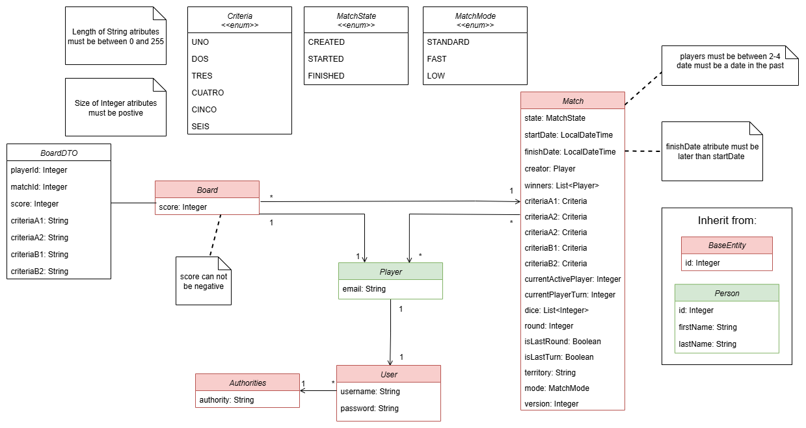
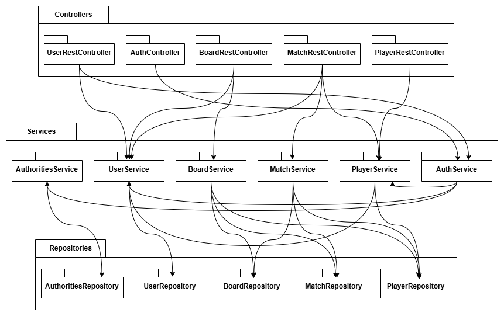

# Documento de diseño del sistema

## Introducción

Los Mapas Del Reino es un juego de mesa de 2 a 4 jugadores, en el que se juegan con *n+1* dados siendo *n* el número de jugadores.

El objetivo de este juego es conseguir el máximo número de puntos a raíz de las combinaciones hechas en el panel de juego, estas combinaciones se reglan por una serie de criterios que se eligen al principio de la partida con una tirada de 4 dados. Al final del juego, se suman los puntos obtenidos por cada jugador según esos 4 criterios basándose en cómo dibujó los territorios en su mapa. 

En cada turno, el jugador activo lanza los dados y elige qué tipo de territorio dibujar, además de apartar un dado que indica cuántas casillas debe dibujar. Los jugadores pasivos eligen un dado de los restantes y todos dibujan la cantidad de casillas elegidas. Luego el turno pasa al siguiente jugador, que repite el proceso con los dados restantes (menos el que fue apartado).

Hay que destacar que cada jugador tiene un número limitado de usos para cada tipo de territorio según la cantidad de jugadores (3/2/1 usos para 2/3/4 jugadores) y que cuando se agotan no pueden elegir ese tipo en su turno activo. Además, el primer  dibujado por cada jugador en cada turno debe conectarse a uno ya dibujado y los territorios dibujados ese turno deben estar agrupados.

Una ronda termina cuando, tras el último turno, solo queda un dado sin usar. Para comenzar una nueva ronda, se reúnen nuevamente todos los dados (número de jugadores + 1) y el siguiente jugador en turno inicia lanzándolos.

Hay una serie de poderes en el tablero de la partida que tendrán todos los jugadores cuando pasen por ellos, estos son: +/- 1 y el ?, el primero de ellos te suma 1 o -1 a tu elección en la tirada que quiera, asi puede abarcar más o menos celdas a gusto del jugador, el poder de ? suma todas las combinaciones que hay en el tablero hasta el momento y las cuenta y anota en su casilla correspondiente. 

La partida termina cuando uno o más jugadores no puedan dibujar territorios en celdas, aunque utilice los poderes de +/- 1. Esto puede suceder cuando dicho jugador o jugadores tengan celdas disponibles, pero no tantas como el número del dado escogido, o el tablero completo. El turno se desarrolla sin que el jugador en cuestión pueda dibujar nada, y al final de éste, la partida finalizará. 

Una vez finalizada la partida, se calculan los puntos de cada jugador y se muestra el ganador, es decir el jugador que más puntos ha obtenido.

[Enlace al vídeo de explicación de las reglas del juego / partida jugada por el grupo](https://youtu.be/3vbqDzdNn9U)
## Diagrama(s) UML:

### Diagrama de Dominio/Diseño
En esta sección se incluye un diagrama UML de dominio que describe las clases así como sus relaciones(direccionalidad, cardinalidad) y herencias.



### Diagrama de Capas (incluyendo Controladores, Servicios y Repositorios)
En esta sección se proporciona un diagrama UML de clases que describe el conjunto de controladores, servicios y repositorios implementados.



## Descomposición del tablero de juego en componentes

En esta sección procesaremos el tablero de juego (o los mockups si el tablero cambia en las distintas fases del juego). Etiquetaremos las zonas de cada una de las pantallas para identificar componentes a implementar. 

Para cada mockup se especificará el árbol de jerarquía de componentes, así como, para cada componente el estado que necesita mantener, las llamadas a la API que debe realizar y los parámetros de configuración global que consideramos que necesita usar cada componente concreto. 

Por ejemplo, para la pantalla de visualización de métricas del usuario en un hipotético módulo de juego social:


   - $\color{red}{\textsf{Tablero - Son las casillas hexagonales donde se colocan los territorios y se desarrolla la acción del juego.}}$
   - $\color{magenta}{\textsf{Poder +/-  - Casillas hexagonales donde se aplica el poder de aumentar o disminuir en 1 la cantidad de territorios a colocar.}}$
   - $\color{orange}{\textsf{Poder ? - Casilla hexagonal donde se aplica el poder de la interrogación, el cual consiste en recoger todos los puntos que lleva en el momento cuando se gasta, para después sumarlos al final de la partida.}}$
   - $\color{blue}{\textsf{Dados - Son la forma en la que se eligen cuantos territorios se van a seleccionar y pueden ser de 1 a 5 dados depenndiendo del momento y jugadores que haya en la partida.}}$
   - $\color{grey}{\textsf{Criterios - Son los distintos criterios con los que se va a jugar en la partida, los cuales marcarán como se hará el recuento de puntos. Existen 2 tipos de criterios A y B y dentro de ellos hay 6 posibles criterios por cada tipo. Al principio de la partida se escogen al azar dos criterios del tipo A y otros 2 del tipo B.}}$
   - $\color{pink}{\textsf{Tiempo - El tiempo restante que tiene cada jugador por turno. Una vez agotado el tiempo el juego le echará de la partida.}}$
   - $\color{green}{\textsf{Territorios - Desplegable con los 6 tipos de territorios que puedes asignar a la casilla donde vayas a colocar. Estos 6 territorios son: Montaña, Río, Castillo, Pueblo, Bosque y Pradera.}}$
   - $\color{purple}{\textsf{Asignar - El botón que tiene como función asignar a la casilla escogida el territorio que hemos elegido en el desplegable.}}$
   - $\color{lightblue}{\textsf{Pasar Turno - Botón con el que cada jugador pasa su turno una vez haya terminado el suyo, y así dar paso al siguiente jugador.}}$
   - $\color{darkred}{\textsf{Abandonar Partida - Botón que sirve para salir de la partida y redirige al menú principal, este limpia el tablero y deja la partida con un jugador menos.}}$

## Documentación de las APIs
Se considerará parte del documento de diseño del sistema la documentación generada para las APIs, que debe incluir como mínimo, una descripción general de las distintas APIs/tags  proporcionadas. Una descripción de los distintos endpoints y operaciones soportadas. Y la especificación de las políticas de seguridad especificadas para cada endpoint y operación. Por ejemplo: “la operación POST sobre el endpoint /api/v1/game, debe realizarse por parte de un usuario autenticado como Player”.

Si lo desea puede aplicar la aproximación descrita en https://vmaks.github.io/2020/02/09/how-to-export-swagger-specification-as-html-or-word-document/ para generar una versión en formato Word de la especificación de la API generada por OpenAPI, colgarla en el propio repositorio y enlazarla en esta sección del documento.  En caso contrario debe asegurarse de que la interfaz de la documentación open-api de su aplicación está accesible, funciona correctamente, y está especificada conforme a las directrices descritas arriba.

## Patrones de diseño y arquitectónicos aplicados
En esta sección de especificar el conjunto de patrones de diseño y arquitectónicos aplicados durante el proyecto. Para especificar la aplicación de cada patrón puede usar la siguiente plantilla:

### Patrón: Single Page Application
#### Tipo: 

Diseño 

#### Contexto de Aplicación:

Nuestra aplicación tiene el formato de una SPA, lo cuál significa solo tiene una única páginam HTML que se actualiza dinámicamente cada vez que el usuario interactúa con ella. Esta página se carga en el navegador una sola vez ahorrándonos un gran número de recargas, disminuyendo así la carga devolviendo JSON y no HTML.

#### Clases o paquetes creados:

Clases asociadas a las entidades Match, Player y Board.

#### Ventajas alcanzadas al aplicar el patrón:

Se reducen el número de recargas de la aplicación así como la carga útil enviándose JSON y no HTML. La interfaz se actualiza dinámicamente sin tener que cargar una página entera. Se mejora así la eficiencia y el rendimiento.

### Patrón: MVC
#### Tipo: 

Arquitectónico 

#### Contexto de Aplicación:

Durante nuestro proyecto hemos aplicado el patrón de diseño MVC en el backend, para implementar todas las entidades y sus funcionalidades de obtención y manipulación de datos. Para ello, se han creado paquetes con cada una de ellas con las clases correspondientes. Este patrón separa los datos de la aplicación, la interfaz de usuario y la lógica de negocio en los siguientes 3 componentes:

Modelo: Es la representación de la información ,incluye los datos y la lógica
para operar con ellos. Dentro del modelo se incluyen las entidades, repositorios y servicios.

Controlador: Responde a eventos de la interfaz de usuario e invoca cambios en el modelo.

Vista: Es la presentación del modelo y representa la información proporcionada por el controlador.

#### Clases o paquetes creados:

En cuanto a los modelos y controladores, se han realizado una clase Repository, Service y Controller por cada una de las entidades siguientes:

Board, Match, Player.

Además, las vistas se encuentran en /frontend/src en cada una de las carpetas respectivas a cada entidad.

#### Ventajas alcanzadas al aplicar el patrón:

Debido a que la implementación del backend se ha realizado con Spring Boot y basándonos en el proyecto de ejemplo y los conociminetos obtenidos de los apuntes de teoría, creemos que es necesario utilizar dicho patrón. Además se ha utilizado JavaScript para hacer las vistas, lo cuál cuadra con el uso del patrón.

### Patrón: Decomposition of UI into components and modules
#### Tipo: 

Diseño 

#### Contexto de Aplicación:

Se ha dividido la UI en componentes y módulos para lograr encapsulación y un bajo acoplamiento. Con esto se consiguen piezas reutilizables de código encapsuladas que solo se relacionan mediante export/import.

#### Clases o paquetes creados:

Se ha dividido el frontend en App, AppNavBar, home, match, playerMatches, lobby. Se ha dividido el frontend encapsulando cada funcionalidad y sección.

#### Ventajas alcanzadas al aplicar el patrón:

Con este modelo, se logra un bajo acomplamiento y se evita el acceso a información por parte de módulos que no deben y colisiones de nombre mediante import/export.

### Patrón: Dependency Injection
#### Tipo: 

Diseño 

#### Contexto de Aplicación:

Se utiliza el patrón de Inyección de Dependencias para gestionar las dependencias entre componentes de manera flexible y sencilla. 

#### Clases o paquetes creados:

Las clases mencionadas en el patrón MVC, los repositorios se inyectan en los servicios y los servicios en los controladores.

#### Ventajas alcanzadas al aplicar el patrón:

Con este modelo, se logra un bajo acomplamiento y un mejor control de dependencias al asegurarnos de que solo se crea un instancia de las clases y que las clases que lo necesiten puedan acceder a ellas.

### Patrón: Domain Model
#### Tipo: 

Diseño 

#### Contexto de Aplicación:

Este patrón nos ha ayudado a que el juego esté sostenido por objetos cuya interacción depende de la comunicación entre ellos. Es el patrón utilizado el 99% de las veces y ayuda a implementar la lógica de negocio compleja.

#### Clases o paquetes creados:

Las clases Match, Board y Player, las cuales son entidades.

#### Ventajas alcanzadas al aplicar el patrón:

Permite implementar lógica de negocio compleja, es compatible con la mayoría de los frameworks y mantiene la consistencia y coherencia de los objetos.

### Patrón: Service Layer
#### Tipo: 

Diseño 

#### Contexto de Aplicación:

Define la frontera de la aplicación con una capa de servicios que establece un conjunto de operaciones disponibles y coordina la respuesta de la aplicación en cada operación. La capa de presentación interactúa con la de dominio a través de la capa de servicio.

#### Clases o paquetes creados:

Las clases MatchService, BoardService y PlayerService.

#### Ventajas alcanzadas al aplicar el patrón:

Aísla la lógica de negocio en un nivel independiente, evitando que esta se mezcle con la lógica de presentación o acceso a datos. Además divide la lógica de negocio separando responsabilidades y facilita la gestión de transacciones.

### Patrón: (Meta) Data Mapper
#### Tipo: 

Diseño 

#### Contexto de Aplicación:

Aunque no se definen clases de mapeo específicas, se realiza un mapeo entre las entidades y la base de datos. El patrón nos permite realizar una transferencia bidireccional de datos entre la BD y el objeto de forma automática.

#### Clases o paquetes creados:

Las clases Match, Board y Player, en concreto mediante las anotaciones realizadas en cada una de ellas.

#### Ventajas alcanzadas al aplicar el patrón:

Permite la transferencia de datos entre la BD y los objetos mientras los mantiene independientes entre sí. 

### Patrón: Identify Field
#### Tipo: 

Diseño 

#### Contexto de Aplicación:

El patrón se utiliza para identificar de manera correcta y rápida a las entidades del modelo.

#### Clases o paquetes creados:

Las clases Match, Board y Player, en concreto mediante las anotaciones acerca del id y la identificacion.

#### Ventajas alcanzadas al aplicar el patrón:

El patrón permite una rápida identificación de las entidades y asegura la unicidad de estas. El patrón genera claves primarias y gestiona el identificador de manera automática.

### Patrón: Repository pattern
#### Tipo: 

Diseño 

#### Contexto de Aplicación:

Para acceder a los datos de la BD, hemos implementado repositorios para cada entidad.

#### Clases o paquetes creados:

Las clases MatchRepository, BoardRepository y PlayerRepository.

#### Ventajas alcanzadas al aplicar el patrón:

El patrón simplifica la lógica de acceso a la base de datos dando la impresión de que se accede a un colección objetos en memoria en lugar de a una base de datos.

### Patrón: Data Transfer Objects(DTO)
#### Tipo: 

Diseño 

#### Contexto de Aplicación:

Ante la necesidad de transferir algunos atributos específicos de la clase Board, implementamos una clase BoardDTO para ello. Igual procedimiento para la clase Match para la cual creamos la clase MatchUpdateRequest.

#### Clases o paquetes creados:

La clase BoardDTO y MatchUpdateRequest.

#### Ventajas alcanzadas al aplicar el patrón:

Reduce el número de llamadas, aumenta la encapsulación y reduce el acoplamiento.

### Patrón: Pagination
#### Tipo: 

Diseño 

#### Contexto de Aplicación:

Se ha utilizado paginación para mostrar conjuntos extensos de datos como el listado de usuarios.

#### Clases o paquetes creados:

No se han creado clases sino que se han añadido métodos y se ha modificado la clase /frontend/src/admin/users/UserAdminList.

#### Ventajas alcanzadas al aplicar el patrón:

Mejora la experiencia y simplifica la visualización de datos extensos mostrando porciones de estos datos. Además mejora la eficiencia y reduce los tiempos al mostrar una parte de los datos evitando tener que mostrarlos todos.

### Patrón: Builder
#### Tipo: 

Diseño 

#### Contexto de Aplicación:

La creación de la partida en el Service ocupaba muchas líneas de código, además de que no era escalable si querías en un futuro modificar ciertos atributos de la partida antes de crearla como hemos hecho con la velocidad de la partida.

#### Clases o paquetes creados:

Se ha creado la clase MatchBuilder que permite construir los objetos Match modificando los valores que únicamente se establecerán una vez.

#### Ventajas alcanzadas al aplicar el patrón:

Mejora mucho la mantenibilidad y legibilidad del código, evitando errores por la cantidad de parámetros de la clase Match, y facilita la reutilización del proceso de creación de partidas en MatchFactory.

### Patrón: Factory
#### Tipo

Diseño 

#### Contexto de Aplicación

En el desarrollo del backend de nuestro sistema de partidas, vimos la necesidad de crear instancias de Match con diferentes configuraciones iniciales según el tipo de partida: estándar, lenta o rápida. Aplicar el patrón Factory nos permitió centralizar esta lógica de creación en una única clase y facilitar futuras extensiones.

#### Clases o paquetes creados

Se ha creado la clase MatchFactory que almacena la lógicua de creación de partidas y utiliza MatchBuilder, ya implementado previamente.

#### Ventajas alcanzadas al aplicar el patrón

Simplifica mucho la implementación en backend, ya que evita la repetición de código. Además, reduce la cantidad de código ilegible para el futuro mantenimiento de la aplicación.

## Decisiones de diseño
_En esta sección describiremos las decisiones de diseño que se han tomado a lo largo del desarrollo de la aplicación que vayan más allá de la mera aplicación de patrones de diseño o arquitectónicos._

### Decisión 1
#### Descripción del problema:
Como grupo encontramos problemas a la hora de diseñar el tablero ya que es un tablero complejo con celdas hexagonales. El tablero debe tener en cuenta la posición de las celdas así como si está o no rellena y en caso afirmativo, el tipo de territorio.

#### Alternativas de solución evaluadas:

*Alternativa 1.a*: Diseñar el tablero como un grafo en el que las celdas son nodos.

Ventajas:

• La relación de proximidad entre las celdas sería más sencillo de describir.

Inconvenientes:

• Difícil implementación.

• Difícil manejo del grafo por su extensión.

*Alternativa 1.b*: Diseñar el tablero asignando a las casillas coordenadas X, Y, Z.

Ventajas:

• Facilidad para dirigirse a una casilla específica a la hora de asignarle un territorio.

Inconvenientes:

• Difícil depuración de errores debido a que un error en las coordenadas de una casilla influiría en las demás.

#### Justificación de la solución adoptada
Debido a la complejidad de diseñar el tablero como un grafo y tras la recomendación de la profesora, decidimos diseñar el tablero mediante celdas con coordenadas.  

### Decisión 2
#### Descripción del problema:
Como grupo teníamos distintas opiniones acerca de cómo crear una partida y unirse a ella.

#### Alternativas de solución evaluadas:

*Alternativa 2.a*: El creador se une directamente a la partida que ha creado y espera a que los demás jugadores se unan a ella.

Ventajas:

• Más facilidad a la hora de programar.

Inconvenientes:

• El creador no sabe cuando se han unido los demás jugadores y por tanto cuando iniciar la partida.

• No es el estilo convencional de los juegos de mesa actuales.

*Alternativa 2.b*: El creador de la partida crea una lobby, espera al resto de jugadores y una vez unidos los jugadores comienza la partida.

Ventajas:

• Facilidad del creador para organizar la partida.

Inconvenientes:

• Mayor dificultad a la hora de desarrollar el código.

#### Justificación de la solución adoptada
Debido a las restricciones para jugar una partida, optamos por una mejor organización para iniciar la partida correctamente usando una lobby.

### Decisión 3
#### Descripción del problema:
Como grupo teníamos distintas opiniones acerca de los atributos de Player y User y la relación entre ellas.

#### Alternativas de solución evaluadas:

*Alternativa 3.a*: Player hereda todos los atributos de User y la clase no tendría ningún atributo propio.

Ventajas:

• Simplicidad en la estructura del código.

• Facilidad en la integración con el resto de clases.

Inconvenientes:

• Se cuestiona la necesidad de una clase Player en el código.

• Si se implementase en un futuro una nueva funcionalidad, sería más complicado refactorizar el código.

*Alternativa 3.b*: Player hereda de Person y tiene un atributo (relación) User y un atributo propio "email".

Ventajas:

• La clase Player coge importancia y se diferencia de User.

• La clase User queda más elemental teniendo los atributos lógicos y necesarios para un usuario.

Inconvenientes:

• Mayor complejidad de implementación del sistema.

• La integración con el resto de clases tiene una complejidad mayor.

#### Justificación de la solución adoptada
Pese a la dificultad de implementación de la clase Player, nos hemos decantado por darle atributos propios a Player para que la implementación de posibles nuevos atributos sea más sencilla.

### Decisión 4
#### Descripción del problema:
Como grupo teníamos distintas opiniones acerca de donde situar las instrucciones del juego para que los jugadores que no sepan cómo se juega puedan aprender y consultar la información necesaria sobre el juego.

#### Alternativas de solución evaluadas:

*Alternativa 4.a*: Instrucciones a la izquierda del tablero.

Ventajas:

• Mayor facilidad para encontrarlas.

• Visualmente más accesibles y siempre disponibles.

Inconvenientes:

• Para jugadores ya experimentados, un obstáculo visual en el juego.

• Estéticamente, el tablero sería menos atractivo con un folio explicativo de las instrucciones.

*Alternativa 4.b*: Una ruta en el AppNavbar.

Ventajas:

• Se puede acceder a las instrucciones cuando se desee y es fácil de encontrar.

• No estorba a nivel visual en la partida.

Inconvenientes:

• El usuario podría distraerse de la partida.

#### Justificación de la solución adoptada
Finalmente, el grupo escogió situar las instrucciones en la barra de navegación, ya que pareció ser la mejor opción. A nivel organizativo, resulta más conveniente que añadir elementos que obstaculicen el diseño del tablero.

### Decisión 5
#### Descripción del problema:
Como grupo teníamos dudas en cuanto al número de jugadores que deben estar en el lobby para empezar la partida y si deberíamos especificar el número de jugadores máximos al crear la partida.

#### Alternativas de solución evaluadas:

*Alternativa 5.a*: Especificar el número de jugadores que participarán en la partida y una vez que haya ese número de jugadores en el lobby, poder empezar la partida.

Ventajas:

• Evitar que se empiece la partida accidentalmente cuando faltan jugadores.

• Sencillez de implementación.

Inconvenientes:

• Si no está el número de jugadores especificados, no se puede empezar la partida. Si hay un jugador que finalmente no puede jugar, hay que crear otra partida.

• Si se especifica un número de jugadores y un nuevo jugador también quiere jugar, hay que crear otra partida.

*Alternativa 5.b*: No especificar el número de jugadores de la partida sino que estos se van uniendo (hasta un máximo de 4 jugadores y no menos de 2), pudiendo el creador empezar la partida cuando quiera.

Ventajas:

• Puede variar el número de jugadores tras crear la partida y no es necesario crear otra si el número cambia.

• Mayor libertad a la hora de empezar la partida.

Inconvenientes:

• Implementación más compleja.

#### Justificación de la solución adoptada
Finalmente, el grupo escogió la alternativa b ya que creemos que es más lógico y cómodo poder empezar la partida cuando quiera el creador y que pueda variar el número de jugadores de la partida una vez ha sido creada.

### Decisión 6
#### Descripción del problema:
Como grupo teníamos dudas en cuanto al procedimiento a seguir cuando un jugador no finaliza su turno y supera el tiempo máximo de turno.

#### Alternativas de solución evaluadas:

*Alternativa 6.a*: Pasar de turno al siguiente jugador correspondiente haciendo además que el jugador que ha perdido el turno sea expulsado de la partida.

Ventajas:

• Forma lógica de resolución.

• Los demás jugadores pueden continuar la partida.

Inconvenientes:

• Con la forma de implementación de los turnos y los dados, no se puede llevar a cabo esta opción ya que habría problemas a la hora de cambiar de turno al siguiente jugador.

• Si el jugador que pierde el turno es el jugador activo (lanza los dados y elige el territorio a dibujar), al pasar su turno el siguiente jugador debería pasar a ser el jugador activo. Esto es difícil y daría errores debido a la forma de implementación de los turnos.

• Además, al expulsar al jugador de la partida, el número de jugadores de esta se reduciría en 1 provocando errores y dudas debido a que cuando finaliza la ronda el jugador activo debe lanzar tantos dados como jugadores haya en la partida más uno.

• Por otro lado, en las instrucciones del juego no se especifica el procedimiento a seguir si se sobrepasa el límite de tiempo ni si existe un tiempo máximo de turno. 

*Alternativa 6.b*: Terminar la partida si un jugador sobrepasa el límite de tiempo de turno.

Ventajas:

• Mayor facilidad de implementación.

• Consistencia con la forma de implementación de los turno y dados reduciendo problemas.

Inconvenientes:

• No es la forma lógica de resolución del problema.

• Todos los jugadores son fastidiados por uno ya que se termina la partida y tienen que volver a empezar una de nuevo.

#### Justificación de la solución adoptada
Debido a que las instrucciones no especifican el procedimiento a seguir, hemos optado por la opción más cómoda y que creemos mejor la cual es que si un jugador supera el tiempo de turno, se finaliza la partida y todos los jugadores son expulsados al menu principal.

### Decisión 7
#### Descripción del problema:
Como grupo teníamos dudas en cuanto a la implementación del poder +/- 1, concretamente el momento del uso del poder.

#### Alternativas de solución evaluadas:

*Alternativa 7.a*: Cuando se dibuja en una casilla del poder +/- 1, se guarda el poder en un contador que almacena el número de poderes +/- 1 que puede utilizar el jugador. Además, el jugador puede utilizar el poder en cualquier turno siempre y cuando haya dibujado en al menos una casilla de poder +/- 1 y le queden usos de dicho poder.

Ventajas:

• Libertad de los jugadores para usar el poder.

• Se pueden usar más de una vez el poder en el mismo turno.

Inconvenientes:

• Mayor dificultad de implementación.

• Errores en el caso de utilizar el poder para sumar y restar en el mismo turno.

*Alternativa 7.b*: El poder se usa en el mismo turno en el que se dibuja la casilla del poder.

Ventajas:

• Mayor facilidad de implementación.

• El poder gana protagonismo y se premia al jugador que elige mejor el turno en el que dibuja la casilla del poder. 

Inconvenientes:

• Los jugadores pierden libertad en cuanto al momento de uso del poder.

#### Justificación de la solución adoptada
Finalmente, el grupo escogió la alternativa b ya que facilita la implementación y premia al jugador que sabe el turno y el momento en el que debe dibujar la casilla del poder. En cambio, con la alternativa a, el jugador puede usar el poder en cualquier momento restando valor al momento en el que dibujas una casilla del poder. Con esto creemos que el poder +/- 1 será más interesante y tendrá un mayor valor su correcto uso.

### Decisión 8
#### Descripción del problema:
Como grupo teníamos dudas en cuanto a la implementación de los dados y turnos para que fueran coherentes y consistentes para todos los jugadores.

#### Alternativas de solución evaluadas:

*Alternativa 8.a*: Utilizar stomp y sockets para implementar la lógica de turnos y dados.

Ventajas:

• Rendimiento.

• Eficiencia.

Inconvenientes:

• Mayor dificultad de implementación.

• Necesita una configuración adecuada de la infraestructura de servidores. 

*Alternativa 8.b*: Se realiza un fetch de la partida cada cierto tiempo mediante un polling. Con esto, se recargan los datos de la partida constantemente.

Ventajas:

• Mayor facilidad de implementación.

• Mayor simplicidad en las peticiones.

• No son necesarias configuraciones adicionales y cada petición es autónoma.

Inconvenientes:

• Peor rendimiento debido a que se necesita que constantemente se hagan peticiones.

• Se hacen peticiones incluso cuando no hay cambios, lo cual empeora el rendimiento.

• Las actualizaciones son más lentas y menos fluidas.

#### Justificación de la solución adoptada
Finalmente, el grupo escogió la alternativa b ya que su implementación es más sencilla y además es una de las metodologías propuestas y explicadas en la asignatura. Por otro lado, no es necesario configurar el servidor del socket y es por tanto más sencillo. Con esta opción, cada jugador realiza un fetch cada cierto periodo de tiempo de los datos de la partida lo que mantiene consistentes los turnos y dados para todos los jugadores.

### Decisión 9
#### Descripción del problema:
Como grupo teníamos dudas en cuanto a la implementación del poder +/- 1 concretamente en el momento del turno de dibujar la casilla correspondiente al poder. Es decir, el número de casilla en el que se puede usar el poder. 

Aclaración: Como se ha especificado en la decisión de diseño 7, el poder +/- 1 se utiliza en el mismo momento en el que se dibuja la casilla correspondiente al poder.

#### Alternativas de solución evaluadas:

*Alternativa 9.a*: La casilla del poder +/- 1 se puede dibujar en cualquier momento del turno. Es decir, si por ejemplo el jugador elige el dado con valor 3, puede dibujar la casilla del poder +/- 1 en cualquier momento del turno, tanto en la primera que dibuja, como en la segunda como en la tercera.

Ventajas:

• El poder se puede utilizar en cualquier momento del turno.

Inconvenientes:

• Error y dudas de como debería comportarse si se usa el poder para restar 1 en la última casilla que dibuja el jugador en el turno. Ya que debe restar en 1 el número de casillas que puede dibujar pero ya ha dibujado todas provocandose una incongruencia.

• Mayor dificultad de implementación.

*Alternativa 9.b*: La casilla del poder +/- 1 no se puede dibujar si es la última casilla que puede dibujar el jugador en ese turno. Es decir, si por ejemplo el jugador elige el dado con valor 3, puede dibujar la casilla del poder +/- 1 tanto en la primera que dibuja, como en la segunda pero no en la tercera casilla que dibuja ya que es la última que puede dibujar en el turno. Porque si el jugador ha dibujado 2 casillas y dibuja la tercera y ultima en la casilla del poder, se produce un conflicto en el caso de que quiera restar (ha dibujado 3 casillas y al restar pasa a tener que haber dibujado 2).

Ventajas:

• Mayor facilidad de implementación.

• No puede ocurrir que use el poder para restar en el último momento del turno.

Inconvenientes:

• No se puede usar el poder en la última casilla que se va a dibujar en el turno.

#### Justificación de la solución adoptada
Finalmente, el grupo escogió la alternativa b ya que facilita la implementación y no se produce el caso en el que se reste 1 cuando ya se han colocado todas las casillas y por tanto no tendría efecto el uso ya que se han dibujado las casillas y no se pueden borrar. Esto soluciona la duda que teníamos acerca del comportamiento del juego si se da ese caso.

### Decisión 10
#### Descripción del problema:
Como grupo teníamos dudas respecto a las funciones disponibles para los usuarios con rol admin, en concreto acerca de si los administradores pueden jugar o no partidas.

#### Alternativas de solución evaluadas:

*Alternativa 10.a*: Los administradores pueden jugar partidas al igual que los usuarios con rol player.

Ventajas:

• Si un admin quiere jugar, no es necesario que se cree otro usuario con rol player.

• Menor número de usuarios y cuentas ya que los admins pueden jugar y gestionar con el mismo usuario.

• Facilita las pruebas ya que los admins pueden testear cambios de las partidas sin tener que cambiar de usuario.

Inconvenientes:

• Mezcla las funciones de cada rol difuminándose las responsabilidades y funciones de cada uno.

• Posibles errores y conflictos de permisos.

*Alternativa 10.b*: Los administradores no pueden jugar partidas, esta funcionalidad solo está disponible para usuarios con rol player.

Ventajas:

• Mayor coherencia ya que lo lógico que es que los únicos que pueden jugar partidas sean los players.

• Mejor separación y diferenciación de roles, cada uno tiene su propia función y responsbilidad por separado.

• Diseño e implementación más simple ya que permite ofrecer interfaces distintas dependiendo del rol.

Inconvenientes:

• Los admins deben tener otro usuario con rol player si quieren jugar partidas.

• Mayor número de cuentas y usuarios.

• Mayor dificultad para realizar pruebas relativas a las partidas ya que los admins deben iniciar sesión con un usuario con rol player.

#### Justificación de la solución adoptada
Finalmente, el grupo escogió la alternativa b ya que es la opción más lógica y que permite una mayor diferenciación entre roles. Con esto los roles quedan perfectamente separados y definidos, cada uno con sus propias funcionalidades disponibles exclusivamente para ese rol. Separar las funcionalidades disponibles para cada rol permite que el sistema mantenga una arquitectura más ordenada, con roles bien definidos y sin solapamiento de responsabilidades.

## Refactorizaciones aplicadas

### Refactorización 1:
En esta refactorización añadimos más funcionalidad al botón "Crear Partida" para ayudar a tener una mejor gestión de los jugadores, utilizando una lobby donde se encuentra el código generado, identifica la partida y permite que los jugadores se unan, ofreciendo un listado de estos.
#### Estado inicial del código

```JavaScript

    const navigate = useNavigate();
    const handleCrearPartida = () => {
        navigate('/tablero'); 
    };

```

#### Estado del código refactorizado

```JavaScript

    const navigate = useNavigate();
    const handleCrearPartida = () => {
        navigate('/lobby'); 
    };

```
```JavaScript
export default function Lobby() {
    const [jugadores, setJugadores] = useState([]);
    const [lobbyCode, setLobbyCode] = useState('');
    const [dots, setDots] = useState(''); // Estado para los puntos suspensivos
    const navigate = useNavigate();

    useEffect(() => {   
       //falta añadir logica de la peticion al backend
        const code = Math.random().toString(36).substring(2, 8).toUpperCase();
        setLobbyCode(code);
    }, []);
 
    useEffect(() => {   //movimiento de los puntos suspensivos
        const interval = setInterval(() => {
            setDots(prevDots => (prevDots.length < 3 ? prevDots + '.' : ''));
        }, 500); // Actualiza los puntos suspensivos cada 500ms

        return () => clearInterval(interval); // Limpia el intervalo cuando el componente se desmonta
    }, []);


    const handleIniciarPartida = () => {
        navigate('/tablero', { state: { lobbyCode } }); 
    };

    return (
        <div className="lobby-container">
            <h1>Lobby de Espera</h1>
            <h3>Esperando a que los jugadores se unan{dots}</h3>
            <p>Código de la lobby: <strong>{lobbyCode}</strong></p>

            <ul>
                {jugadores.map((jugador, index) => (
                    <li key={index}>{jugador}</li>
                ))}
            </ul>

            <button 
                onClick={handleIniciarPartida}
                className="btn-iniciar"
                disabled={jugadores.length < 0} //Cambiar a 2
            >
                Iniciar Partida
            </button>
        </div>
    );
}

```

#### Problema que nos hizo realizar la refactorización
 Era complicado gestionar los jugadores ya con la partida iniciada, además de que podrían unirse directamente a una partida empezada. También era inviable que se pueda empezar una partida con tan solo el creador cuando el juego es de 2-4 jugadores.

#### Ventajas que presenta la nueva versión del código respecto de la versión original
 La lobby permite que los jugadores se agrupen y visualicen quiénes están listos antes de comenzar, mejorando la coordinación y
 permitiendo que no se pueda empezar la partida hasta que estén el número de jugadores requerido.


### Refactorización 2: 
Cambios en el diagrama de clases, mejorando las clases "Usuario", "Admin" y "Player" mediante redistribucón de atributos y relaciones. Y simplificación de clases como turno y ronda.

#### Problema que nos hizo realizar la refactorización
 Teniamos dificultad en algunos momentos del desarrollo del proyecto a la hora de establecer algunas funcionalidades y relaciones entre clases que realmente no eran necesarias o complicaban más de lo necesario el desarrollo, encontrando soluciones mejores.

#### Ventajas que presenta la nueva versión del código respecto de la versión original
 El diagrama nos ayuda a entender mejor como realizar ahora el proyecto y optimiza nuestro enfoque.


 ### Refactorización 3:
 La barra de navegación se ha mejorado para ahora poder ver tu perfil mediante una función en esta. Ahora pinchando en el nombre de usuario puedes ver más datos no simplemente el nombre de usuario. Además se han implementado nuevos apartados para el administrador, los apartados "Users" y "Developers".

#### Estado inicial del código

```JavaScript

   function AppNavbar() {
    const [roles, setRoles] = useState([]);
    const [username, setUsername] = useState("");
    const jwt = tokenService.getLocalAccessToken();
    const [collapsed, setCollapsed] = useState(true);

    const toggleNavbar = () => setCollapsed(!collapsed);

    useEffect(() => {
        if (jwt) {
            setRoles(jwt_decode(jwt).authorities);
            setUsername(jwt_decode(jwt).sub);
        }
    }, [jwt])

    let adminLinks = <></>;
    let ownerLinks = <></>;
    let userLinks = <></>;
    let userLogout = <></>;
    let publicLinks = <></>;

    roles.forEach((role) => {
        if (role === "ADMIN") {
            adminLinks = (
                <>                    
                    <NavItem>
                        <NavLink style={{ color: "white" }} tag={Link} to="/users">Users</NavLink>
                    </NavItem>
                </>
            )
        }        
    })

    if (!jwt) {
        publicLinks = (
            <>
                <NavItem>
                    <NavLink style={{ color: "white" }} id="docs" tag={Link} to="/docs">Docs</NavLink>
                </NavItem>
                <NavItem>
                    <NavLink style={{ color: "white" }} id="plans" tag={Link} to="/plans">Pricing Plans</NavLink>
                </NavItem>
                <NavItem>
                    <NavLink style={{ color: "white" }} id="register" tag={Link} to="/register">Register</NavLink>
                </NavItem>
                <NavItem>
                    <NavLink style={{ color: "white" }} id="login" tag={Link} to="/login">Login</NavLink>
                </NavItem>
            </>
        )
    } else {
        userLinks = (
            <>
                <NavItem>
                    <NavLink style={{ color: "white" }} tag={Link} to="/dashboard">Dashboard</NavLink>
                </NavItem>
            </>
        )
        userLogout = (
            <>
                <NavItem>
                    <NavLink style={{ color: "white" }} id="docs" tag={Link} to="/docs">Docs</NavLink>
                </NavItem>
                <NavItem>
                    <NavLink style={{ color: "white" }} id="plans" tag={Link} to="/plans">Pricing Plans</NavLink>
                </NavItem>
                <NavbarText style={{ color: "white" }} className="justify-content-end">{username}</NavbarText>
                <NavItem className="d-flex">
                    <NavLink style={{ color: "white" }} id="logout" tag={Link} to="/logout">Logout</NavLink>
                </NavItem>
            </>
        )

    }

    return (
        <div>
            <Navbar expand="md" dark color="dark">
                <NavbarBrand href="/">
                    
                    <span style={{ marginLeft: '10px' }}>Los Mapas Del Reino</span>
                </NavbarBrand>
                <NavbarToggler onClick={toggleNavbar} className="ms-2" />
                <Collapse isOpen={!collapsed} navbar>
                    <Nav className="me-auto mb-2 mb-lg-0" navbar>
                        {userLinks}
                        {adminLinks}
                        {ownerLinks}
                    </Nav>
                    <Nav className="ms-auto mb-2 mb-lg-0" navbar>
                        {publicLinks}
                        {userLogout}
                    </Nav>
                </Collapse>
            </Navbar>
        </div>
    );
}

export default AppNavbar;
``` 

#### Estado del código refactorizado

```JavaScript
function AppNavbar() {
    const [roles, setRoles] = useState([]);
    const [username, setUsername] = useState("");
    const jwt = tokenService.getLocalAccessToken();
    const [collapsed, setCollapsed] = useState(true);

    const toggleNavbar = () => setCollapsed(!collapsed);

    useEffect(() => {
        if (jwt) {
            setRoles(jwt_decode(jwt).authorities);
            setUsername(jwt_decode(jwt).sub);
        }
    }, [jwt])

    let adminLinks = <></>;
    let ownerLinks = <></>;
    let userLinks = <></>;
    let userLogout = <></>;
    let publicLinks = <></>;

    roles.forEach((role) => {
        if (role === "ADMIN") {
            adminLinks = (
                <>                    
                    <NavItem>
                        <NavLink style={{ color: "white" }} tag={Link} to="/users">Users</NavLink>
                    </NavItem>
                    <NavItem>
                        <NavLink style={{ color: "white" }} tag={Link} to="/developers">Developers</NavLink>
                    </NavItem> 
                </>
            )
        }  
        if (role === "PLAYER") { 
            ownerLinks = ( 
            <> 
            </> 
            ) 
        }      
    })

    if (!jwt) {
        publicLinks = (
            <>
                <NavItem>
                    <NavLink style={{ color: "white" }} id="docs" tag={Link} to="/docs">Docs</NavLink>
                </NavItem>
                <NavItem>
                    <NavLink style={{ color: "white" }} id="plans" tag={Link} to="/plans">Pricing Plans</NavLink>
                </NavItem>
                <NavItem>
                    <NavLink style={{ color: "white" }} id="register" tag={Link} to="/register">Register</NavLink>
                </NavItem>
                <NavItem>
                    <NavLink style={{ color: "white" }} id="login" tag={Link} to="/login">Login</NavLink>
                </NavItem>
            </>
        )
    } else {
        userLinks = (
            <>
                <NavItem>
                    <NavLink style={{ color: "white" }} tag={Link} to="/dashboard">Dashboard</NavLink>
                </NavItem>
            </>
        )
        userLogout = (
            <>
                <NavItem>
                    <NavLink style={{ color: "white" }} id="docs" tag={Link} to="/docs">Docs</NavLink>
                </NavItem>
                <NavItem>
                    <NavLink style={{ color: "white" }} id="plans" tag={Link} to="/plans">Pricing Plans</NavLink>
                </NavItem>
                <NavItem>
                    <NavLink style={{ color: "white" }} tag={Link} to="/profileList">{username}</NavLink>
                </NavItem>
                <NavItem className="d-flex">
                    <NavLink style={{ color: "white" }} id="logout" tag={Link} to="/logout">Logout</NavLink>
                </NavItem>
            </>
        )

    }

    return (
        <div>
            <Navbar expand="md" dark color="dark">
                <NavbarBrand href="/">
                    
                    <span style={{ marginLeft: '10px' }}>Los Mapas Del Reino</span>
                </NavbarBrand>
                <NavbarToggler onClick={toggleNavbar} className="ms-2" />
                <Collapse isOpen={!collapsed} navbar>
                    <Nav className="me-auto mb-2 mb-lg-0" navbar>
                        {userLinks}
                        {adminLinks}
                        {ownerLinks}
                    </Nav>
                    <Nav className="ms-auto mb-2 mb-lg-0" navbar>
                        {publicLinks}
                        {userLogout}
                    </Nav>
                </Collapse>
            </Navbar>
        </div>
    );
}

export default AppNavbar;

```

#### Problema que nos hizo realizar la refactorización
Al estar logado como usuario tan solo podias ver tu nombre de usuario ya que tus datos solo los registras una vez o sino debes modificar tu perfil.
Por otro lado la gestión de usuarios y tareas para el desarrollador no estaban al fácil acceso para el administrador-


 #### Ventajas que presenta la nueva versión del código respecto de la versión original
 Mayor control y visibilidad para el usuario que ya no es necesario que vaya a modificar su perfil para consultar sus datos.

 Con los nuevos apartados de Users y Developers, el administrador puede gestionar mejor la plataforma y tener a mano herramientas de administración y desarrollo, optimizando la gestión del sistema.

 ### Refactorización 4:
Se ha modificado la clase Player añadiendo el email que se encontraban en la clase User. De esta forma un Player tiene asociado un email, nombre y apellido (ya que extiende a Person) mientras que un usuario tiene asociado un nombre de usuario y una contraseña.

#### Estado inicial del código
```JavaScript
@Entity
@Getter
@Setter
@Table(name = "players")
public class Player extends Person {

    @OneToOne(cascade= {CascadeType.DETACH,CascadeType.REFRESH, CascadeType.PERSIST})
    @JoinColumn(name = "user_id", referencedColumnName = "id")
    @OnDelete(action = OnDeleteAction.CASCADE)
    private User user;
}


@Getter
@Setter
@Entity
@Table(name = "appusers")
public class User extends BaseEntity {

	@Email
	String email;
	@Column(unique = true)
	String username;

	String firstName;
	String lastName;
	String password;

	@NotNull
	@ManyToOne(optional = false)
	@JoinColumn(name = "authority")
	Authorities authority;

	public Boolean hasAuthority(String auth) {
		return authority.getAuthority().equals(auth);
	}

	public Boolean hasAnyAuthority(String... authorities) {
		Boolean cond = false;
		for (String auth : authorities) {
			if (auth.equals(authority.getAuthority()))
				cond = true;
		}
		return cond;
	}

}
``` 

#### Estado del código refactorizado

```JavaScript
@Entity
@Getter
@Setter
@Table(name = "players")
public class Player extends Person {

    @Email
    String email;
    @OneToOne(cascade= {CascadeType.DETACH,CascadeType.REFRESH, CascadeType.PERSIST})
    @JoinColumn(name = "user_id", referencedColumnName = "id")
    @OnDelete(action = OnDeleteAction.CASCADE)
    private User user;
}

@Getter
@Setter
@Entity
@Table(name = "appusers")
public class User extends BaseEntity {

	@Column(unique = true)
	String username;

	String password;

	@NotNull
	@ManyToOne(optional = false)
	@JoinColumn(name = "authority")
	Authorities authority;

	public Boolean hasAuthority(String auth) {
		return authority.getAuthority().equals(auth);
	}

	public Boolean hasAnyAuthority(String... authorities) {
		Boolean cond = false;
		for (String auth : authorities) {
			if (auth.equals(authority.getAuthority()))
				cond = true;
		}
		return cond;
	}

}
```

#### Problema que nos hizo realizar la refactorización
La clase User tenía atributos innecesarios como email, nombre o apellido mientras que la clase Player únicamente tenía la propiedad user. 
Además encontramos problemas y dificultades para referenciar los atributos en user.

 #### Ventajas que presenta la nueva versión del código respecto de la versión original
 Ahora que Player contiene los atributos email, nombre y apellido  (extendidos de Person) es más sencillo referenciarlos y creemos que es más lógico que Player contenga estos atributos y no User. Por otro lado, la clase User ha quedado simplificada con lo esencial que debe tener un usuario (nombre de usuario y contraseña) aumentando así la cohesión de las clases. 

### Refactorización 5: 
En esta refactorización, hemos modificado la forma de acceder a una partida desde la página principal. Anteriormente, se utilizaba un código generado que se almacenaba de forma local para acceder al lobby de la partida. Ahora hemos integrado el backend con el frontend, lo que permite que las partidas sean visibles para otros usuarios en diferentes dispositivos. De esta manera, eliminamos la dependencia del almacenamiento local. En lugar de acceder mediante un código, ahora los usuarios pueden seleccionar una partida de una lista disponible, siempre que se cumplan ciertas condiciones: que la partida no esté llena, que el usuario no esté ya en la misma, entre otras.

#### Estado inicial del código
En el código, solo se incluyen las funciones que han sido modificadas, añadidas o eliminadas.

```JavaScript en el Home
    const generateLobbyId = () => {
        return Math.random().toString(36).substr(2, 6).toUpperCase();
    };
    // Crear lobby simulando un backend con localStorage
    const crearLobby = () => {
        if (!user.username) {
            alert('Por favor, ingresa tu nombre de usuario.');
            return;
        }
        const newLobbyId = generateLobbyId();
        const lobbies = JSON.parse(localStorage.getItem('lobbies')) || {};
        lobbies[newLobbyId] = { players: [user.username] };
        localStorage.setItem('lobbies', JSON.stringify(lobbies));
        navigate(`/lobbies/${newLobbyId}`);
    };
    const handleUnirmePartida = () => {
        if (!user.username) {
            alert('Por favor, ingresa tu nombre de usuario.');
            return;
        }
        navigate('/joinLobby');
    };
    return(
        <div className="home-page-container">
            <div className="hero-div">
                <h1>Bienvenido a</h1>
                
                <h3>¡A por la Victoria!</h3>
                <div className="buttons-container">
                    <button onClick={crearLobby} className="btn-crear">
                        Crear Partida
                    </button>
                    <button onClick={handleUnirmePartida} className="btn-unirme">
                        Unirme a Partida
                    </button>
                    </div>

                {isAdmin && (
                    <div className='admin-tools'>
                        <p>Admin tools:</p>
                        <Link to="/matches/started">
                            <button className='start-game-button'>Partidas en curso</button>
                        </Link>
                        <Link to="/matches/finished">
                            <button className='start-game-button'>Partidas terminadas</button>
                        </Link>
                    </div>
                    )
                }
                </div>
        </div>
    );
```

```JavaScript en el Lobby
const { lobbyId } = useParams();
const [players, setPlayers] = useState([]);
const navigate = useNavigate();

useEffect(() => {
        const lobbies = JSON.parse(localStorage.getItem('lobbies')) || {};
        const lobby = lobbies[lobbyId];

        if (lobby) {
            setPlayers(lobby.players);
        } else {
            alert('Lobby no encontrado.');
            navigate('/');
         }
    }, [lobbyId, navigate]);

const leaveLobby = () => {
        const savedLobbies = JSON.parse(localStorage.getItem('lobbies')) || {};
        const lobby = savedLobbies[lobbyId];
        if (lobby) {
            // Eliminar al jugador de la lista
            const updatedPlayers = lobby.players.filter(player => player !== user.username);
            lobby.players = updatedPlayers;
            savedLobbies[lobbyId] = lobby;
            localStorage.setItem('lobbies', JSON.stringify(savedLobbies));
            setPlayers(updatedPlayers);
            navigate('/');
        }
};

const handleStartGame = () => {
        if (players.length < 2) {
            alert('Necesitas al menos 2 jugadores para empezar la partida.');
        } else {
            alert('La partida va a comenzar.');
            navigate(`/tablero/${lobbyId}`);
        }
};

return (
        <div className="lobby-page-container">
            <div className="lobby-div">
                <h1>Lobby Code: {lobbyId}</h1>
                <h3>Jugadores:</h3>
                <ul>
                    {players.length > 0 ? (
                        players.map((player, index) => (
                            <li key={index}>{player}</li>
                        ))
                    ) : (
                        <p>No hay jugadores en el lobby.</p>
                    )}
                </ul>
                <div className="buttons-container">
                    <button className="btn-iniciar" onClick={handleStartGame}>
                        Iniciar Partida
                    </button>
                    <button className="btn-salir" onClick={leaveLobby}>
                        Salir del lobby
                    </button>
                </div>
            </div>
        </div>
);
```

#### Estado del código refactorizado

```JavaScript en el Home
const jwt = tokenService.getLocalAccessToken();
const [isInMatch, setIsInMatch] = useState(false);
const [matchId, setMatchId] = useState(null);

const checkIfInMatch = async () => {
        if (!jwt || !user || !user.id) {
            console.log("No hay token o usuario no autenticado.");
            return;
        }
        const createdMatchesResponse = await fetch(`/api/v1/matches/created`, {
            method: 'GET',
            headers: {
                Authorization: `Bearer ${jwt}`,
                "Content-Type": "application/json",
            },
        });
        const createdMatches = await createdMatchesResponse.json();
        const startedMatchesResponse = await fetch(`/api/v1/matches/started`, {
            method: 'GET',
            headers: {
                Authorization: `Bearer ${jwt}`,
                "Content-Type": "application/json",
            },
        });
        const startedMatches = await startedMatchesResponse.json();
        const allMatches = [...createdMatches, ...startedMatches];
        const activeMatch = allMatches.find((match) =>
            match.players.some((player) => player.user.id === user.id)
        );
        if (activeMatch) {
            setIsInMatch(true); 
            setMatchId(activeMatch.id); 
            console.log(`Usuario en partida activa con ID: ${activeMatch.id}`);
        } else {
            setIsInMatch(false);
            console.log("Usuario no está en ninguna partida activa.");
        }
    };
    

    const crearLobby = async () => {
        if (!user.username) {
            alert('Por favor, ingresa tu nombre de usuario.');
            return;
        }
        if (!jwt) {
            alert('No estás autenticado. Por favor, inicia sesión.');
            return;
        }
    
            const response = await fetch(`/api/v1/matches`, {
                method: 'POST',
                headers: {
                    Authorization: `Bearer ${jwt}`,
                    "Content-Type": "application/json"
                },
            });
            
    
            if (!response.ok) {
                throw new Error('Error al crear la partida');
            }
    
            const matchData = await response.json();
            const matchId = matchData.id; 
    
            navigate(`/lobbies/${matchId}`);
        
    };
     const handleUnirmePartida = () => {
        if (!user.username) {
            alert('Por favor, ingresa tu nombre de usuario.');
            return;
        }
               
        navigate('/matchList');
    };
    return (
        <div className="home-page-container">
            <div className="hero-div">
                <h1>Bienvenido a</h1>
                
                <h3>¡A por la Victoria!</h3>
                <div className="buttons-container">
                    {isInMatch ? (
                        <div>
                            <p>Ya estás en una partida</p>
                            <button onClick={() => navigate(`/lobbies/${matchId}`)} className="start-match-button">
                                Ir al Lobby
                            </button>
                        </div>
                    ) : (
                        <>
                            <button onClick={crearLobby} className="btn-crear">
                                Crear Partida
                            </button>
                            <button onClick={handleUnirmePartida} className="btn-unirme">
                                Unirme a Partida
                            </button>
                        </>
                    )}
                </div>

                {isAdmin && (
                    <div className='admin-tools'>
                        <p>Admin tools:</p>
                        <Link to="/matches/started">
                            <button className='start-match-button'>Partidas en curso</button>
                        </Link>
                        <Link to="/matches/finished">
                            <button className='start-match-button'>Partidas terminadas</button>
                        </Link>
                    </div>
                )}
            </div>
        </div>
    );
```

```JavaScript en el Lobby
    const navigation = useNavigate();
    const welcome = `¡Bienvenido a la sala, ${user.username}!`;
    const jwt = tokenService.getLocalAccessToken();
    const matchId = getIdFromUrl(2);
    const [players, setPlayers] = useState([]);
    const [match, setMatch] = useState(null);
    const [playerId, setPlayerId] = useState(null);
    const [creatorId, setCreatorId] = useState(null);
    const [creatorCondition, setCreatorCondition] = useState(false);
    const [isLeaveModalOpen, setIsLeaveModalOpen] = useState(false);
    const [isDeleteModalOpen, setIsDeleteModalOpen] = useState(false);
    const [selectedMatch, setSelectedMatch] = useState(null);

    useEffect(() => {
        const interval = setInterval(fetchMatch, 5000);
        fetchMatch();
        return () => clearInterval(interval);
    }, [matchId]);

    useEffect(() => {
        async function fetchPlayer() {
            const playerResponse = await fetch(`/api/v1/players/user/${user.id}`, {
                headers: {
                    Authorization: `Bearer ${jwt}`,
                    "Content-Type": "application/json"
                },
            });
            const playerData = await playerResponse.json();
            if (playerData) {
                setPlayerId(playerData.id);
            }
        }
        fetchPlayer();
    }, []);

    async function fetchMatch() {
        try {
            const matchResponse = await fetch(`/api/v1/matches/${matchId}`, {
                headers: {
                    Authorization: `Bearer ${jwt}`,
                    "Content-Type": "application/json"
                },
            });
            const matchData = await matchResponse.json();
            if (matchData) {
                setMatch(matchData);
                if (Array.isArray(matchData.players)) {
                    setPlayers(matchData.players);
                    if (matchData.players.length === 0) {
                        await deleteMatch(matchId);
                    }
                    if (matchData.state === 'STARTED') {
                        navigation(`/matches/${matchId}`); 
                    }
                } else {
                    setPlayers([]);
                }
                setCreatorId(matchData.creatorId);
            }
        } catch (error) {
            console.error("Error fetching match:", error);
            navigation(`/`, { state: { matchDeleted: true } });
        }
    }

    useEffect(() => {
        if (match && match.creator.id === playerId) {
            setCreatorCondition(true);
        }
    }, [match, playerId]);

    async function startMatch() {
        try {
            const startMatchResponse = await fetch(`/api/v1/matches/start/${matchId}`, {
                method: 'PUT',
                headers: {
                    Authorization: `Bearer ${jwt}`,
                    "Content-Type": "application/json"
                },
            });
    
            const startMatchData = await startMatchResponse.json();
    
            if (startMatchData && startMatchData.state === "STARTED") {
                setMatch(startMatchData);
    
                startMatchData.players.forEach(player => {
                    if (player.id !== creatorId) {
                        navigation(`/matches/${matchId}`);
                    }
                });
    
                navigation(`/matches/${matchId}`);
            }
        } catch (error) {
            console.error("Error starting match:", error);
        }
    }

    async function leaveMatch(matchId) {
        try {
            const leaveMatchResponse = await fetch(`/api/v1/matches/leave/${matchId}`, {
                method: 'PUT',
                headers: {
                    Authorization: `Bearer ${jwt}`,
                    "Content-Type": "application/json"
                },
            });
            const leaveMatchData = await leaveMatchResponse.json();
            if (leaveMatchData) {
                navigation(`/matchList`);
            }
        } catch (error) {
            console.error("Error leaving match:", error);
        }
    }

    async function deleteMatch(matchId) {
        try {
            const deleteMatchResponse = await fetch(`/api/v1/matches/${matchId}`, {
                method: 'DELETE',
                headers: {
                    Authorization: `Bearer ${jwt}`,
                    "Content-Type": "application/json"
                },
            });
            if (deleteMatchResponse.ok) {
                navigation(`/`);
            }
        } catch (error) {
            console.error("Error deleting match:", error);
        }
    }

    return (
        <div className="lobby-page-container">
            <div className="lobby-div">
            <h1>{welcome}</h1>
                <div className="players-list">
                    <h3>Jugadores en la sala:</h3>
                    <ul>
                        {players.length === 0 ? (
                            <li>No hay jugadores en la sala</li>
                        ) : (
                            players.map((player, index) => (
                                <li key={index}>
                                    {`${player.user.username} ${player.id === creatorId ? ' ✦' : ''}`}
                                </li>
                            ))
                        )}
                    </ul>
                </div>
                <div className="buttons-container">
                    {creatorCondition && (
                        <button className="btn-iniciar" onClick={() => deleteMatch(matchId)}>Eliminar partida</button>
                    )}
                    {creatorCondition && players.length > 1 && (
                        <button className="btn-iniciar" onClick={() => startMatch(matchId)}>Comenzar partida</button>
                    )}
                    <button className="btn-salir" onClick={() => leaveMatch(matchId)}>Abandonar partida</button>
                </div>
            </div>
            <Modal
                isModalOpen={isLeaveModalOpen}
                toggleModal={() => setIsLeaveModalOpen(!isLeaveModalOpen)}
                onConfirm={() => leaveMatch(selectedMatch)}
            />
            <Modal
                isModalOpen={isDeleteModalOpen}
                toggleModal={() => setIsDeleteModalOpen(!isDeleteModalOpen)}
                onConfirm={() => deleteMatch(selectedMatch)}
            />
        </div>
    );
```


#### Problema que nos hizo realizar la refactorización
Nos dimos cuenta de que, con la forma en que se gestionaban los lobbies de las distintas partidas, estos no se almacenaban si cerrábamos el navegador. Por ello, decidimos replantear su implementación para resolver este problema.

 #### Ventajas que presenta la nueva versión del código respecto de la versión original
El nuevo sistema implementado nos permite visualizar las distintas partidas desde otros dispositivos, sin depender del mismo navegador, lo cual resulta mucho más lógico. Además, facilita el proceso de unirse a las partidas, ya que los jugadores no necesitan preocuparse por ingresar un código; simplemente pueden seleccionar la partida que desean jugar directamente desde un listado.

### Refactorización 6:
En esta refactorización, hemos modificado algunos de los atributos de la clase Match. De esta forma el número mínimo de jugadores de una partida es 1 y el ganador es un atributo opcional.

#### Estado inicial del código
En el código, solo se incluyen las funciones que han sido modificadas, añadidas o eliminadas.

```Java

package es.us.dp1.lx_xy_24_25.your_game_name.match;

import java.time.LocalDateTime;
import java.util.List;

import org.springframework.format.annotation.DateTimeFormat;
import es.us.dp1.lx_xy_24_25.your_game_name.model.BaseEntity;
import es.us.dp1.lx_xy_24_25.your_game_name.player.Player;
import jakarta.persistence.Column;
import jakarta.persistence.Entity;
import jakarta.persistence.EnumType;
import jakarta.persistence.Enumerated;
import jakarta.persistence.JoinColumn;
import jakarta.persistence.JoinTable;
import jakarta.persistence.ManyToMany;
import jakarta.persistence.ManyToOne;
import jakarta.persistence.OneToOne;
import jakarta.persistence.Table;
import jakarta.validation.constraints.Size;
import lombok.Getter;
import lombok.Setter;


@Getter
@Setter
@Entity
@Table(name = "matches")
public class Match extends BaseEntity{

    @Size(min = 2, max = 4, message = "La partida debe tener entre 1 y 4 jugadores")
    @ManyToMany
    @JoinTable(name = "match_players",
    joinColumns = @JoinColumn(name="match_id"),
    inverseJoinColumns = @JoinColumn(name="player_id")
    )
    public List<Player> players;

    @Enumerated(EnumType.STRING)
    MatchState state;

    LocalDateTime startDate;

    LocalDateTime finishDate;

    @ManyToOne(optional=false)
    @JoinColumn(name = "creator_id")
    Player creator;

    @ManyToOne(optional=false)
    @JoinColumn(name = "winner_id")
    Player winner;
}

```

#### Estado del código refactorizado

```Java

package es.us.dp1.lx_xy_24_25.your_game_name.match;

import java.time.LocalDateTime;
import java.util.List;

import org.springframework.format.annotation.DateTimeFormat;
import es.us.dp1.lx_xy_24_25.your_game_name.model.BaseEntity;
import es.us.dp1.lx_xy_24_25.your_game_name.player.Player;
import jakarta.persistence.Column;
import jakarta.persistence.Entity;
import jakarta.persistence.EnumType;
import jakarta.persistence.Enumerated;
import jakarta.persistence.JoinColumn;
import jakarta.persistence.JoinTable;
import jakarta.persistence.ManyToMany;
import jakarta.persistence.ManyToOne;
import jakarta.persistence.OneToOne;
import jakarta.persistence.Table;
import jakarta.validation.constraints.Size;
import lombok.Getter;
import lombok.Setter;


@Getter
@Setter
@Entity
@Table(name = "matches")
public class Match extends BaseEntity{

    @Size(min = 1, max = 4, message = "La partida debe tener entre 1 y 4 jugadores")
    @ManyToMany
    @JoinTable(name = "match_players",
    joinColumns = @JoinColumn(name="match_id"),
    inverseJoinColumns = @JoinColumn(name="player_id")
    )
    public List<Player> players;

    @Enumerated(EnumType.STRING)
    MatchState state;

    LocalDateTime startDate;

    LocalDateTime finishDate;

    @ManyToOne(optional=false)
    @JoinColumn(name = "creator_id")
    Player creator;

    @ManyToOne(optional=true)
    @JoinColumn(name = "winner_id")
    Player winner;   
}

```

#### Problema que nos hizo realizar la refactorización
Nos dimos cuenta de que si el número mínimo de jugadores de una partida eran 2, un usuario no podía crear la partida para que luego el resto de jugadores se unieran ya que solo tendría un jugador la partida(el creador). Esto ocasionaba un error 500 al intentar crear una partida con un solo jugador cuando el mínimo eran 2. Además, el ganador se debe calcular y conocer al finalizar la partida y debe ser desconocido o null al crear la partida. Por ello, se producía un error al crear la partida y no pasarle el ganador ya que este atributo estaba anotado como obligatorio.

#### Ventajas que presenta la nueva versión del código respecto de la versión original
Con estos cambios, se corrigen los errores anteriores y se puede crear una partida sin especificar el ganador y la partida la puede crear un solo jugador para que posteriormente los demás jugadores se unan.

### Refactorización 7:
En esta refactorización, hemos modificado algunos de los atributos de la clase Match. Añadiendo los atributos criteriaA1, criteriaA2, criteriaA3, criteriaA4. Además, hemos modificado la clase MatchRestController para inicializar correctamente los valores de los criterios en el método createMatch. Por otro lado, hemos creado la clase MatchUpdateRequest que actúa como DTO para actualizar ciertos atributos de la clase Match.

#### Estado inicial del código
En el código, solo se incluyen las funciones que han sido modificadas, añadidas o eliminadas.

```Java

package es.us.dp1.lx_xy_24_25.your_game_name.match;

import java.time.LocalDateTime;
import java.util.List;

import org.springframework.format.annotation.DateTimeFormat;
import es.us.dp1.lx_xy_24_25.your_game_name.model.BaseEntity;
import es.us.dp1.lx_xy_24_25.your_game_name.player.Player;
import jakarta.persistence.Column;
import jakarta.persistence.Entity;
import jakarta.persistence.EnumType;
import jakarta.persistence.Enumerated;
import jakarta.persistence.JoinColumn;
import jakarta.persistence.JoinTable;
import jakarta.persistence.ManyToMany;
import jakarta.persistence.ManyToOne;
import jakarta.persistence.OneToOne;
import jakarta.persistence.Table;
import jakarta.validation.constraints.Size;
import lombok.Getter;
import lombok.Setter;


@Getter
@Setter
@Entity
@Table(name = "matches")
public class Match extends BaseEntity{

    @Size(min = 2, max = 4, message = "La partida debe tener entre 1 y 4 jugadores")
    @ManyToMany
    @JoinTable(name = "match_players",
    joinColumns = @JoinColumn(name="match_id"),
    inverseJoinColumns = @JoinColumn(name="player_id")
    )
    public List<Player> players;

    @Enumerated(EnumType.STRING)
    MatchState state;

    LocalDateTime startDate;

    LocalDateTime finishDate;

    @ManyToOne(optional=false)
    @JoinColumn(name = "creator_id")
    Player creator;

    @ManyToOne(optional=false)
    @JoinColumn(name = "winner_id")
    Player winner;
}

    @PostMapping
    @ResponseStatus(HttpStatus.CREATED)
    public ResponseEntity<Match> createMatch(){
        Match match = new Match();
        Integer userId = userService.findCurrentUser().getId();
        Player player = playerService.findPlayerByUserId(userId);
        List<Player> players = new ArrayList<>();
        players.add(player);
        match.setPlayers(players);
        match.setState(MatchState.CREATED);
        match.setCreator(player);
        match.setWinner(null);
        match.setStartDate(LocalDateTime.now());
        match.setFinishDate(null);
        matchService.save(match);
        return new ResponseEntity<>(match, HttpStatus.CREATED);
    }

```

#### Estado del código refactorizado

```Java

package es.us.dp1.lx_xy_24_25.your_game_name.match;

import java.time.LocalDateTime;
import java.util.List;

import es.us.dp1.lx_xy_24_25.your_game_name.board.Criteria;
import es.us.dp1.lx_xy_24_25.your_game_name.model.BaseEntity;
import es.us.dp1.lx_xy_24_25.your_game_name.player.Player;
import jakarta.persistence.Entity;
import jakarta.persistence.EnumType;
import jakarta.persistence.Enumerated;
import jakarta.persistence.JoinColumn;
import jakarta.persistence.JoinTable;
import jakarta.persistence.ManyToMany;
import jakarta.persistence.ManyToOne;
import jakarta.persistence.Table;
import jakarta.validation.constraints.Size;
import lombok.Getter;
import lombok.Setter;


@Getter
@Setter
@Entity
@Table(name = "matches")
public class Match extends BaseEntity{

    @Size(min = 1, max = 4, message = "La partida debe tener entre 1 y 4 jugadores")
    @ManyToMany
    @JoinTable(name = "match_players",
    joinColumns = @JoinColumn(name="match_id"),
    inverseJoinColumns = @JoinColumn(name="player_id")
    )
    public List<Player> players;

    @Enumerated(EnumType.STRING)
    MatchState state;

    LocalDateTime startDate;

    LocalDateTime finishDate;

    @ManyToOne(optional=false)
    @JoinColumn(name = "creator_id")
    Player creator;

    @ManyToOne(optional=true)
    @JoinColumn(name = "winner_id")
    Player winner;
    @Enumerated(EnumType.STRING)
    private Criteria criteriaA1;
    @Enumerated(EnumType.STRING)
    private Criteria criteriaA2;
    @Enumerated(EnumType.STRING)
    private Criteria criteriaB1;
    @Enumerated(EnumType.STRING)
    private Criteria criteriaB2;
}

    @PostMapping
    @ResponseStatus(HttpStatus.CREATED)
    public ResponseEntity<Match> createMatch(){
        Match match = new Match();
        Integer userId = userService.findCurrentUser().getId();
        Player player = playerService.findPlayerByUserId(userId);
        List<Player> players = new ArrayList<>();
        players.add(player);
        match.setPlayers(players);
        match.setState(MatchState.CREATED);
        match.setCreator(player);
        match.setWinner(null);
        match.setStartDate(LocalDateTime.now());
        match.setFinishDate(null);
        match.setCriteriaA1(null);
        match.setCriteriaA2(null);
        match.setCriteriaB1(null);
        match.setCriteriaB2(null);
        matchService.save(match);
        return new ResponseEntity<>(match, HttpStatus.CREATED);
    }

    package es.us.dp1.lx_xy_24_25.your_game_name.match;
    import java.util.List;
    public class MatchUpdateRequest {
    private Integer currentActivePlayer; // Índice del jugador activo
    private Integer currentPlayerTurn;   // Turno actual
    private List<Integer> dice;          // Resultados de los dados
    // Getters y setters
    public Integer getCurrentActivePlayer() {
        return currentActivePlayer;
    }
    public void setCurrentActivePlayer(Integer currentActivePlayer) {
        this.currentActivePlayer = currentActivePlayer;
    }
    public Integer getCurrentPlayerTurn() {
        return currentPlayerTurn;
    }
    public void setCurrentPlayerTurn(Integer currentPlayerTurn) {
        this.currentPlayerTurn = currentPlayerTurn;
    }
    public List<Integer> getDice() {
        return dice;
    }
    public void setDice(List<Integer> dice) {
        this.dice = dice;
    }
}
```

#### Problema que nos hizo realizar la refactorización
Nos dimos cuenta de que los criterios de cálculo de los puntos de la partida eran comunes a todos a todos los jugadores de la partida y por ello debía ser algo que se almacenara en backend como atributos de Match. De esta forma sería algo consistente y permanente para todos los jugadores.

#### Ventajas que presenta la nueva versión del código respecto de la versión original
Con este cambio, se facilita la implementación de los criterios y se logra que cuando el creador de la partida lanza los dados que definen los criterios, estos sean comunes para todos los jugadores de la partida.

### Refactorización 8:
En esta refactorización, hemos modificado algunos de los atributos de la clase Match. Añadiendo los atributos currentActivePlayer, currentPlayerTurn y dice.

#### Estado inicial del código
En el código, solo se incluyen las funciones que han sido modificadas, añadidas o eliminadas.

```Java

package es.us.dp1.lx_xy_24_25.your_game_name.match;

import java.time.LocalDateTime;
import java.util.List;

import es.us.dp1.lx_xy_24_25.your_game_name.board.Criteria;
import es.us.dp1.lx_xy_24_25.your_game_name.model.BaseEntity;
import es.us.dp1.lx_xy_24_25.your_game_name.player.Player;
import jakarta.persistence.Entity;
import jakarta.persistence.EnumType;
import jakarta.persistence.Enumerated;
import jakarta.persistence.JoinColumn;
import jakarta.persistence.JoinTable;
import jakarta.persistence.ManyToMany;
import jakarta.persistence.ManyToOne;
import jakarta.persistence.Table;
import jakarta.validation.constraints.Size;
import lombok.Getter;
import lombok.Setter;


@Getter
@Setter
@Entity
@Table(name = "matches")
public class Match extends BaseEntity{

    @Size(min = 1, max = 4, message = "La partida debe tener entre 1 y 4 jugadores")
    @ManyToMany
    @JoinTable(name = "match_players",
    joinColumns = @JoinColumn(name="match_id"),
    inverseJoinColumns = @JoinColumn(name="player_id")
    )
    public List<Player> players;

    @Enumerated(EnumType.STRING)
    MatchState state;

    LocalDateTime startDate;

    LocalDateTime finishDate;

    @ManyToOne(optional=false)
    @JoinColumn(name = "creator_id")
    Player creator;

    @ManyToOne(optional=true)
    @JoinColumn(name = "winner_id")
    Player winner;
    @Enumerated(EnumType.STRING)
    private Criteria criteriaA1;
    @Enumerated(EnumType.STRING)
    private Criteria criteriaA2;
    @Enumerated(EnumType.STRING)
    private Criteria criteriaB1;
    @Enumerated(EnumType.STRING)
    private Criteria criteriaB2;
}
```

#### Estado del código refactorizado

```Java

package es.us.dp1.lx_xy_24_25.your_game_name.match;

import java.time.LocalDateTime;
import java.util.List;

import es.us.dp1.lx_xy_24_25.your_game_name.board.Criteria;
import es.us.dp1.lx_xy_24_25.your_game_name.model.BaseEntity;
import es.us.dp1.lx_xy_24_25.your_game_name.player.Player;
import jakarta.persistence.Entity;
import jakarta.persistence.EnumType;
import jakarta.persistence.Enumerated;
import jakarta.persistence.JoinColumn;
import jakarta.persistence.JoinTable;
import jakarta.persistence.ManyToMany;
import jakarta.persistence.ManyToOne;
import jakarta.persistence.Table;
import jakarta.validation.constraints.Size;
import lombok.Getter;
import lombok.Setter;


@Getter
@Setter
@Entity
@Table(name = "matches")
public class Match extends BaseEntity{

    @Size(min = 1, max = 4, message = "La partida debe tener entre 1 y 4 jugadores")
    @ManyToMany
    @JoinTable(name = "match_players",
    joinColumns = @JoinColumn(name="match_id"),
    inverseJoinColumns = @JoinColumn(name="player_id")
    )
    public List<Player> players;

    @Enumerated(EnumType.STRING)
    MatchState state;

    LocalDateTime startDate;

    LocalDateTime finishDate;

    @ManyToOne(optional=false)
    @JoinColumn(name = "creator_id")
    Player creator;

    @ManyToOne(optional=true)
    @JoinColumn(name = "winner_id")
    Player winner;

    @Enumerated(EnumType.STRING)
    private Criteria criteriaA1;

    @Enumerated(EnumType.STRING)
    private Criteria criteriaA2;

    @Enumerated(EnumType.STRING)
    private Criteria criteriaB1;

    @Enumerated(EnumType.STRING)
    private Criteria criteriaB2;
    private Integer currentActivePlayer;
    private Integer currentPlayerTurn;
    private List<Integer> dice;
}
```

#### Problema que nos hizo realizar la refactorización
Para mantener consistentes la partida y los tableros de los jugadores, implementamos mediante polling que cada jugador recargara cada cierto tiempo los datos de la partida mediante un fetch. Con esto, cada jugador realiza automáticamente una recarga de los datos de la partida para mantener actualizados los datos y si un jugador modifica los datos de la partida, el resto de los jugadores recibiría esos cambios al hacer constantemente el fetch.

Con esta forma de mantener la consistencia de la partida para todos los jugadores, la mejor forma de implementar los turnos y dados es añadir estos atributos a Match y que cuando cada jugador haga fetch, se actualicen los datos de "su partida".

#### Ventajas que presenta la nueva versión del código respecto de la versión original
Gracias a este añadido, la implementación de los turnos y los dados se simplifica considerablemente. Cuando un jugador finaliza su turno, actualiza los datos de la partida, lo que modifica el valor de currentPlayerTurn. Esto permite que el turno pase automáticamente al siguiente jugador. Los demás jugadores sincronizan los datos de la partida mediante un fetch, comparando el índice de currentPlayerTurn con el suyo propio. Si coinciden, saben que es su turno. De manera similar, el atributo currentActivePlayer indica quién es el jugador activo en cada momento y permite gestionar su cambio de manera eficiente.

Además, cuando el jugador activo lanza los dados y selecciona uno, este queda reservado para él y ya no está disponible para los demás jugadores. Los jugadores pasivos, en su turno, deben elegir entre los dados restantes lanzados por el jugador activo. Para garantizar la consistencia de los valores de los dados y que todos los jugadores vean la misma información, se añadió un atributo específico que almacena dichos valores. Así, cuando el jugador activo lanza los dados, los valores de este atributo se actualizan y se envían al backend. Esto permite que, al sincronizar los datos, los demás jugadores puedan ver los resultados del lanzamiento de manera coherente.

### Refactorización 9:
En esta refactorización, hemos modificado algunos de los atributos de la clase Match añadiendo el atributo round para facilitar el cambio de ronda con su correspondiente lógica. Además, hemos modificado la clase MatchRestController para inicializar correctamente el atributo en el método createMatch y hemos añadido el atributo round a la clase MatchUpdateRequest para que se modifique correctamente la ronda cuando sea necesario.

#### Estado inicial del código
En el código, solo se incluyen las funciones que han sido modificadas, añadidas o eliminadas.

```Java

package es.us.dp1.lx_xy_24_25.your_game_name.match;

import java.time.LocalDateTime;
import java.util.List;

import es.us.dp1.lx_xy_24_25.your_game_name.board.Criteria;
import es.us.dp1.lx_xy_24_25.your_game_name.model.BaseEntity;
import es.us.dp1.lx_xy_24_25.your_game_name.player.Player;
import jakarta.persistence.Entity;
import jakarta.persistence.EnumType;
import jakarta.persistence.Enumerated;
import jakarta.persistence.JoinColumn;
import jakarta.persistence.JoinTable;
import jakarta.persistence.ManyToMany;
import jakarta.persistence.ManyToOne;
import jakarta.persistence.Table;
import jakarta.validation.constraints.Size;
import lombok.Getter;
import lombok.Setter;


@Getter
@Setter
@Entity
@Table(name = "matches")
public class Match extends BaseEntity{

    @Size(min = 1, max = 4, message = "La partida debe tener entre 1 y 4 jugadores")
    @ManyToMany
    @JoinTable(name = "match_players",
    joinColumns = @JoinColumn(name="match_id"),
    inverseJoinColumns = @JoinColumn(name="player_id")
    )
    public List<Player> players;

    @Enumerated(EnumType.STRING)
    MatchState state;

    LocalDateTime startDate;

    LocalDateTime finishDate;

    @ManyToOne(optional=false)
    @JoinColumn(name = "creator_id")
    Player creator;

    @ManyToOne(optional=true)
    @JoinColumn(name = "winner_id")
    Player winner;

    @Enumerated(EnumType.STRING)
    private Criteria criteriaA1;

    @Enumerated(EnumType.STRING)
    private Criteria criteriaA2;

    @Enumerated(EnumType.STRING)
    private Criteria criteriaB1;

    @Enumerated(EnumType.STRING)
    private Criteria criteriaB2;
    private Integer currentActivePlayer;
    private Integer currentPlayerTurn;
    private List<Integer> dice;
}

    @PostMapping
    @ResponseStatus(HttpStatus.CREATED)
    public ResponseEntity<Match> createMatch(){
        Match match = new Match();
        Integer userId = userService.findCurrentUser().getId();
        Player player = playerService.findPlayerByUserId(userId);
        List<Player> players = new ArrayList<>();
        players.add(player);
        match.setPlayers(players);
        match.setState(MatchState.CREATED);
        match.setCreator(player);
        match.setWinner(null);
        match.setStartDate(LocalDateTime.now());
        match.setFinishDate(null);
        match.setCriteriaA1(null);
        match.setCriteriaA2(null);
        match.setCriteriaB1(null);
        match.setCriteriaB2(null);
        matchService.save(match);
        return new ResponseEntity<>(match, HttpStatus.CREATED);
    }

    package es.us.dp1.lx_xy_24_25.your_game_name.match;
    import java.util.List;
    public class MatchUpdateRequest {
    private Integer currentActivePlayer; // Índice del jugador activo
    private Integer currentPlayerTurn;   // Turno actual
    private List<Integer> dice;          // Resultados de los dados
    // Getters y setters
    public Integer getCurrentActivePlayer() {
        return currentActivePlayer;
    }
    public void setCurrentActivePlayer(Integer currentActivePlayer) {
        this.currentActivePlayer = currentActivePlayer;
    }
    public Integer getCurrentPlayerTurn() {
        return currentPlayerTurn;
    }
    public void setCurrentPlayerTurn(Integer currentPlayerTurn) {
        this.currentPlayerTurn = currentPlayerTurn;
    }
    public List<Integer> getDice() {
        return dice;
    }
    public void setDice(List<Integer> dice) {
        this.dice = dice;
    }
}
```

#### Estado del código refactorizado

```Java

package es.us.dp1.lx_xy_24_25.your_game_name.match;

import java.time.LocalDateTime;
import java.util.List;

import es.us.dp1.lx_xy_24_25.your_game_name.board.Criteria;
import es.us.dp1.lx_xy_24_25.your_game_name.model.BaseEntity;
import es.us.dp1.lx_xy_24_25.your_game_name.player.Player;
import jakarta.persistence.Entity;
import jakarta.persistence.EnumType;
import jakarta.persistence.Enumerated;
import jakarta.persistence.JoinColumn;
import jakarta.persistence.JoinTable;
import jakarta.persistence.ManyToMany;
import jakarta.persistence.ManyToOne;
import jakarta.persistence.Table;
import jakarta.validation.constraints.Size;
import lombok.Getter;
import lombok.Setter;


@Getter
@Setter
@Entity
@Table(name = "matches")
public class Match extends BaseEntity{

    @Size(min = 1, max = 4, message = "La partida debe tener entre 1 y 4 jugadores")
    @ManyToMany
    @JoinTable(name = "match_players",
    joinColumns = @JoinColumn(name="match_id"),
    inverseJoinColumns = @JoinColumn(name="player_id")
    )
    public List<Player> players;

    @Enumerated(EnumType.STRING)
    MatchState state;

    LocalDateTime startDate;

    LocalDateTime finishDate;

    @ManyToOne(optional=false)
    @JoinColumn(name = "creator_id")
    Player creator;

    @ManyToOne(optional=true)
    @JoinColumn(name = "winner_id")
    Player winner;

    @Enumerated(EnumType.STRING)
    private Criteria criteriaA1;

    @Enumerated(EnumType.STRING)
    private Criteria criteriaA2;

    @Enumerated(EnumType.STRING)
    private Criteria criteriaB1;

    @Enumerated(EnumType.STRING)
    private Criteria criteriaB2;

    private Integer currentActivePlayer;

    private Integer currentPlayerTurn;

    private List<Integer> dice;
    private Integer round;
}

    @PostMapping
    @ResponseStatus(HttpStatus.CREATED)
    public ResponseEntity<Match> createMatch() {
        Match match = new Match();
        Integer userId = userService.findCurrentUser().getId();
        Player player = playerService.findPlayerByUserId(userId);
        List<Player> players = new ArrayList<>();
        players.add(player);
        match.setPlayers(players);
        match.setState(MatchState.CREATED);
        match.setCreator(player);
        match.setWinner(null);
        match.setStartDate(LocalDateTime.now());
        match.setFinishDate(null);
        match.setCriteriaA1(null);
        match.setCriteriaA2(null);
        match.setCriteriaB1(null);
        match.setCriteriaB2(null);
        match.setCurrentActivePlayer(0);
        match.setCurrentPlayerTurn(0);
        match.setDice(new ArrayList<>());
        match.setRound(0);
        matchService.save(match);
        return new ResponseEntity<>(match, HttpStatus.CREATED);
    }

    package es.us.dp1.lx_xy_24_25.your_game_name.match;

    import java.util.List;

    public class MatchUpdateRequest {
    private Integer currentActivePlayer; // Índice del jugador activo
    private Integer currentPlayerTurn;   // Turno actual
    private List<Integer> dice;          // Resultados de los dados
    private Integer round;

    // Getters y setters
    public Integer getCurrentActivePlayer() {
        return currentActivePlayer;
    }

    public void setCurrentActivePlayer(Integer currentActivePlayer) {
        this.currentActivePlayer = currentActivePlayer;
    }

    public Integer getCurrentPlayerTurn() {
        return currentPlayerTurn;
    }

    public void setCurrentPlayerTurn(Integer currentPlayerTurn) {
        this.currentPlayerTurn = currentPlayerTurn;
    }

    public List<Integer> getDice() {
        return dice;
    }

    public void setDice(List<Integer> dice) {
        this.dice = dice;
    }
    public Integer getRound() {
        return round;
    }
    public void setRound(Integer round) {
        this.round = round;
    }
}
```

#### Problema que nos hizo realizar la refactorización
Para manejar el cambio de ronda, era necesario tener en backend un atributo round para que cuando quedara un dado y el último jugador terminara su turno, se cambiara de ronda volviendo a disponer de tantos dados como número de jugadores más 1 hubiera. Con esto, el último jugador modificaría el valor de round y se iniciaría una nueva ronda. La consistencia para todos los jugadores se lograría de igual forma que con los turnos y dados, mediante el fetch constante de los datos de la partida.

#### Ventajas que presenta la nueva versión del código respecto de la versión original
Con este cambio se simplifica la lógica de cambio de ronda y se logra la consistencia de la partida para todos los jugadores.

### Refactorización 10:
En esta refactorización, hemos modificado algunos de los atributos de la clase Match añadiendo el atributo territory para facilitar la lógica de selección de territorio. Además, hemos modificado la clase MatchRestController para inicializar correctamente el atributo en el método createMatch y hemos añadido el atributo territory a la clase MatchUpdateRequest para que se modifique correctamente la ronda cuando sea necesario.

#### Estado inicial del código
En el código, solo se incluyen las funciones que han sido modificadas, añadidas o eliminadas.

```Java

package es.us.dp1.lx_xy_24_25.your_game_name.match;

import java.time.LocalDateTime;
import java.util.List;

import es.us.dp1.lx_xy_24_25.your_game_name.board.Criteria;
import es.us.dp1.lx_xy_24_25.your_game_name.model.BaseEntity;
import es.us.dp1.lx_xy_24_25.your_game_name.player.Player;
import jakarta.persistence.Entity;
import jakarta.persistence.EnumType;
import jakarta.persistence.Enumerated;
import jakarta.persistence.JoinColumn;
import jakarta.persistence.JoinTable;
import jakarta.persistence.ManyToMany;
import jakarta.persistence.ManyToOne;
import jakarta.persistence.Table;
import jakarta.validation.constraints.Size;
import lombok.Getter;
import lombok.Setter;


@Getter
@Setter
@Entity
@Table(name = "matches")
public class Match extends BaseEntity{

    @Size(min = 1, max = 4, message = "La partida debe tener entre 1 y 4 jugadores")
    @ManyToMany
    @JoinTable(name = "match_players",
    joinColumns = @JoinColumn(name="match_id"),
    inverseJoinColumns = @JoinColumn(name="player_id")
    )
    public List<Player> players;

    @Enumerated(EnumType.STRING)
    MatchState state;

    LocalDateTime startDate;

    LocalDateTime finishDate;

    @ManyToOne(optional=false)
    @JoinColumn(name = "creator_id")
    Player creator;

    @ManyToOne(optional=true)
    @JoinColumn(name = "winner_id")
    Player winner;

    @Enumerated(EnumType.STRING)
    private Criteria criteriaA1;

    @Enumerated(EnumType.STRING)
    private Criteria criteriaA2;

    @Enumerated(EnumType.STRING)
    private Criteria criteriaB1;

    @Enumerated(EnumType.STRING)
    private Criteria criteriaB2;

    private Integer currentActivePlayer;

    private Integer currentPlayerTurn;

    private List<Integer> dice;

    private Integer round;
}

    @PostMapping
    @ResponseStatus(HttpStatus.CREATED)
    public ResponseEntity<Match> createMatch(){
        Match match = new Match();
        Integer userId = userService.findCurrentUser().getId();
        Player player = playerService.findPlayerByUserId(userId);
        List<Player> players = new ArrayList<>();
        players.add(player);
        match.setPlayers(players);
        match.setState(MatchState.CREATED);
        match.setCreator(player);
        match.setWinner(null);
        match.setStartDate(LocalDateTime.now());
        match.setFinishDate(null);
        match.setCriteriaA1(null);
        match.setCriteriaA2(null);
        match.setCriteriaB1(null);
        match.setCriteriaB2(null);
        matchService.save(match);
        return new ResponseEntity<>(match, HttpStatus.CREATED);
    }

    package es.us.dp1.lx_xy_24_25.your_game_name.match;
    import java.util.List;
    public class MatchUpdateRequest {
    private Integer currentActivePlayer; // Índice del jugador activo
    private Integer currentPlayerTurn;   // Turno actual
    private List<Integer> dice;          // Resultados de los dados
    // Getters y setters
    public Integer getCurrentActivePlayer() {
        return currentActivePlayer;
    }
    public void setCurrentActivePlayer(Integer currentActivePlayer) {
        this.currentActivePlayer = currentActivePlayer;
    }
    public Integer getCurrentPlayerTurn() {
        return currentPlayerTurn;
    }
    public void setCurrentPlayerTurn(Integer currentPlayerTurn) {
        this.currentPlayerTurn = currentPlayerTurn;
    }
    public List<Integer> getDice() {
        return dice;
    }
    public void setDice(List<Integer> dice) {
        this.dice = dice;
    }
}
```

#### Estado del código refactorizado

```Java

package es.us.dp1.lx_xy_24_25.your_game_name.match;

import java.time.LocalDateTime;
import java.util.List;

import es.us.dp1.lx_xy_24_25.your_game_name.board.Criteria;
import es.us.dp1.lx_xy_24_25.your_game_name.model.BaseEntity;
import es.us.dp1.lx_xy_24_25.your_game_name.player.Player;
import jakarta.persistence.Entity;
import jakarta.persistence.EnumType;
import jakarta.persistence.Enumerated;
import jakarta.persistence.JoinColumn;
import jakarta.persistence.JoinTable;
import jakarta.persistence.ManyToMany;
import jakarta.persistence.ManyToOne;
import jakarta.persistence.Table;
import jakarta.validation.constraints.Size;
import lombok.Getter;
import lombok.Setter;


@Getter
@Setter
@Entity
@Table(name = "matches")
public class Match extends BaseEntity{

    @Size(min = 1, max = 4, message = "La partida debe tener entre 1 y 4 jugadores")
    @ManyToMany
    @JoinTable(name = "match_players",
    joinColumns = @JoinColumn(name="match_id"),
    inverseJoinColumns = @JoinColumn(name="player_id")
    )
    public List<Player> players;

    @Enumerated(EnumType.STRING)
    MatchState state;

    LocalDateTime startDate;

    LocalDateTime finishDate;

    @ManyToOne(optional=false)
    @JoinColumn(name = "creator_id")
    Player creator;

    @ManyToOne(optional=true)
    @JoinColumn(name = "winner_id")
    Player winner;

    @Enumerated(EnumType.STRING)
    private Criteria criteriaA1;

    @Enumerated(EnumType.STRING)
    private Criteria criteriaA2;

    @Enumerated(EnumType.STRING)
    private Criteria criteriaB1;

    @Enumerated(EnumType.STRING)
    private Criteria criteriaB2;

    private Integer currentActivePlayer;

    private Integer currentPlayerTurn;

    private List<Integer> dice;

    private Integer round;
    private String territory;
}

    @PostMapping
    @ResponseStatus(HttpStatus.CREATED)
    public ResponseEntity<Match> createMatch() {
        Match match = new Match();
        Integer userId = userService.findCurrentUser().getId();
        Player player = playerService.findPlayerByUserId(userId);
        List<Player> players = new ArrayList<>();
        players.add(player);
        match.setPlayers(players);
        match.setState(MatchState.CREATED);
        match.setCreator(player);
        match.setWinner(null);
        match.setStartDate(LocalDateTime.now());
        match.setFinishDate(null);
        match.setCriteriaA1(null);
        match.setCriteriaA2(null);
        match.setCriteriaB1(null);
        match.setCriteriaB2(null);
        match.setCurrentActivePlayer(0);
        match.setCurrentPlayerTurn(0);
        match.setDice(new ArrayList<>());
        match.setRound(0);
        match.setTerritory(null);
        matchService.save(match);
        return new ResponseEntity<>(match, HttpStatus.CREATED);
    }

    package es.us.dp1.lx_xy_24_25.your_game_name.match;

import java.util.List;

public class MatchUpdateRequest {
    private Integer currentActivePlayer; // Índice del jugador activo
    private Integer currentPlayerTurn;   // Turno actual
    private List<Integer> dice;          // Resultados de los dados
    private Integer round;
    private String territory;

    // Getters y setters
    public Integer getCurrentActivePlayer() {
        return currentActivePlayer;
    }

    public void setCurrentActivePlayer(Integer currentActivePlayer) {
        this.currentActivePlayer = currentActivePlayer;
    }

    public Integer getCurrentPlayerTurn() {
        return currentPlayerTurn;
    }

    public void setCurrentPlayerTurn(Integer currentPlayerTurn) {
        this.currentPlayerTurn = currentPlayerTurn;
    }

    public List<Integer> getDice() {
        return dice;
    }

    public void setDice(List<Integer> dice) {
        this.dice = dice;
    }

    public Integer getRound() {
        return round;
    }

    public void setRound(Integer round) {
        this.round = round;
    }
    public String getTerritory() {
        return territory;
    }
    public void setTerritory(String territory) {
        this.territory = territory;
    }
}
```

#### Problema que nos hizo realizar la refactorización
Cuando el jugador activo lanza los dados y elige el territorio que se va a dibujar, el resto de jugadores deberá dibujar ese territorio en sus turnos hasta que el siguiente jugador activo elija una nuevo territorio. Por ello, pensamos que el territorio debía ser un atributo de Match que se almacenara cuando el jugador activo lo modificara y que el resto de jugadores, al actualizar los datos de la partida, solo pudieran dibujar el territorio que han obtenido de estos.

#### Ventajas que presenta la nueva versión del código respecto de la versión original
Con este cambio se simplifica la lógica del territorio a dibujar logrando que solo se pueda dibujar el territorio que ha elegido el jugador activo modicándose este cuando el nuevo jugador activo elige otro territorio.

### Refactorización 11:
En esta refactorización, hemos modificado ciertas líneas de código de la clase index del componente board en frontend. Con ello, hemos hecho que solo se pueda pasar de turno cuando se han dibujado el número de territorios que indica el dado seleccionado (ni más casillas ni menos) y que cuando es el turno de cada jugador y le llegue dicha notificación, se le indique el territorio que ha elegido el jugador activo. Además, hemos realizado modificaciones para que solo le aparezca el desplegable de elección de territorio al jugador activo.

#### Estado inicial del código
En el código, solo se incluyen las funciones que han sido modificadas, añadidas o eliminadas.

```JavaScript
{numTerritorioASeleccionar !== null && (
    <button onClick={nextTurn}>Pasar turno</button>
)}

{showTurnScreen && isCurrentPlayerTurn && (
            <div className="turn-screen">
                <h2>¡Es tu turno!</h2>
                <button onClick={handleStartTurn}>¡Comenzar!</button>
            </div>
)}

<label>
                        Territorio:
                        <select
                            value={selectedTerritory}
                            onChange={handleTerritoryChange}
                            disabled={!puedeSeleccionarTerritorios || bloquearTerritorio}
                        >
                         <option value="" disabled>
                                Selecciona un territorio
                            </option>
                            <option value="bosque">Bosque</option>
                            <option value="rio">Río</option>
                            <option value="pueblo">Pueblo</option>
                            <option value="montaña">Montaña</option>
                            <option value="pradera">Pradera</option>
                            <option value="castillo">Castillo</option>
                        </select>
</label>
```

#### Estado del código refactorizado

```JavaScript
{numTerritorioASeleccionar !== null && territoriosColocados === numTerritorioASeleccionar &&(
    <button onClick={nextTurn}>Pasar turno</button>
)}

{showTurnScreen && isCurrentPlayerTurn && (
            <div className="turn-screen">
                <h2>¡Es tu turno!</h2>
                <button onClick={handleStartTurn}>¡Comenzar!</button>
                <p>TERRITORIO A DIBUJAR: {selectedTerritory}</p>
            </div>
)}

{isCurrentActivePlayer && (
                        <label>
                        Territorio:
                        <select
                            value={selectedTerritory}
                            onChange={handleTerritoryChange}
                            disabled={!puedeSeleccionarTerritorios || bloquearTerritorio || !isCurrentActivePlayer}
                        >
                            <option value="" disabled>
                                Selecciona un territorio
                            </option>
                            <option value="bosque">Bosque</option>
                            <option value="rio">Río</option>
                            <option value="pueblo">Pueblo</option>
                            <option value="montaña">Montaña</option>
                            <option value="pradera">Pradera</option>
                            <option value="castillo">Castillo</option>
                        </select>
                    </label>
)}
```

#### Problema que nos hizo realizar la refactorización
No habíamos tenido en cuenta que los jugadores pasivos deben dibujar el territorio que ha elegido el jugador activo y no pueden elegir otro territorio. Además, se podía pasar el turno sin haber dibujado exactamente el número de casillas como indicara el dado elegido.

#### Ventajas que presenta la nueva versión del código respecto de la versión original
Con este cambio se logra que el jugador activo sea el único al que le aparece el desplegable de elección de territorio y al resto se le notifica el territorio elegido por el jugador activo para que así sepan el territorio que van a dibujar. Por otro lado, ahora solo se puede pasar el turno cuando se han dibujar exactamente el númeor de casillas como el dado elegido, ni más casillas ni menos.

### Refactorización 12:
En esta refactorización, hemos modificado ciertas líneas de código de la clase index del componente board en frontend. Con ello, hemos logrado que no se pueda asignar un territorio en una casilla ya dibujada, algo que no estaba implementado. Para ello hemos modificado la funcion hanldeAssingTerritory.

#### Estado inicial del código
En el código, solo se incluyen las funciones que han sido modificadas, añadidas o eliminadas.

```JavaScript
 const handleAssignTerritory = () => {
        if (!selectedHex || !selectedTerritory || !puedeSeleccionarTerritorios) return;
        const esAdyacente = esPrimerTerritorioDelTurno
        ? isNeighborOccupied(selectedHex.q, selectedHex.r, selectedHex.s)
        : isNeighborOfLastPlaced(selectedHex.q, selectedHex.r, selectedHex.s);

        if (esAdyacente || tablero.casillas.every((casilla) => !casilla.territorio)) {
        setTablero((prevTablero) => {
            const updatedCasillas = prevTablero.casillas.map((casilla) => {
                if (casilla.q === selectedHex.q && casilla.r === selectedHex.r && casilla.s === selectedHex.s) {
                    return { ...casilla, territorio: selectedTerritory };
                }
                return casilla;
            });
            return { ...prevTablero, casillas: updatedCasillas };
        });

            setTerritoriosColocados(territoriosColocados + 1);
            setUltimoTerritorioColocado({ q: selectedHex.q, r: selectedHex.r, s: selectedHex.s });

            if (territoriosColocados + 1 === numTerritorioASeleccionar) {
                setNumTerritorioASeleccionar(0);
                setTerritoriosColocados(0);
                setSelectedHex(null);
                setSelectedTerritory("");
                setPuedeSeleccionarTerritorios(false);
                setEsPrimerTerritorioDelTurno(true); // Resetear para el próximo turno
                setBloquearTerritorio(false)
            }else{
                setBloquearTerritorio(true);
                setEsPrimerTerritorioDelTurno(false); // Ya no es el primer territorio del turno
            }

        } else {
            alert("Debes seleccionar una casilla adyacente a un territorio ya asignado.");
        }
    };
```

#### Estado del código refactorizado

```JavaScript
const handleAssignTerritory = () => {
        if (!selectedHex || !selectedTerritory || !puedeSeleccionarTerritorios) return;
        const casillaSeleccionada = tablero.casillas.find(
            (casilla) => casilla.q === selectedHex.q && casilla.r === selectedHex.r && casilla.s === selectedHex.s
        );
        if (casillaSeleccionada && casillaSeleccionada.territorio) {
            alert("No puedes colocar un territorio en una casilla que ya tiene un territorio.");
            return;
        }
        const esAdyacente = esPrimerTerritorioDelTurno
        ? isNeighborOccupied(selectedHex.q, selectedHex.r, selectedHex.s)
        : isNeighborOfLastPlaced(selectedHex.q, selectedHex.r, selectedHex.s);

        if (esAdyacente || tablero.casillas.every((casilla) => !casilla.territorio)) {
        setTablero((prevTablero) => {
            const updatedCasillas = prevTablero.casillas.map((casilla) => {
                if (casilla.q === selectedHex.q && casilla.r === selectedHex.r && casilla.s === selectedHex.s) {
                    return { ...casilla, territorio: selectedTerritory };
                }
                return casilla;
            });
            return { ...prevTablero, casillas: updatedCasillas };
        });

            setTerritoriosColocados(territoriosColocados + 1);
            setUltimoTerritorioColocado({ q: selectedHex.q, r: selectedHex.r, s: selectedHex.s });

            if (territoriosColocados + 1 === numTerritorioASeleccionar) {
                setNumTerritorioASeleccionar(0);
                setTerritoriosColocados(0);
                setSelectedHex(null);
                setSelectedTerritory("");
                setPuedeSeleccionarTerritorios(false);
                setEsPrimerTerritorioDelTurno(true); // Resetear para el próximo turno
                setBloquearTerritorio(false)
            }else{
                setBloquearTerritorio(true);
                setEsPrimerTerritorioDelTurno(false); // Ya no es el primer territorio del turno
            }

        } else {
            alert("Debes seleccionar una casilla adyacente a un territorio ya asignado o al último colocado.");
        }
    };
```

#### Problema que nos hizo realizar la refactorización
Se podía dibujar en una casilla ya dibujada, restandóse el contador de número de casillas que se pueden dibujar cuando no debería ocurrir.

#### Ventajas que presenta la nueva versión del código respecto de la versión original
Con esta modificación, no se puede dibujar en una casilla ya dibujada y por tanto no se resta el contador de número de casillas a dibujar cuando se pulsa en una casilla ya dibujada.

### Refactorización 13
En esta refactorización, hemos ajustado varias líneas de código en los controladores principales del backend para alinearlas con las buenas prácticas de la asignatura. Anteriormente, existía código que no debía estar presente en estas clases, así como relaciones con otras clases que no respetaban la separación de capas definida en la estructura de nuestro proyecto.

#### Estado inicial del código
En el código, solo se incluyen algunos ejemplos de las funciones que han sido modificadas, añadidas o eliminadas.

Un ejemplo de clases que se utilizaban anteriormente en el BoardRestController, y que no debían estar presentes allí, son aquellas pertenecientes a la capa de persistencia o servicios, como BoardRepository o UserService. Su uso directo en el controlador violaba la separación de responsabilidades, por lo que fueron extraídas o reemplazadas por llamadas adecuadas a través de una capa intermedia de servicio.
```JavaScript
  public BoardRestController(BoardService bs, UserService us, PlayerService ps,PlayerRepository playerRepository, MatchRepository matchRepository,
            BoardRepository boardRepository) {
        this.bs = bs;
        this.us = us;
        this.ps = ps;
        this.playerRepository = playerRepository;
        this.matchRepository = matchRepository;
        this.boardRepository = boardRepository;
    }
```
Otro ejemplo es la lógica que teníamos definida en el MatchRestController, la cual no debía situarse en esta clase. Por ejemplo, se realizaban operaciones complejas directamente en el controlador, como la validación del estado de un partido o la asignación de jugadores. Este tipo de lógica pertenece a la capa de servicios, por lo que ha sido trasladada a clases específicas para mantener una arquitectura limpia y desacoplada.
```JavaScript
  @GetMapping("{matchId}")
    public ResponseEntity<?> findMatchById(@PathVariable("matchId") int matchId) {
        Optional<Match> matchOptional = matchService.findMatchWithPlayersById(matchId);

        if (matchOptional.isEmpty()) {
            return ResponseEntity.status(HttpStatus.NOT_FOUND).build();
        }

        Match match = matchOptional.get();

        Integer userId = userService.findCurrentUser().getId();
        System.out.println("Usuario actual: " + userId);

        boolean jugadorEnPartida = match.getPlayers().stream()
                .anyMatch(player -> player.getUser().getId().equals(userId));

        if (!jugadorEnPartida) {
            return ResponseEntity.status(HttpStatus.FORBIDDEN)
                    .body("No tienes permiso para acceder a esta partida");
        }

        return ResponseEntity.ok(match);
    }
```
Un último ejemplo que encontramos en el PlayerRestController, donde observamos un método donde se escribe lógica de negocio que debería ir en el PlayerService.
```JavaScript
  @PostMapping()
    @ResponseStatus(HttpStatus.CREATED)
    public ResponseEntity<Player> create(@RequestBody @Valid Player player) throws URISyntaxException {
        Player newPlayer = new Player();
        BeanUtils.copyProperties(player, newPlayer, "id");
        User user = userService.findCurrentUser();
        newPlayer.setUser(user);
        Player savedPlayer = this.playerService.savePlayer(newPlayer);
        return new ResponseEntity<>(savedPlayer, HttpStatus.CREATED);
    }
```

#### Estado del código refactorizado
Como resultado de la refactorización, todas las clases implicadas quedaron correctamente estructuradas, evitando así violaciones en la separación de capas y mejorando la mantenibilidad del código.
```JavaScript
public BoardRestController(BoardService boardService, UserService userService) {
        this.boardService = boardService;
        this.userService = userService;
    }

public BoardService(BoardRepository boardRepository, PlayerRepository playerRepository, MatchRepository matchRepository) {
        this.boardRepository = boardRepository;
        this.playerRepository = playerRepository;
        this.matchRepository = matchRepository;
    }
```
Actualmente, los métodos se encuentran correctamente organizados: la lógica de negocio ha sido trasladada a las clases de servicio (Service), mientras que los controladores (Controller) se limitan a realizar llamadas a dichos métodos. De esta forma, se respeta la separación de responsabilidades y se mejora la legibilidad y mantenibilidad del código.
```JavaScript
@GetMapping("{matchId}")
    public ResponseEntity<?> findMatchById(@PathVariable("matchId") int matchId) {
        return matchService.getMatchByIdWithAccessCheck(matchId, userService.findCurrentUser().getId());
    }

@Transactional(readOnly = true)
    public Optional<Match> findMatchById(Integer id) {
        return matchRepository.findById(id);
    }
```
```JavaScript
public ResponseEntity<Player> create(@RequestBody @Valid Player player) throws URISyntaxException {
        Player savedPlayer = this.playerService.createPlayer(player);
        return new ResponseEntity<>(savedPlayer, HttpStatus.CREATED);
    }

@Transactional
    public Player createPlayer(Player player) {
        Player newPlayer = new Player();
        BeanUtils.copyProperties(player, newPlayer, "id");
        newPlayer.setUser(userService.findCurrentUser());
        return savePlayer(newPlayer);
    }
```

#### Problema que nos hizo realizar la refactorización
El principal problema que nos llevó a realizar la refactorización fue la falta de una adecuada separación de capas en la arquitectura del proyecto. Existía una mezcla de responsabilidades entre controladores, servicios y repositorios: los controladores contenían lógica de negocio que no les correspondía, y accedían directamente a clases de la capa de persistencia, como los repositorios. Esta estructura dificultaba la mantenibilidad del código, aumentaba el acoplamiento entre componentes y contradecía las buenas prácticas de desarrollo enseñadas en la asignatura.

#### Ventajas que presenta la nueva versión del código respecto de la versión original
Con esta modificación la nueva versión del código presenta varias ventajas significativas respecto a la versión original. Mejor separación de responsabilidades, ya que la lógica de negocio se ha trasladado correctamente a la capa de servicios, y los controladores se encargan únicamente de recibir las peticiones y delegar en dicha capa. Facilidad para las pruebas, con una lógica desacoplada es más sencillo realizar pruebas unitarias sobre los servicios sin necesidad de simular el comportamiento de los controladores, y cumplimiento de buenas prácticasrespetando los principios de diseño de software enseñados en la asignatura.

### Refactorización 14:
En esta refactorización, hemos modificado varias clases para que la funcionalidad de registro se comporte según lo previsto desde un principio. En la versión anterior, el proceso de registro creaba un usuario sin asignarle ningún rol, lo que lo hacía inservible dentro del sistema: no podía jugar partidas al no ser Player, ni gestionar el sistema al no ser Admin.

#### Estado inicial del código
En el código, solo se incluye la función principal que se ejecutaba al crear un usuario donde queda reflejado el funcionamiento de esta.

```JavaScript
  @Transactional
	public void createUser(@Valid SignupRequest request) {
		User user = new User();
		user.setUsername(request.getUsername());
		user.setPassword(encoder.encode(request.getPassword()));
		String strRoles = request.getAuthority();
		Authorities role;
        switch (strRoles.toLowerCase()) {
		case "admin":
			role = authoritiesService.findByAuthority("ADMIN");
			user.setAuthority(role);
			userService.saveUser(user);
			break;
		default:
			role = authoritiesService.findByAuthority("PLAYER");
			user.setAuthority(role);
			userService.saveUser(user);
		}
	}
```

#### Estado del código refactorizado
Como resultado de la refactorización, el proceso de registro ahora se ajusta a los objetivos reales del sistema. En concreto, permite crear un usuario con el rol de Player si se trata de un nuevo jugador, y también ofrece la posibilidad de registrar un usuario con rol de Admin en caso de que otro administrador desee probar funcionalidades administrativas con una segunda cuenta.

```JavaScript
@Transactional
	public void createAdminUser(@Valid AdminSignupRequest request) {
			if (userService.existsUser(request.getUsername())) {
				throw new IllegalArgumentException("El nombre de usuario ya está cogido");
			}
			User user = new User();
			user.setUsername(request.getUsername());
			user.setPassword(encoder.encode(request.getPassword()));
			Authorities role = authoritiesService.findByAuthority("ADMIN");
			user.setAuthority(role);
			userService.saveUser(user);
	}

	@Transactional
	public void createPlayerUser(@Valid PlayerSignupRequest request) {
		if (userService.existsUser(request.getUsername())) {
			throw new IllegalArgumentException("El nombre de usuario ya está cogido");
		}
		User user = new User();
		user.setUsername(request.getUsername());
		user.setPassword(encoder.encode(request.getPassword()));
		Authorities role = authoritiesService.findByAuthority("PLAYER");
		user.setAuthority(role);
		userService.saveUser(user);
		Player player = new Player();
		player.setFirstName(request.getFirstName());
		player.setLastName(request.getLastName());
		player.setEmail(request.getEmail());
		player.setUser(user);
		playerService.savePlayer(player);

	}
```

#### Problema que nos hizo realizar la refactorización
El principal problema que motivó la refactorización fue que los nuevos usuarios registrados carecían de roles asignados, lo que les impedía interactuar con el sistema. Por ejemplo, no podían crear partidas porque no tenían el rol de Player, ni realizar funciones administrativas al no contar con el rol de Admin. Esto hacía que los usuarios resultaran inutilizables en la práctica.

#### Ventajas que presenta la nueva versión del código respecto de la versión original
La nueva versión del sistema asigna automáticamente el rol adecuado al usuario durante el proceso de registro, garantizando que pueda desempeñar las funciones correspondientes según su tipo. Esto permite que los nuevos jugadores (Player) puedan participar en partidas desde el inicio, mientras que los administradores (Admin) tienen acceso a las funcionalidades de gestión. Como resultado, el sistema es más funcional, coherente y acorde a los objetivos planteados, mejorando la experiencia de usuario y facilitando el mantenimiento del código.

### Refactorización 15:
En esta refactorización, hemos modificado ciertas líneas de código de la clase index del componente board en frontend, de la clase criterios del frontend y de BoardRestController del backend. Con ello, hemos logrado que no se pueda acceder al tablero de un jugador de una partida en curso estando registrado como un player que no corresponde con el jugador del tablero. Es decir, al tablero asociado a un player en un match solo puede acceder dicho player. Esto protege el get hacking ya que al intentar acceder a la url del tablero de un jugador estando registrado como un jugador distinto, aparece un mensaje indicando que no se puede acceder.

#### Estado inicial del código
En el código, solo se incluyen las funciones que han sido modificadas, añadidas o eliminadas.

En index.js del componente board:

```JavaScript
 const fetchMatchData = async () => {
        try {
            const response = await fetch(`/api/v1/matches/${matchId}`, {
                method: 'GET',
                headers: {
                    Authorization: `Bearer ${jwt}`,
                    "Content-Type": "application/json"
                },
            });
```
En criterios.js del componente criterios:

```JavaScript
useEffect(() => {
        async function checkBoard() {
            try {
                const response = await fetch(`/api/v1/boards/${matchId}/${playerId}`, {
                    method: 'GET',
                    headers: {
                        Authorization: `Bearer ${jwt}`,
                        "Content-Type": "application/json"
                    },
                });
```
En BoardRestController.java del componente board en backend:

```JavaScript
@GetMapping("/{matchId}/{playerId}")
    public ResponseEntity<Board> findBoardByMatchIdAndUserId(@PathVariable("matchId") Integer matchId,
            @PathVariable("playerId") Integer userId) {

        return new ResponseEntity<>(bs.findBoardByMatchIdAndUserId(matchId, userId), HttpStatus.OK);
    }
```

#### Estado del código refactorizado

En index.js del componente board:

```JavaScript
  const fetchMatchData = async () => {
        try {
            const response = await fetch(`/api/v1/matches/${matchId}`, {
                method: 'GET',
                headers: {
                    Authorization: `Bearer ${jwt}`,
                    "Content-Type": "application/json"
                },
            });

        if (!response.ok) {
            if (response.status= 403) {
                alert("No tienes permisos para acceder a esta partida. Por favor, vuelve a iniciar sesión.");
                navigate("/");
                return;
            }
            console.error("Error al obtener los datos del match:", response.statusText);
            return;
        }

```
En criterios.js del componente criterios:

```JavaScript
 useEffect(() => {
        async function checkBoard() {
            try {
                const response = await fetch(`/api/v1/boards/${matchId}/${playerId}`, {
                    method: 'GET',
                    headers: {
                        Authorization: `Bearer ${jwt}`,
                        "Content-Type": "application/json"
                    },
                });

                if (!response.ok) {
                    const errorMessage = await response.text();
                    throw new Error(errorMessage);
                }

```
En BoardRestController.java del componente board en backend:

```JavaScript
@GetMapping("/{matchId}/{playerId}")
    public ResponseEntity<?> findBoardByMatchIdAndUserId(
            @PathVariable("matchId") Integer matchId,
            @PathVariable("playerId") Integer userId) {

        Integer currentUserId = us.findCurrentUser().getId();

        Optional<Match> matchOpt = matchRepository.findById(matchId);
        if (matchOpt.isEmpty()) {
            return ResponseEntity.status(HttpStatus.NOT_FOUND).build();
        }

        if (!currentUserId.equals(userId)) {
            return ResponseEntity.status(HttpStatus.FORBIDDEN).body("No puedes acceder al tablero de otro jugador");
        }

        return new ResponseEntity<>(bs.findBoardByMatchIdAndUserId(matchId, userId), HttpStatus.OK);
    }
```

#### Problema que nos hizo realizar la refactorización
Se podía acceder al tablero de otro jugador poniendo la url del tablero en el navegador

#### Ventajas que presenta la nueva versión del código respecto de la versión original
Con esta modificación, solo puede acceder al tablero el jugador asociado a ese tablero.

### Refactorización 16
En esta refactorización, se ha reducido la lógica de los dados y los turnos de jugador activo y turno actual en casi 2000 líneas de código. Esta lógica estaba implementada en el frontend del tablero, donde se gestiona cual va a ser el jugador siguiente en tirar los dados y cual debe elegir de los dados restantes. Debido al poco tiempo que teníamos y que el juego sigue un sistema de turnos mediante secuencia, se hizo mediante bloques if-else repetitivos llegando a tener el componente más de 4000 líneas de código. La refactorización ha consistido en meter en funciones las secuencias de dados que se seguían para 2, 3 y 4 jugadores en cada una de las rondas, debido a que varios turnos se repetían en la forma de jugar. Además se ha separado la lógica de dados de la del jugador activo y el turno actual, y ahora es manejada mediante una tabla de transiciones.


#### Estado inicial del código

```JavaScript
  if (playerCount === 2) { // 2 jugadores
                if (round === 0) {  // 2 jugadores - Ronda 0
                    if (activePlayer === 0 && currentTurn === 0) {
                        newActivePlayer = 0;
                        nextTurn = 1;
                        if (dado1 === 0) {
                            diceValues = [0, dado2, dado3, null, null];
                        }
                        if (dado2 === 0) {
                            diceValues = [dado1, 0, dado3, null, null];
                        }
                        if (dado3 === 0) {
                            diceValues = [dado1, dado2, 0, null, null];
                        }
                    }
                    if (activePlayer === 0 && currentTurn === 1) {
                        newActivePlayer = 1;
                        nextTurn = 1;
                        if (dado1 === 0) {
                            diceValues = [0, null, null, null, null];
                        }
                        if (dado2 === 0) {
                            diceValues = [null, 0, null, null, null];
                        }
                        if (dado3 === 0) {
                            diceValues = [null, null, 0, null, null];
                        }
                    }
                    if (activePlayer === 1 && currentTurn === 1) {
                        newActivePlayer = 1;
                        nextTurn = 0;
                        if (dado1 === 0 && dado2 === 0) {
                            diceValues = [0, 0, dado3, null, null];
                        }
                        if (dado1 === 0 && dado3 === 0) {
                            diceValues = [0, dado2, 0, null, null];
                        }
                        if (dado2 === 0 && dado3 === 0) {
                            diceValues = [dado1, 0, 0, null, null];
                        }
                    }
                    if (activePlayer === 1 && currentTurn === 0) {
                        newActivePlayer = 0;
                        nextTurn = 0;
                        diceValues = [null, null, null, null, null];
                    }
                }

                if (round === 1) { // 2 jugadores - Ronda 1
                    if (activePlayer === 1 && currentTurn === 1) {
                        newActivePlayer = 1;
                        nextTurn = 0;
                        if (dado1 === 0) {
                            diceValues = [0, dado2, dado3, null, null];
                        }
                        if (dado2 === 0) {
                            diceValues = [dado1, 0, dado3, null, null];
                        }
                        if (dado3 === 0) {
                            diceValues = [dado1, dado2, 0, null, null];
                        }
                    }
                    if (activePlayer === 1 && currentTurn === 0) {
                        newActivePlayer = 0;
                        nextTurn = 0;
                        if (dado1 === 0) {
                            diceValues = [0, null, null, null, null];
                        }
                        if (dado2 === 0) {
                            diceValues = [null, 0, null, null, null];
                        }
                        if (dado3 === 0) {
                            diceValues = [null, null, 0, null, null];
                        }
                    }
                    if (activePlayer === 0 && currentTurn === 0) {
                        newActivePlayer = 0;
                        nextTurn = 1;
                        if (dado1 === 0 && dado2 === 0) {
                            diceValues = [0, 0, dado3, null, null];
                        }
                        if (dado1 === 0 && dado3 === 0) {
                            diceValues = [0, dado2, 0, null, null];
                        }
                        if (dado2 === 0 && dado3 === 0) {
                            diceValues = [dado1, 0, 0, null, null];
                        }
                    }
                    if (activePlayer === 0 && currentTurn === 1) {
                        newActivePlayer = 1;
                        nextTurn = 1;
                        diceValues = [null, null, null, null, null];
                    }
                }
            }

            if (playerCount === 2) {
                if (round === 0) {
                    if (newActivePlayer === 0 && nextTurn === 0) {
                        nextRound = 1;
                        newActivePlayer = 1;
                        nextTurn = 1;
                    } else nextRound = 0;
                }
                if (round === 1) {
                    if (newActivePlayer === 1 && nextTurn === 1) {
                        nextRound = 0;
                        newActivePlayer = 0;
                        nextTurn = 0;
                    } else nextRound = 1;
                }
            }
```

#### Estado del código refactorizado

```JavaScript
    const setDiceWithZero = (...dados) => {
        return dados.map(d => d === 0 ? 0 : d);
    };

    const setSingleZero = (...dados) => {
        return dados.map(d => d === 0 ? 0 : null);
    };

    function getZeroCombo2P(d1, d2, d3) {
        if (d1 === 0 && d2 === 0) return [0, 0, d3, null, null];
        else if (d1 === 0 && d3 === 0) return [0, d2, 0, null, null];
        else if (d2 === 0 && d3 === 0) return [d1, 0, 0, null, null];
    }

    if (playerCount === 2) {
        if (round === 0) {  // 2 jugadores - Ronda 0
            if (activePlayer === 0 && currentTurn === 0) diceValues = setDiceWithZero(dado1, dado2, dado3);
            else if (activePlayer === 0 && currentTurn === 1) diceValues = setSingleZero(dado1, dado2, dado3);
            else if (activePlayer === 1 && currentTurn === 0) diceValues = [null, null, null, null, null];
            else if (activePlayer === 1 && currentTurn === 1) diceValues = getZeroCombo2P(dado1, dado2, dado3);
        }
        if (round === 1) {  // 2 jugadores - Ronda 1
            if (activePlayer === 1 && currentTurn === 0) diceValues = setSingleZero(dado1, dado2, dado3);
            else if (activePlayer === 1 && currentTurn === 1) diceValues = setDiceWithZero(dado1, dado2, dado3);
            else if (activePlayer === 0 && currentTurn === 1) diceValues = [null, null, null, null, null];
            else if (activePlayer === 0 && currentTurn === 0) diceValues = getZeroCombo2P(dado1, dado2, dado3);
        }
    }

    let transitions = {};
    if (playerCount === 2) {
        transitions = {
            '0-0-0': { nextRound: 0, newActivePlayer: 0, nextTurn: 1 },
            '0-0-1': { nextRound: 0, newActivePlayer: 1, nextTurn: 1 },
            '0-1-1': { nextRound: 0, newActivePlayer: 1, nextTurn: 0 },
            '0-1-0': { nextRound: 1, newActivePlayer: 1, nextTurn: 1 },
            '1-1-1': { nextRound: 1, newActivePlayer: 1, nextTurn: 0 },
            '1-1-0': { nextRound: 1, newActivePlayer: 0, nextTurn: 0 },
            '1-0-0': { nextRound: 1, newActivePlayer: 0, nextTurn: 1 },
            '1-0-1': { nextRound: 0, newActivePlayer: 0, nextTurn: 0 }
        };
    }

    const key = `${round}-${activePlayer}-${currentTurn}`;
    const transition = transitions[key];

    if (transition) {
        nextTurn = transition.nextTurn;
        newActivePlayer = transition.newActivePlayer;
        nextRound = transition.nextRound;
    }
```

#### Problema que nos hizo realizar la refactorización
La lógica contenía elementos repetidos que hacía que el componente ocupase demasiadas líneas de código

#### Ventajas que presenta la nueva versión del código respecto de la versión original
Con esta modificación la lógica ha sido muy reducida y optimizada, sobre todo para 3 y 4 jugadores. Ahora es más legible, lo cual facilita el mantenimiento del código.

### Refactorización 17
En esta refactorización, se ha simplificado la creación de las partidas mediante un patrón de diseño Builder, que además permite modificar ciertos atributos de la partida antes de crearla. Además, ahora la aplicación es fácilmente escalable a añadir distintas modalidades de partidas gracias a la implementación de un patrón de diseño Factory.

#### Estado inicial del código

```Java
public class MatchBuilder {

    @Transactional
    public Match createMatch(Player player) {
        Match match = new Match();
        match.setPlayers(new ArrayList<>(List.of(player)));
        match.setState(MatchState.CREATED);
        match.setCreator(player);
        match.setWinners(new ArrayList<>());
        match.setStartDate(LocalDateTime.now());
        match.setFinishDate(null);
        match.setCriteriaA1(null);
        match.setCriteriaA2(null);
        match.setCriteriaB1(null);
        match.setCriteriaB2(null);
        match.setCurrentActivePlayer(0);
        match.setCurrentPlayerTurn(0);
        match.setDice(new ArrayList<>());
        match.setRound(0);
        match.setIsLastRound(false);
        match.setIsLastTurn(false);
        match.setTerritory(null);
        return save(match);
    }
}
```

#### Estado del código refactorizado

```Java
public class MatchBuilder {

    private Match match;

    public MatchBuilder() {
        this.match = new Match();
    }

    public MatchBuilder withPlayers(List<Player> players) {
        this.match.setPlayers(players);
        return this;
    }

    public MatchBuilder withStartDate(LocalDateTime startDate) {
        this.match.setStartDate(startDate);
        return this;
    }

    public MatchBuilder withCreator(Player creator) {
        this.match.setCreator(creator);
        return this;
    }

    public MatchBuilder withMode(MatchMode mode) {
        this.match.setMode(mode);
        return this;
    }

    public Match build() {
        match.setState(MatchState.CREATED);
        match.setWinners(new ArrayList<>());
        match.setFinishDate(null);
        match.setCriteriaA1(null);
        match.setCriteriaA2(null);
        match.setCriteriaB1(null);
        match.setCriteriaB2(null);
        match.setCurrentActivePlayer(0);
        match.setCurrentPlayerTurn(0);
        match.setDice(new ArrayList<>());
        match.setRound(0);
        match.setIsLastRound(false);
        match.setIsLastTurn(false);
        match.setTerritory(null);
        return match;
    }
}

public class MatchFactory {
    
    public static Match createStandardMatch(Player player) {
        return new MatchBuilder()
                .withPlayers(new ArrayList<>(List.of(player)))
                .withStartDate(LocalDateTime.now())
                .withCreator(player)
                .withMode(MatchMode.STANDARD)
                .build();
    }

    public static Match createSlowMatch(Player player) {
        return new MatchBuilder()
                .withPlayers(new ArrayList<>(List.of(player)))
                .withStartDate(LocalDateTime.now())
                .withCreator(player)
                .withMode(MatchMode.SLOW)
                .build();
    }

    public static Match createFastMatch(Player player) {
        return new MatchBuilder()
                .withPlayers(new ArrayList<>(List.of(player)))
                .withStartDate(LocalDateTime.now())
                .withCreator(player)
                .withMode(MatchMode.FAST)
                .build();
    }
}


public class MatchService {

    @Transactional
    public Match createMatch(Player player, MatchCreateRequest createRequest) {
    Match match;
        switch (createRequest.getMode()) {
            case STANDARD:
                match = MatchFactory.createStandardMatch(player);
                break;
            case SLOW:
                match = MatchFactory.createSlowMatch(player);
                break;
            case FAST:
                match = MatchFactory.createFastMatch(player);
                break;
            default:
                throw new ResponseStatusException(HttpStatus.BAD_REQUEST, "Invalid match mode");
        }
        return save(match);
    }
}
```

#### Problema que nos hizo realizar la refactorización
La poca escalabilidad para futuras modalidades del juego.

#### Ventajas que presenta la nueva versión del código respecto de la versión original
Nos ha permitido que la implementación de las modalidades de velocidad para las partidas sea mucho más sencillo: una llamada al Service y una función en el Factory bastaría para crear una modalidad nueva.