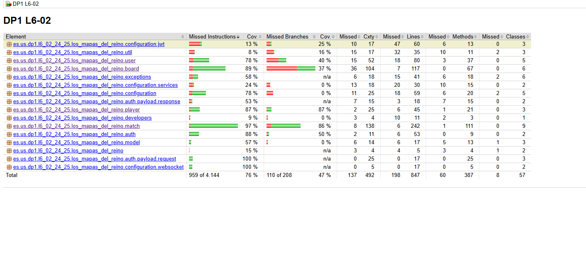

# Plan de Pruebas

## 1. Introducción

Este documento describe el plan de pruebas para el proyecto **Mapas del Reino** desarrollado en el marco de la asignatura **Diseño y Pruebas 1** por el grupo **L6-02**. El objetivo del plan de pruebas es garantizar que el software desarrollado cumple con los requisitos especificados en las historias de usuario y que se han realizado las pruebas necesarias para validar su funcionamiento.

## 2. Alcance

El alcance de este plan de pruebas incluye:

- Pruebas unitarias.
  - Pruebas unitarias de backend incluyendo pruebas servicios o repositorios
  - Pruebas unitarias de frontend: pruebas de las funciones javascript creadas en frontend.
  - Pruebas unitarias de interfaz de usuario. Usan la interfaz de usuario de nuestros componentes frontend.
- Pruebas de integración.  En nuestro caso principalmente son pruebas de controladores.

## 3. Estrategia de Pruebas

### 3.1 Tipos de Pruebas

#### 3.1.1 Pruebas Unitarias
Las pruebas unitarias se realizarán para verificar el correcto funcionamiento de los componentes individuales del software. Se utilizarán herramientas de automatización de pruebas como **JUnit** en background.

#### 3.1.2 Pruebas de Integración
Las pruebas de integración se enfocarán en evaluar la interacción entre los distintos módulos o componentes del sistema, nosotros las realizaremos a nivel de API, probando nuestros controladores Spring.

## 4. Herramientas y Entorno de Pruebas

### 4.1 Herramientas
- **Maven**: Gestión de dependencias y ejecución de las pruebas.
- **JUnit**: Framework de pruebas unitarias.
- **Jacoco**: Generación de informes de cobertura de código.
- **Jest**: Framework para pruebas unitarias en javascript.
- **React-test**: Liberaría para la creación de pruebas unitarias de componentes React.

### 4.2 Entorno de Pruebas
Las pruebas se ejecutarán en el entorno de desarrollo y, eventualmente, en el entorno de pruebas del servidor de integración continua.

## 5. Planificación de Pruebas

### 5.1 Cobertura de Pruebas

El informe de cobertura de pruebas es fácil de acceder mediante un Maven verify(mvn verify en consola) y tras esto acceder al index.html y mostrarlo en el server.

### 5.2 Matriz de Trazabilidad

| Historia de Usuario | Pruebas | Descripción | Estado | Tipo |
|---------------------|---------|-------------|--------|------|
| HU1: Registro | [TestshouldInsertUser](../../src/test/java/es/us/dp1/l6_02_24_25/los_mapas_del_reino/user/UserServiceTests.java#L118) | Verifica que un usuario pueda registrarse con credenciales válidas. | Implementada | Unitaria en backend |
| HU1: Registro | [TestCreate_Positive](../../src/test/java/es/us/dp1/l6_02_24_25/los_mapas_del_reino/player/PlayerRestControllerTest.java#L119) | Verifica que se cree el player asociado al registro. | Implementada | Integración |
| HU1: Registro | [TestSavePlayerSuccess](../../src/test/java/es/us/dp1/l6_02_24_25/los_mapas_del_reino/player/PlayerServiceTest.java#L128) | Verifica que se guarde correctamente el player en el registro. | Implementada | Unitaria en backend |
| HU1: Registro | [TestSavePlayerDataAccessException](../../src/test/java/es/us/dp1/l6_02_24_25/los_mapas_del_reino/player/PlayerServiceTest.java#L140) | Verifica manejo de errores en el registro. | Implementada | Unitaria en backend |
| HU2: Inicio Sesión | [TestFindCurrentUser](../../src/test/java/es/us/dp1/l6_02_24_25/los_mapas_del_reino/user/UserServiceTests.java#L38) | Verifica que un usuario pueda iniciar sesión correctamente. | Implementada | Unitaria en backend |
| HU2: Inicio Sesión | [TestNotFindCorrectCurrentUser](../../src/test/java/es/us/dp1/l6_02_24_25/los_mapas_del_reino/user/UserServiceTests.java#L45) | Verifica manejo de usuario incorrecto en login. | Implementada | Unitaria en backend |
| HU2: Inicio Sesión | [TestExistUser](../../src/test/java/es/us/dp1/l6_02_24_25/los_mapas_del_reino/user/UserServiceTests.java#L92) | Verifica que se valide la existencia del usuario. | Implementada | Unitaria en backend |
| HU2: Inicio Sesión | [TestNotExistUser](../../src/test/java/es/us/dp1/l6_02_24_25/los_mapas_del_reino/user/UserServiceTests.java#L98) | Verifica manejo de usuario inexistente. | Implementada | Unitaria en backend |
| HU3: Visualizar perfil | [TestReturnUser](../../src/test/java/es/us/dp1/l6_02_24_25/los_mapas_del_reino/user/UserControllerTests.java#L159) | Verifica que un usuario pueda visualizar su perfil. | Implementada | Integración |
| HU3: Visualizar perfil | [TestFindUsersByUsername](../../src/test/java/es/us/dp1/l6_02_24_25/los_mapas_del_reino/user/UserServiceTests.java#L61) | Verifica búsqueda de usuario por nombre. | Implementada | Unitaria en backend |
| HU3: Visualizar perfil | [TestFindSingleUser](../../src/test/java/es/us/dp1/l6_02_24_25/los_mapas_del_reino/user/UserServiceTests.java#L84) | Verifica búsqueda de usuario individual. | Implementada | Unitaria en backend |
| HU3: Visualizar perfil | [TestFindById](../../src/test/java/es/us/dp1/l6_02_24_25/los_mapas_del_reino/player/PlayerRestControllerTest.java#L91) | Verifica búsqueda de perfil por ID. | Implementada | Integración |
| HU3: Visualizar perfil | [TestFindPlayerByIdSuccess](../../src/test/java/es/us/dp1/l6_02_24_25/los_mapas_del_reino/player/PlayerServiceTest.java#L84) | Verifica encontrar player por ID exitosamente. | Implementada | Unitaria en backend |
| HU4: Editar perfil | [TestUpdateUser](../../src/test/java/es/us/dp1/l6_02_24_25/los_mapas_del_reino/user/UserControllerTests.java#L187) | Verifica que un usuario pueda editar su perfil. | Implementada | Unitaria en backend |
| HU4: Editar perfil | [TestUpdateUserService](../../src/test/java/es/us/dp1/l6_02_24_25/los_mapas_del_reino/user/UserServiceTests.java#L106) | Verifica actualización de usuario en el servicio. | Implementada | Unitaria en backend |
| HU4: Editar perfil | [TestUpdatePlayerSuccess](../../src/test/java/es/us/dp1/l6_02_24_25/los_mapas_del_reino/player/PlayerServiceTest.java#L150) | Verifica actualización exitosa del player. | Implementada | Unitaria en backend |
| HU4: Editar perfil | [TestUpdatePlayerOnlyUsername](../../src/test/java/es/us/dp1/l6_02_24_25/los_mapas_del_reino/player/PlayerServiceTest.java#L194) | Verifica actualización solo del nombre de usuario. | Implementada | Unitaria en backend |
| HU4: Editar perfil | [TestUpdatePlayerOnlyPassword](../../src/test/java/es/us/dp1/l6_02_24_25/los_mapas_del_reino/player/PlayerServiceTest.java#L231) | Verifica actualización solo de la contraseña. | Implementada | Unitaria en backend |
| HU4: Editar perfil | [TestUpdatePlayerWithNullUser](../../src/test/java/es/us/dp1/l6_02_24_25/los_mapas_del_reino/player/PlayerServiceTest.java#L266) | Verifica manejo de actualización con usuario nulo. | Implementada | Unitaria en backend |
| HU4: Editar perfil | [UpdatePositive](../../src/test/java/es/us/dp1/l6_02_24_25/los_mapas_del_reino/player/PlayerRestControllerTest.java#L151) | Verifica actualización positiva en el controlador. | Implementada | Integración |
| HU5: Cerrar sesión | [TestNotFindAuthenticated](../../src/test/java/es/us/dp1/l6_02_24_25/los_mapas_del_reino/user/UserServiceTests.java#L51) | Verifica que un usuario pueda cerrar sesión correctamente. | Implementada | Unitaria en backend |
| HU6: Consultar usuarios | [TestFindByUserId](../../src/test/java/es/us/dp1/l6_02_24_25/los_mapas_del_reino/player/PlayerRepositoryTest.java#L18) | Verifica que un administrador pueda consultar un jugador por su id. | Implementada | Unitaria en backend |
| HU6: Consultar usuarios | [TestFindByUserIdNotFound](../../src/test/java/es/us/dp1/l6_02_24_25/los_mapas_del_reino/player/PlayerRepositoryTest.java#L25) | Verifica manejo cuando no se encuentra el usuario. | Implementada | Unitaria en backend |
| HU6: Consultar usuarios | [TestFindPlayerByUserIdSuccess](../../src/test/java/es/us/dp1/l6_02_24_25/los_mapas_del_reino/player/PlayerServiceTest.java#L104) | Verifica búsqueda exitosa de player por user ID. | Implementada | Unitaria en backend |
| HU6: Consultar usuarios | [TestFindPlayerByUserIdNotFound](../../src/test/java/es/us/dp1/l6_02_24_25/los_mapas_del_reino/player/PlayerServiceTest.java#L118) | Verifica manejo cuando no se encuentra el player. | Implementada | Unitaria en backend |
| HU6: Consultar usuarios | [TestFindByUserId](../../src/test/java/es/us/dp1/l6_02_24_25/los_mapas_del_reino/player/PlayerRestControllerTest.java#L105) | Verifica consulta por ID en el controlador. | Implementada | Integración |
| HU7: Crear usuario | [TestCreateUser](../../src/test/java/es/us/dp1/l6_02_24_25/los_mapas_del_reino/user/UserControllerTests.java#L1758) | Verifica que un administrador pueda crear usuarios. | Implementada | Unitaria en backend |
| HU7: Crear usuario | [CreatePositive](../../src/test/java/es/us/dp1/l6_02_24_25/los_mapas_del_reino/player/PlayerRestControllerTest.java#L119) | Verifica creación positiva en el controlador. | Implementada |Integración |
| HU8: Actualizar usuario | [TestUpdateUser](../../src/test/java/es/us/dp1/l6_02_24_25/los_mapas_del_reino/user/UserControllerTests.java#L187) | Verifica que un administrador pueda actualizar usuarios. | Implementada | Integración |
| HU8: Actualizar usuario | [TestReturnNotFoundUpdateUser](../../src/test/java/es/us/dp1/l6_02_24_25/los_mapas_del_reino/user/UserControllerTests.java#L201) | Verifica manejo de usuario no encontrado en actualización. | Implementada | Integración |
| HU8: Actualizar usuario | [TestUpdatePlayerSuccess](../../src/test/java/es/us/dp1/l6_02_24_25/los_mapas_del_reino/player/PlayerServiceTest.java#L150) | Verifica actualización exitosa del player. | Implementada | Unitaria en backend |
| HU8: Actualizar usuario | [TestUpdatePlayerNotFound](../../src/test/java/es/us/dp1/l6_02_24_25/los_mapas_del_reino/player/PlayerServiceTest.java#L299) | Verifica manejo de player no encontrado en actualización. | Implementada | Unitaria en backend |
| HU8: Actualizar usuario | [UpdatePositive](../../src/test/java/es/us/dp1/l6_02_24_25/los_mapas_del_reino/player/PlayerRestControllerTest.java#L151) | Verifica actualización positiva en el controlador. | Implementada | Integración |
| HU9: Eliminar usuario | [TestDeleteOtherUser](../../src/test/java/es/us/dp1/l6_02_24_25/los_mapas_del_reino/user/UserControllerTests.java#L214) | Verifica que un administrador pueda eliminar otros usuarios. | Implementada | Integración |
| HU9: Eliminar usuario | [TestNotDeleteLoggedUser](../../src/test/java/es/us/dp1/l6_02_24_25/los_mapas_del_reino/user/UserControllerTests.java#L226) | Verifica que no se pueda eliminar el usuario logueado. | Implementada | Integración |
| HU9: Eliminar usuario | [TestDeletePlayerSuccess](../../src/test/java/es/us/dp1/l6_02_24_25/los_mapas_del_reino/player/PlayerServiceTest.java#L324) | Verifica eliminación exitosa del player. | Implementada | Unitaria en backend |
| HU9: Eliminar usuario | [TestDeletePlayerNotFound](../../src/test/java/es/us/dp1/l6_02_24_25/los_mapas_del_reino/player/PlayerServiceTest.java#L337) | Verifica manejo de player no encontrado en eliminación. | Implementada | Unitaria en backend |
| HU9: Eliminar usuario | [DeletePositive](../../src/test/java/es/us/dp1/l6_02_24_25/los_mapas_del_reino/player/PlayerRestControllerTest.java#L184) | Verifica eliminación positiva en el controlador. | Implementada | Integración |
| HU9: Eliminar usuario | [DeleteNegativeNotFound](../../src/test/java/es/us/dp1/l6_02_24_25/los_mapas_del_reino/player/PlayerRestControllerTest.java#L198) | Verifica manejo de eliminación fallida. | Implementada | Integración |
| HU10: Crear partida | [TestCreateMatchSuccess](../../src/test/java/es/us/dp1/l6_02_24_25/los_mapas_del_reino/match/MatchRestControllerTest.java#L158) | Verifica que un jugador pueda crear una partida. | Implementada | Integración |
| HU10: Crear partida | [TestCreateMatchNegative](../../src/test/java/es/us/dp1/l6_02_24_25/los_mapas_del_reino/match/MatchRestControllerTest.java#L198) | Verifica manejo de errores en creación de partida. | Implementada | Integración |
| HU10: Crear partida | [TestCreateMatchPlayerNotFound](../../src/test/java/es/us/dp1/l6_02_24_25/los_mapas_del_reino/match/MatchRestControllerTest.java#L208) | Verifica manejo cuando no se encuentra el player. | Implementada | Integración |
| HU10: Crear partida | [TestCreateMatchStandardMode](../../src/test/java/es/us/dp1/l6_02_24_25/los_mapas_del_reino/match/MatchServiceTest.java#L258) | Verifica creación de partida en modo estándar. | Implementada | Unitaria en backend |
| HU10: Crear partida | [TestCreateMatchSlowMode](../../src/test/java/es/us/dp1/l6_02_24_25/los_mapas_del_reino/match/MatchServiceTest.java#L289) | Verifica creación de partida en modo lento. | Implementada | Unitaria en backend |
| HU10: Crear partida | [TestCreateMatchFastMode](../../src/test/java/es/us/dp1/l6_02_24_25/los_mapas_del_reino/match/MatchServiceTest.java#L318) | Verifica creación de partida en modo rápido. | Implementada | Unitaria en backend |
| HU10: Crear partida | [TestCreateMatchInvalidModeNull](../../src/test/java/es/us/dp1/l6_02_24_25/los_mapas_del_reino/match/MatchServiceTest.java#L347) | Verifica manejo de modo inválido. | Implementada | Unitaria en backend |
| HU10: Crear partida | [TestCreateStandardMatch](../../src/test/java/es/us/dp1/l6_02_24_25/los_mapas_del_reino/match/MatchFactoryTest.java#L39) | Verifica creación de partida estándar en factory. | Implementada | Unitaria en backend |
| HU10: Crear partida | [TestCreateSlowMatch](../../src/test/java/es/us/dp1/l6_02_24_25/los_mapas_del_reino/match/MatchFactoryTest.java#L62) | Verifica creación de partida lenta en factory. | Implementada | Unitaria en backend |
| HU10: Crear partida | [TestCreateFastMatch](../../src/test/java/es/us/dp1/l6_02_24_25/los_mapas_del_reino/match/MatchFactoryTest.java#L85) | Verifica creación de partida rápida en factory. | Implementada | Unitaria en backend |
| HU11: Visualizar mis partidas | [TestFindMatchsByPlayerIdSuccess](../../src/test/java/es/us/dp1/l6_02_24_25/los_mapas_del_reino/match/MatchRestControllerTest.java#L229) | Verifica que un jugador pueda visualizar sus partidas. | Implementada | Integración |
| HU11: Visualizar mis partidas | [TestFindMatchsByPlayerIdNotFound](../../src/test/java/es/us/dp1/l6_02_24_25/los_mapas_del_reino/match/MatchRestControllerTest.java#L241) | Verifica manejo cuando no se encuentran partidas. | Implementada | Integración |
| HU11: Visualizar mis partidas | [TestFindAllMatchesByPlayerIdSuccess](../../src/test/java/es/us/dp1/l6_02_24_25/los_mapas_del_reino/match/MatchServiceTest.java#L161) | Verifica búsqueda exitosa de partidas por player ID. | Implementada | Unitaria en backend |
| HU11: Visualizar mis partidas | [TestFindAllMatchesByPlayerIdNotFound](../../src/test/java/es/us/dp1/l6_02_24_25/los_mapas_del_reino/match/MatchServiceTest.java#L175) | Verifica manejo cuando no se encuentran partidas del player. | Implementada | Unitaria en backend |
| HU12: Mostrar partidas en espera | [TestFindCreatedMatchesSuccess](../../src/test/java/es/us/dp1/l6_02_24_25/los_mapas_del_reino/match/MatchRestControllerTest.java#L252) | Verifica que un jugador pueda ver partidas creadas disponibles. | Implementada | Integración  |
| HU12: Mostrar partidas en espera | [TestFindCreatedMatchesEmpty](../../src/test/java/es/us/dp1/l6_02_24_25/los_mapas_del_reino/match/MatchRestControllerTest.java#L275) | Verifica manejo cuando no hay partidas creadas disponibles. | Implementada | Integración  |
| HU12: Mostrar partidas en espera | [TestGetFilteredCreatedMatchesSuccess](../../src/test/java/es/us/dp1/l6_02_24_25/los_mapas_del_reino/match/MatchServiceTest.java#L892) | Verifica filtrado exitoso de partidas creadas. | Implementada | Unitaria en backend |
| HU12: Mostrar partidas en espera | [TestGetFilteredCreatedMatchesEmpty](../../src/test/java/es/us/dp1/l6_02_24_25/los_mapas_del_reino/match/MatchServiceTest.java#L916) | Verifica filtrado cuando no hay partidas. | Implementada | Unitaria en backend |
| HU12: Mostrar partidas en espera | [TestGetFilteredCreatedMatchesEmpty](../../src/test/java/es/us/dp1/l6_02_24_25/los_mapas_del_reino/match/MatchServiceTest.java#L338) | Verifica filtrado cuando no hay partidas. | Implementada | Unitaria en backend |
| HU12: Mostrar partidas en espera | [TestFindCreatedMatchesSuccess](../../src/test/java/es/us/dp1/l6_02_24_25/los_mapas_del_reino/match/MatchServiceTest.java#L186) | Verifica búsqueda exitosa de partidas creadas. | Implementada | Unitaria en backend |
| HU12: Mostrar partidas en espera | [TestFindCreatedMatchesSuccess](../../src/test/java/es/us/dp1/l6_02_24_25/los_mapas_del_reino/match/MatchRepositoryTest.java#L47) | Verifica búsqueda en repositorio de partidas creadas. | Implementada | Unitaria en backend |
| HU12: Mostrar partidas en espera | [TestFindCreatedMatchesNotFound](../../src/test/java/es/us/dp1/l6_02_24_25/los_mapas_del_reino/match/MatchRepositoryTest.java#L59) | Verifica manejo cuando no se encuentran partidas creadas. | Implementada | Unitaria en backend |
| HU13: Acceder a la partida | [TestJoinMatchSuccess](../../src/test/java/es/us/dp1/l6_02_24_25/los_mapas_del_reino/match/MatchRestControllerTest.java#L354) | Verifica que un jugador pueda unirse a una partida. | Implementada | Integración |
| HU13: Acceder a la partida | [TestJoinMatchServiceThrowsException](../../src/test/java/es/us/dp1/l6_02_24_25/los_mapas_del_reino/match/MatchRestControllerTest.java#L388) | Verifica manejo de excepciones al unirse. | Implementada | Integración  |
| HU13: Acceder a la partida | [TestJoinMatchUserNotFound](../../src/test/java/es/us/dp1/l6_02_24_25/los_mapas_del_reino/match/MatchRestControllerTest.java#L414) | Verifica manejo cuando no se encuentra el usuario. | Implementada | Integración  |
| HU13: Acceder a la partida | [TestJoinMatchPlayerNotFound](../../src/test/java/es/us/dp1/l6_02_24_25/los_mapas_del_reino/match/MatchRestControllerTest.java#L430) | Verifica manejo cuando no se encuentra el player. | Implementada | Integración  |
| HU13: Acceder a la partida | [TestJoinMatchWithMultiplePlayers](../../src/test/java/es/us/dp1/l6_02_24_25/los_mapas_del_reino/match/MatchRestControllerTest.java#L452) | Verifica unión con múltiples jugadores. | Implementada | Integración  |
| HU13: Acceder a la partida | [TestJoinMatchSuccess](../../src/test/java/es/us/dp1/l6_02_24_25/los_mapas_del_reino/match/MatchServiceTest.java#L363) | Verifica unión exitosa en el servicio. | Implementada | Unitaria en backend |
| HU13: Acceder a la partida | [TestJoinMatchPlayerAlreadyInMatch](../../src/test/java/es/us/dp1/l6_02_24_25/los_mapas_del_reino/match/MatchServiceTest.java#L393) | Verifica manejo cuando el player ya está en la partida. | Implementada | Unitaria en backend |
| HU13: Acceder a la partida | [TestJoinMatchFull](../../src/test/java/es/us/dp1/l6_02_24_25/los_mapas_del_reino/match/MatchServiceTest.java#L416) | Verifica manejo cuando la partida está llena. | Implementada | Unitaria en backend |
| HU13: Acceder a la partida | [TestJoinMatchNotFound](../../src/test/java/es/us/dp1/l6_02_24_25/los_mapas_del_reino/match/MatchServiceTest.java#L447) | Verifica manejo cuando no se encuentra la partida. | Implementada | Unitaria en backend |
| HU13: Acceder a la partida | [TestJoinMatchWith3PlayersSuccess](../../src/test/java/es/us/dp1/l6_02_24_25/los_mapas_del_reino/match/MatchServiceTest.java#L464) | Verifica unión exitosa con 3 jugadores. | Implementada | Unitaria en backend |
| HU13: Acceder a la partida | [TestJoinMatchWithNullPlayer](../../src/test/java/es/us/dp1/l6_02_24_25/los_mapas_del_reino/match/MatchServiceTest.java#L496) | Verifica manejo con player nulo. | Implementada | Unitaria en backend |
| HU14: Visualizar partidas creadas | [TestFindAllSuccess](../../src/test/java/es/us/dp1/l6_02_24_25/los_mapas_del_reino/match/MatchRestControllerTest.java#L85) | Verifica que un administrador pueda ver todas las partidas. | Implementada | Integración  |
| HU14: Visualizar partidas creadas | [TestFindAllNotFound](../../src/test/java/es/us/dp1/l6_02_24_25/los_mapas_del_reino/match/MatchRestControllerTest.java#L97) | Verifica manejo cuando no hay partidas. | Implementada | Integración  |
| HU14: Visualizar partidas creadas | [TestFindAllMatchesSuccess](../../src/test/java/es/us/dp1/l6_02_24_25/los_mapas_del_reino/match/MatchServiceTest.java#L90) | Verifica búsqueda exitosa de todas las partidas. | Implementada | Unitaria en backend |
| HU14: Visualizar partidas creadas | [TestFindAllSuccess](../../src/test/java/es/us/dp1/l6_02_24_25/los_mapas_del_reino/match/MatchRepositoryTest.java#L27) | Verifica búsqueda exitosa en repositorio. | Implementada | Unitaria en backend |
| HU14: Visualizar partidas creadas | [TestFindAllNotFound](../../src/test/java/es/us/dp1/l6_02_24_25/los_mapas_del_reino/match/MatchRepositoryTest.java#L38) | Verifica manejo cuando no se encuentran partidas. | Implementada | Unitaria en backend |
| HU14: Visualizar partidas creadas | [TestFindFinishedMatchsSuccess](../../src/test/java/es/us/dp1/l6_02_24_25/los_mapas_del_reino/match/MatchRestControllerTest.java#L305) | Verifica visualización de partidas terminadas. | Implementada | Integración  |
| HU14: Visualizar partidas creadas | [TestFindFinishedMatchsNegative](../../src/test/java/es/us/dp1/l6_02_24_25/los_mapas_del_reino/match/MatchRestControllerTest.java#L315) | Verifica manejo de errores en partidas terminadas. | Implementada | Integración  |
| HU14: Visualizar partidas creadas | [TestFindFinishedMatchesSuccess](../../src/test/java/es/us/dp1/l6_02_24_25/los_mapas_del_reino/match/MatchServiceTest.java#L208) | Verifica búsqueda exitosa de partidas terminadas. | Implementada | Unitaria en backend |
| HU14: Visualizar partidas creadas | [TestFindFinishedMatchesSuccess](../../src/test/java/es/us/dp1/l6_02_24_25/los_mapas_del_reino/match/MatchRepositoryTest.java#L89) | Verifica búsqueda en repositorio de partidas terminadas. | Implementada | Unitaria en backend |
| HU14: Visualizar partidas creadas | [TestFindFinishedMatchesNotFound](../../src/test/java/es/us/dp1/l6_02_24_25/los_mapas_del_reino/match/MatchRepositoryTest.java#L101) | Verifica manejo cuando no hay partidas terminadas. | Implementada | Unitaria en backend |
| HU14: Visualizar partidas creadas | [TestFindStartedMatchsSuccess](../../src/test/java/es/us/dp1/l6_02_24_25/los_mapas_del_reino/match/MatchRestControllerTest.java#L286) | Verifica visualización de partidas en curso. | Implementada | Integración  |
| HU14: Visualizar partidas creadas | [TestFindStartedMatchsNegative](../../src/test/java/es/us/dp1/l6_02_24_25/los_mapas_del_reino/match/MatchRestControllerTest.java#L296) | Verifica manejo de errores en partidas en curso. | Implementada | Integración  |
| HU14: Visualizar partidas creadas | [TestFindStartedMatchesSuccess](../../src/test/java/es/us/dp1/l6_02_24_25/los_mapas_del_reino/match/MatchServiceTest.java#L197) | Verifica búsqueda exitosa de partidas iniciadas. | Implementada | Unitaria en backend |
| HU14: Visualizar partidas creadas | [TestFindStartedMatchesSuccess](../../src/test/java/es/us/dp1/l6_02_24_25/los_mapas_del_reino/match/MatchRepositoryTest.java#L68) | Verifica búsqueda en repositorio de partidas iniciadas. | Implementada | Unitaria en backend |
| HU14: Visualizar partidas creadas | [TestFindStartedMatchesNotFound](../../src/test/java/es/us/dp1/l6_02_24_25/los_mapas_del_reino/match/MatchRepositoryTest.java#L80) | Verifica manejo cuando no hay partidas iniciadas. | Implementada | Unitaria en backend |
| HU16: Tirar dados | [TestUpdateMatchWithDice](../../src/test/java/es/us/dp1/l6_02_24_25/los_mapas_del_reino/match/MatchServiceTest.java#L1002) | Verifica actualización de partida con dados. | Implementada | Unitaria en backend |
| HU18: Elegir tipo de territorio | [TestUpdateMatchWithTerritory](../../src/test/java/es/us/dp1/l6_02_24_25/los_mapas_del_reino/match/MatchServiceTest.java#L1029) | Verifica actualización de partida con territorio. | Implementada | Unitaria en backend |
| HU21: Salir de partida | [TestLeaveMatchSuccess](../../src/test/java/es/us/dp1/l6_02_24_25/los_mapas_del_reino/match/MatchRestControllerTest.java#L487) | Verifica que un jugador pueda salir de una partida. | Implementada | Integración  |
| HU21: Salir de partida | [TestLeaveMatchUserNotFound](../../src/test/java/es/us/dp1/l6_02_24_25/los_mapas_del_reino/match/MatchRestControllerTest.java#L509) | Verifica manejo cuando no se encuentra el usuario. | Implementada | Integración  |
| HU21: Salir de partida | [TestLeaveMatchMatchNotFound](../../src/test/java/es/us/dp1/l6_02_24_25/los_mapas_del_reino/match/MatchRestControllerTest.java#L524) | Verifica manejo cuando no se encuentra la partida. | Implementada | Integración  |
| HU21: Salir de partida | [TestRemovePlayerFromMatchSuccess](../../src/test/java/es/us/dp1/l6_02_24_25/los_mapas_del_reino/match/MatchServiceTest.java#L516) | Verifica eliminación exitosa del jugador. | Implementada | Unitaria en backend |
| HU21: Salir de partida | [TestRemovePlayerFromMatchNotFound](../../src/test/java/es/us/dp1/l6_02_24_25/los_mapas_del_reino/match/MatchServiceTest.java#L584) | Verifica manejo cuando no se encuentra el jugador en la partida. | Implementada | Unitaria en backend |
| HU21: Salir de partida | [TestRemovePlayerFromMatchPlayerNotInMatch](../../src/test/java/es/us/dp1/l6_02_24_25/los_mapas_del_reino/match/MatchServiceTest.java#L626) | Verifica manejo cuando el jugador no está en la partida. | Implementada | Unitaria en backend |
| HU21: Salir de partida | [TestRemovePlayerFromMatchLastPlayerDeletesMatch](../../src/test/java/es/us/dp1/l6_02_24_25/los_mapas_del_reino/match/MatchServiceTest.java#L676) | Verifica eliminación de partida con último jugador. | Implementada | Unitaria en backend |
| HU21: Salir de partida | [TestRemovePlayerFromMatchCreatorChanges](../../src/test/java/es/us/dp1/l6_02_24_25/los_mapas_del_reino/match/MatchServiceTest.java#L704) | Verifica cambio de creador al salir. | Implementada | Unitaria en backend |
| HU21: Salir de partida | [TestRemovePlayerFromMatchNoBoardToDelete](../../src/test/java/es/us/dp1/l6_02_24_25/los_mapas_del_reino/match/MatchServiceTest.java#L555) | Verifica manejo cuando no hay tablero que eliminar. | Implementada | Unitaria en backend |
| HU22: Eliminar partida | [TestDeleteMatchSuccess](../../src/test/java/es/us/dp1/l6_02_24_25/los_mapas_del_reino/match/MatchRestControllerTest.java#L550) | Verifica que un jugador pueda eliminar una partida. | Implementada | Integración |
| HU22: Eliminar partida | [TestDeleteMatchNegative](../../src/test/java/es/us/dp1/l6_02_24_25/los_mapas_del_reino/match/MatchRestControllerTest.java#L556) | Verifica manejo de errores en eliminación. | Implementada | Unitaria en backend |
| HU22: Eliminar partida | [TestDeleteMatchSuccess](../../src/test/java/es/us/dp1/l6_02_24_25/los_mapas_del_reino/match/MatchServiceTest.java#L241) | Verifica eliminación exitosa en el servicio. | Implementada | Unitaria en backend |
| HU22: Eliminar partida | [TestDeleteMatchDataAccessException](../../src/test/java/es/us/dp1/l6_02_24_25/los_mapas_del_reino/match/MatchServiceTest.java#L250) | Verifica manejo de excepciones de acceso a datos. | Implementada | Unitaria en backend |
| HU23: Crear tablero | [TestCreateBoardSuccess](../../src/test/java/es/us/dp1/l6_02_24_25/los_mapas_del_reino/board/BoardRestControllerTest.java#L270) | Verifica que un jugador pueda crear un tablero. | Implementada | Integración  |
| HU23: Crear tablero | [TestCreateBoardNegative](../../src/test/java/es/us/dp1/l6_02_24_25/los_mapas_del_reino/board/BoardRestControllerTest.java#L292) | Verifica manejo de errores en creación de tablero. | Implementada | Integración  |
| HU23: Crear tablero | [TestCreateBoardSuccess](../../src/test/java/es/us/dp1/l6_02_24_25/los_mapas_del_reino/board/BoardServiceTest.java#L208) | Verifica creación exitosa en el servicio. | Implementada | Unitaria en backend |
| HU23: Crear tablero | [TestCreateBoardMatchNotFound](../../src/test/java/es/us/dp1/l6_02_24_25/los_mapas_del_reino/board/BoardServiceTest.java#L234) | Verifica manejo cuando no se encuentra la partida. | Implementada | Unitaria en backend |
| HU23: Crear tablero | [TestCreateBoardPlayerNotFound](../../src/test/java/es/us/dp1/l6_02_24_25/los_mapas_del_reino/board/BoardServiceTest.java#L251) | Verifica manejo cuando no se encuentra el jugador. | Implementada | Unitaria en backend |
| HU23: Crear tablero | [TestCreateBoardWithNullCriteria](../../src/test/java/es/us/dp1/l6_02_24_25/los_mapas_del_reino/board/BoardServiceTest.java#L270) | Verifica manejo con criterios nulos. | Implementada | Unitaria en backend |
| HU23: Crear tablero | [TestCreateBoardRepositoryException](../../src/test/java/es/us/dp1/l6_02_24_25/los_mapas_del_reino/board/BoardServiceTest.java#L301) | Verifica manejo de excepciones del repositorio. | Implementada | Unitaria en backend |
| HU23: Crear tablero | [TestCreateBoardWithNullBoardRequest](../../src/test/java/es/us/dp1/l6_02_24_25/los_mapas_del_reino/board/BoardServiceTest.java#L320) | Verifica manejo con request nulo. | Implementada | Unitaria en backend |
| HU26: Finalizar partida | [TestFinishMatchSuccess](../../src/test/java/es/us/dp1/l6_02_24_25/los_mapas_del_reino/match/MatchRestControllerTest.java#L324) | Verifica que se pueda finalizar una partida. | Implementada | Integración  |
| HU26: Finalizar partida | [TestFinishMatchNegative](../../src/test/java/es/us/dp1/l6_02_24_25/los_mapas_del_reino/match/MatchRestControllerTest.java#L340) | Verifica manejo de errores en finalización. | Implementada | Integración  |
| HU26: Finalizar partida | [TestFinishMatchSuccess](../../src/test/java/es/us/dp1/l6_02_24_25/los_mapas_del_reino/match/MatchServiceTest.java#L728) | Verifica finalización exitosa en el servicio. | Implementada | Unitaria en backend |
| HU26: Finalizar partida | [TestFinishMatchNotFound](../../src/test/java/es/us/dp1/l6_02_24_25/los_mapas_del_reino/match/MatchServiceTest.java#L748) | Verifica manejo cuando no se encuentra la partida. | Implementada | Unitaria en backend |
| HU26: Finalizar partida | [TestHandleFinishMatchSuccess](../../src/test/java/es/us/dp1/l6_02_24_25/los_mapas_del_reino/match/MatchServiceTest.java#L847) | Verifica manejo exitoso de finalización. | Implementada | Unitaria en backend |
| HU26: Finalizar partida | [TestHandleFinishMatchNotFound](../../src/test/java/es/us/dp1/l6_02_24_25/los_mapas_del_reino/match/MatchServiceTest.java#L862) | Verifica manejo cuando no se encuentra en finalización. | Implementada | Unitaria en backend |
| HU26: Finalizar partida | [TestHandleFinishMatchInternalServerError](../../src/test/java/es/us/dp1/l6_02_24_25/los_mapas_del_reino/match/MatchServiceTest.java#L873) | Verifica manejo de errores internos en finalización. | Implementada | Unitaria en backend |
| HU28: Cálculo de puntuaciones | [TestUpdateBoardScoreSuccess](../../src/test/java/es/us/dp1/l6_02_24_25/los_mapas_del_reino/board/BoardServiceTest.java#L378) | Verifica que se calculen las puntuaciones correctamente. | Implementada | Unitaria en backend |
| HU28: Cálculo de puntuaciones | [TestUpdateBoardScoreNotFound](../../src/test/java/es/us/dp1/l6_02_24_25/los_mapas_del_reino/board/BoardServiceTest.java#L408) | Verifica manejo cuando no se encuentra el tablero. | Implementada | Unitaria en backend |
| HU28: Cálculo de puntuaciones | [TestUpdateBoardScoreSuccess](../../src/test/java/es/us/dp1/l6_02_24_25/los_mapas_del_reino/board/BoardRestControllerTest.java#L369) | Verifica actualización exitosa de puntuación. | Implementada | Unitaria en backend |
| HU28: Cálculo de puntuaciones | [TestUpdateBoardScoreBoardNotFound](../../src/test/java/es/us/dp1/l6_02_24_25/los_mapas_del_reino/board/BoardRestControllerTest.java#L395) | Verifica manejo cuando no se encuentra el tablero. | Implementada | Integración  |
| HU29: Visualizar ganadores | [TestGetWinnersSuccess](../../src/test/java/es/us/dp1/l6_02_24_25/los_mapas_del_reino/match/MatchRestControllerTest.java#L619) | Verifica que se muestren los ganadores correctamente. | Implementada | Integración  |
| HU29: Visualizar ganadores | [TestGetWinnersIllegalStateException](../../src/test/java/es/us/dp1/l6_02_24_25/los_mapas_del_reino/match/MatchRestControllerTest.java#L1498) | Verifica manejo de estado ilegal. | Implementada | Integración |
| HU29: Visualizar ganadores | [TestGetWinnersAccessDeniedException](../../src/test/java/es/us/dp1/l6_02_24_25/los_mapas_del_reino/match/MatchRestControllerTest.java#L630) | Verifica manejo de acceso denegado. | Implementada | Integración  |
| HU29: Visualizar ganadores | [TestGetWinnersSuccess](../../src/test/java/es/us/dp1/l6_02_24_25/los_mapas_del_reino/match/MatchServiceTest.java#L1077) | Verifica obtención exitosa de ganadores. | Implementada | Unitaria en backend |
| HU29: Visualizar ganadores | [TestGetWinnersNegativeNoBoards](../../src/test/java/es/us/dp1/l6_02_24_25/los_mapas_del_reino/match/MatchServiceTest.java#L1096) | Verifica manejo cuando no hay tableros. | Implementada | Unitaria en backend |
| HU30: Modalidades de partida | [TestCreateMatchStandardMode](../../src/test/java/es/us/dp1/l6_02_24_25/los_mapas_del_reino/match/MatchServiceTest.java#L257) | Verifica creación de partida en modo estándar con tiempo por turno configurado. | Implementada | Unitaria en backend |
| HU30: Modalidades de partida | [TestCreateMatchSlowMode](../../src/test/java/es/us/dp1/l6_02_24_25/los_mapas_del_reino/match/MatchServiceTest.java#L288) | Verifica creación de partida en modo lento con tiempo extendido por turno. | Implementada | Unitaria en backend |
| HU30: Modalidades de partida | [TestCreateMatchFastMode](../../src/test/java/es/us/dp1/l6_02_24_25/los_mapas_del_reino/match/MatchServiceTest.java#L317) | Verifica creación de partida en modo rápido con tiempo reducido por turno. | Implementada | Unitaria en backend |
| HU30: Modalidades de partida | [TestCreateMatchInvalidModeNull](../../src/test/java/es/us/dp1/l6_02_24_25/los_mapas_del_reino/match/MatchServiceTest.java#L346) | Verifica manejo de modalidad inválida/nula. | Implementada | Unitaria en backend |
| HU30: Modalidades de partida | [TestCreateStandardMatch](../../src/test/java/es/us/dp1/l6_02_24_25/los_mapas_del_reino/match/MatchFactoryTest.java#L39) | Verifica creación correcta de partida estándar en factory con configuración de tiempo. | Implementada | Unitaria en backend |
| HU30: Modalidades de partida | [TestCreateSlowMatch](../../src/test/java/es/us/dp1/l6_02_24_25/los_mapas_del_reino/match/MatchFactoryTest.java#L62) | Verifica creación correcta de partida lenta en factory con configuración de tiempo. | Implementada | Unitaria en backend |
| HU30: Modalidades de partida | [TestCreateFastMatch](../../src/test/java/es/us/dp1/l6_02_24_25/los_mapas_del_reino/match/MatchFactoryTest.java#L85) | Verifica creación correcta de partida rápida en factory con configuración de tiempo. | Implementada | Unitaria en backend |
| HU30: Modalidades de partida | [TestCreateMatchSuccess](../../src/test/java/es/us/dp1/l6_02_24_25/los_mapas_del_reino/match/MatchRestControllerTest.java#L158) | Verifica creación exitosa de partida con modalidad seleccionada desde controlador. | Implementada | Integración |
| HU30: Modalidades de partida | [TestCreateMatchNegative](../../src/test/java/es/us/dp1/l6_02_24_25/los_mapas_del_reino/match/MatchRestControllerTest.java#L198) | Verifica manejo de errores al crear partida con modalidad inválida. | Implementada | Integración |

### 5.3 Matriz de Trazabilidad entre Pruebas e Historias de Usuario

| Prueba / Historia de Usuario | HU1 | HU2 | HU3 | HU4 | HU5 | HU6 | HU7 | HU8 | HU9 | HU10 | HU11 | HU12 | HU13 | HU14 | HU15 | HU16 | HU17 | HU18 | HU19 | HU20 | HU21 | HU22 | HU23 | HU24 | HU25 | HU26 | HU27 | HU28 | HU29 | HU30 |
|--------------------------------|-----|-----|-----|-----|-----|-----|-----|-----|-----|------|------|------|------|------|------|------|------|------|------|------|------|------|------|------|------|------|------|------|------|------|
| TestshouldInsertUser           |  X  |     |     |     |     |     |  X  |     |     |      |      |      |      |      |      |      |      |      |      |      |      |      |      |      |      |      |      |      |      |      |
| TestCreate_Positive            |  X  |     |     |     |     |     |  X  |     |     |      |      |      |      |      |      |      |      |      |      |      |      |      |      |      |      |      |      |      |      |      |
| TestSavePlayerSuccess          |  X  |     |     |     |     |     |     |     |     |      |      |      |      |      |      |      |      |      |      |      |      |      |      |      |      |      |      |      |      |      |
| TestSavePlayerDataAccessException |  X  |     |     |     |     |     |     |     |     |      |      |      |      |      |      |      |      |      |      |      |      |      |      |      |      |      |      |      |      |      |
| TestFindCurrentUser            |     |  X  |     |     |     |     |     |     |     |      |      |      |      |      |      |      |      |      |      |      |      |      |      |      |      |      |      |      |      |      |
| TestNotFindCorrectCurrentUser  |     |  X  |     |     |     |     |     |     |     |      |      |      |      |      |      |      |      |      |      |      |      |      |      |      |      |      |      |      |      |      |
| TestExistUser                  |     |  X  |     |     |     |     |     |     |     |      |      |      |      |      |      |      |      |      |      |      |      |      |      |      |      |      |      |      |      |      |
| TestNotExistUser               |     |  X  |     |     |     |     |     |     |     |      |      |      |      |      |      |      |      |      |      |      |      |      |      |      |      |      |      |      |      |      |
| TestReturnUser                 |     |     |  X  |     |     |     |     |     |     |      |      |      |      |      |      |      |      |      |      |      |      |      |      |      |      |      |      |      |      |      |
| TestFindUsersByUsername        |     |     |  X  |     |     |     |     |     |     |      |      |      |      |      |      |      |      |      |      |      |      |      |      |      |      |      |      |      |      |      |
| TestFindSingleUser             |     |     |  X  |     |     |     |     |     |     |      |      |      |      |      |      |      |      |      |      |      |      |      |      |      |      |      |      |      |      |      |
| TestFindById                   |     |     |  X  |     |     |  X  |     |     |     |      |      |      |      |      |      |      |      |      |      |      |      |      |      |      |      |      |      |      |      |      |
| TestFindPlayerByIdSuccess      |     |     |  X  |     |     |     |     |     |     |      |      |      |      |      |      |      |      |      |      |      |      |      |      |      |      |      |      |      |      |      |
| TestUpdateUser                 |     |     |     |  X  |     |     |     |  X  |     |      |      |      |      |      |      |      |      |      |      |      |      |      |      |      |      |      |      |      |      |      |
| TestUpdateUserService          |     |     |     |  X  |     |     |     |     |     |      |      |      |      |      |      |      |      |      |      |      |      |      |      |      |      |      |      |      |      |      |
| TestUpdatePlayerSuccess        |     |     |     |  X  |     |     |     |  X  |     |      |      |      |      |      |      |      |      |      |      |      |      |      |      |      |      |      |      |      |      |      |
| TestUpdatePlayerOnlyUsername   |     |     |     |  X  |     |     |     |     |     |      |      |      |      |      |      |      |      |      |      |      |      |      |      |      |      |      |      |      |      |      |
| TestUpdatePlayerOnlyPassword   |     |     |     |  X  |     |     |     |     |     |      |      |      |      |      |      |      |      |      |      |      |      |      |      |      |      |      |      |      |      |      |
| TestUpdatePlayerWithNullUser   |     |     |     |  X  |     |     |     |     |     |      |      |      |      |      |      |      |      |      |      |      |      |      |      |      |      |      |      |      |      |      |
| UpdatePositive                 |     |     |     |  X  |     |     |     |  X  |     |      |      |      |      |      |      |      |      |      |      |      |      |      |      |      |      |      |      |      |      |      |
| TestNotFindAuthenticated       |     |     |     |     |  X  |     |     |     |     |      |      |      |      |      |      |      |      |      |      |      |      |      |      |      |      |      |      |      |      |      |
| TestFindByUserId               |     |     |     |     |     |  X  |     |     |     |      |      |      |      |      |      |      |      |      |      |      |      |      |      |      |      |      |      |      |      |      |
| TestFindByUserIdNotFound       |     |     |     |     |     |  X  |     |     |     |      |      |      |      |      |      |      |      |      |      |      |      |      |      |      |      |      |      |      |      |      |
| TestFindPlayerByUserIdSuccess  |     |     |     |     |     |  X  |     |     |     |      |      |      |      |      |      |      |      |      |      |      |      |      |      |      |      |      |      |      |      |      |
| TestFindPlayerByUserIdNotFound |     |     |     |     |     |  X  |     |     |     |      |      |      |      |      |      |      |      |      |      |      |      |      |      |      |      |      |      |      |      |      |
| TestCreateUser                 |     |     |     |     |     |     |  X  |     |     |      |      |      |      |      |      |      |      |      |      |      |      |      |      |      |      |      |      |      |      |      |
| CreatePositive                 |     |     |     |     |     |     |  X  |     |     |      |      |      |      |      |      |      |      |      |      |      |      |      |      |      |      |      |      |      |      |      |
| TestReturnNotFoundUpdateUser   |     |     |     |     |     |     |     |  X  |     |      |      |      |      |      |      |      |      |      |      |      |      |      |      |      |      |      |      |      |      |      |
| TestUpdatePlayerNotFound       |     |     |     |     |     |     |     |  X  |     |      |      |      |      |      |      |      |      |      |      |      |      |      |      |      |      |      |      |      |      |      |
| TestDeleteOtherUser            |     |     |     |     |     |     |     |     |  X  |      |      |      |      |      |      |      |      |      |      |      |      |      |      |      |      |      |      |      |      |      |
| TestNotDeleteLoggedUser        |     |     |     |     |     |     |     |     |  X  |      |      |      |      |      |      |      |      |      |      |      |      |      |      |      |      |      |      |      |      |      |
| TestDeletePlayerSuccess        |     |     |     |     |     |     |     |     |  X  |      |      |      |      |      |      |      |      |      |      |      |      |      |      |      |      |      |      |      |      |      |
| TestDeletePlayerNotFound       |     |     |     |     |     |     |     |     |  X  |      |      |      |      |      |      |      |      |      |      |      |      |      |      |      |      |      |      |      |      |      |
| DeletePositive                 |     |     |     |     |     |     |     |     |  X  |      |      |      |      |      |      |      |      |      |      |      |      |      |      |      |      |      |      |      |      |      |
| DeleteNegativeNotFound         |     |     |     |     |     |     |     |     |  X  |      |      |      |      |      |      |      |      |      |      |      |      |      |      |      |      |      |      |      |      |      |
| TestCreateMatchSuccess         |     |     |     |     |     |     |     |     |     |   X  |      |      |      |      |      |      |      |      |      |      |      |      |      |      |      |      |      |      |      |  **X**  |
| TestCreateMatchNegative        |     |     |     |     |     |     |     |     |     |   X  |      |      |      |      |      |      |      |      |      |      |      |      |      |      |      |      |      |      |      |  **X**  |
| TestCreateMatchPlayerNotFound  |     |     |     |     |     |     |     |     |     |   X  |      |      |      |      |      |      |      |      |      |      |      |      |      |      |      |      |      |      |      |      |
| TestCreateMatchStandardMode    |     |     |     |     |     |     |     |     |     |   X  |      |      |      |      |      |      |      |      |      |      |      |      |      |      |      |      |      |      |      |  X  |
| TestCreateMatchSlowMode        |     |     |     |     |     |     |     |     |     |   X  |      |      |      |      |      |      |      |      |      |      |      |      |      |      |      |      |      |      |      |  X  |
| TestCreateMatchFastMode        |     |     |     |     |     |     |     |     |     |   X  |      |      |      |      |      |      |      |      |      |      |      |      |      |      |      |      |      |      |      |  X  |
| TestCreateMatchInvalidModeNull |     |     |     |     |     |     |     |     |     |   X  |      |      |      |      |      |      |      |      |      |      |      |      |      |      |      |      |      |      |      |  X  |
| TestCreateStandardMatch        |     |     |     |     |     |     |     |     |     |   X  |      |      |      |      |      |      |      |      |      |      |      |      |      |      |      |      |      |      |      |  X  |
| TestCreateSlowMatch            |     |     |     |     |     |     |     |     |     |   X  |      |      |      |      |      |      |      |      |      |      |      |      |      |      |      |      |      |      |      |  X  |
| TestCreateFastMatch            |     |     |     |     |     |     |     |     |     |   X  |      |      |      |      |      |      |      |      |      |      |      |      |      |      |      |      |      |      |      |  X  |
| TestFindMatchsByPlayerIdSuccess |     |     |     |     |     |     |     |     |     |      |   X  |      |      |      |      |      |      |      |      |      |      |      |      |      |      |      |      |      |      |      |
| TestFindMatchsByPlayerIdNotFound |     |     |     |     |     |     |     |     |     |      |   X  |      |      |      |      |      |      |      |      |      |      |      |      |      |      |      |      |      |      |      |
| TestFindAllMatchesByPlayerIdSuccess |     |     |     |     |     |     |     |     |     |      |   X  |      |      |      |      |      |      |      |      |      |      |      |      |      |      |      |      |      |      |      |
| TestFindAllMatchesByPlayerIdNotFound |     |     |     |     |     |     |     |     |     |      |   X  |      |      |      |      |      |      |      |      |      |      |      |      |      |      |      |      |      |      |      |
| TestFindCreatedMatchesSuccess  |     |     |     |     |     |     |     |     |     |      |      |   X  |      |      |      |      |      |      |      |      |      |      |      |      |      |      |      |      |      |      |
| TestFindCreatedMatchesEmpty    |     |     |     |     |     |     |     |     |     |      |      |   X  |      |      |      |      |      |      |      |      |      |      |      |      |      |      |      |      |      |      |
| TestGetFilteredCreatedMatchesSuccess |     |     |     |     |     |     |     |     |     |      |      |   X  |      |      |      |      |      |      |      |      |      |      |      |      |      |      |      |      |      |      |
| TestGetFilteredCreatedMatchesEmpty |     |     |     |     |     |     |     |     |     |      |      |   X  |      |      |      |      |      |      |      |      |      |      |      |      |      |      |      |      |      |      |
| TestFindCreatedMatchesNotFound |     |     |     |     |     |     |     |     |     |      |      |   X  |      |      |      |      |      |      |      |      |      |      |      |      |      |      |      |      |      |      |
| TestJoinMatchSuccess           |     |     |     |     |     |     |     |     |     |      |      |      |   X  |      |      |      |      |      |      |      |      |      |      |      |      |      |      |      |      |      |
| TestJoinMatchServiceThrowsException |     |     |     |     |     |     |     |     |     |      |      |      |   X  |      |      |      |      |      |      |      |      |      |      |      |      |      |      |      |      |      |
| TestJoinMatchUserNotFound      |     |     |     |     |     |     |     |     |     |      |      |      |   X  |      |      |      |      |      |      |      |      |      |      |      |      |      |      |      |      |      |
| TestJoinMatchPlayerNotFound    |     |     |     |     |     |     |     |     |     |      |      |      |   X  |      |      |      |      |      |      |      |      |      |      |      |      |      |      |      |      |      |
| TestJoinMatchWithMultiplePlayers |     |     |     |     |     |     |     |     |     |      |      |      |   X  |      |      |      |      |      |      |      |      |      |      |      |      |      |      |      |      |      |
| TestJoinMatchPlayerAlreadyInMatch |     |     |     |     |     |     |     |     |     |      |      |      |   X  |      |      |      |      |      |      |      |      |      |      |      |      |      |      |      |      |      |
| TestJoinMatchFull              |     |     |     |     |     |     |     |     |     |      |      |      |   X  |      |      |      |      |      |      |      |      |      |      |      |      |      |      |      |      |      |
| TestJoinMatchNotFound          |     |     |     |     |     |     |     |     |     |      |      |      |   X  |      |      |      |      |      |      |      |      |      |      |      |      |      |      |      |      |      |
| TestJoinMatchWith3PlayersSuccess |     |     |     |     |     |     |     |     |     |      |      |      |   X  |      |      |      |      |      |      |      |      |      |      |      |      |      |      |      |      |      |
| TestJoinMatchWithNullPlayer    |     |     |     |     |     |     |     |     |     |      |      |      |   X  |      |      |      |      |      |      |      |      |      |      |      |      |      |      |      |      |      |
| TestFindAllSuccess             |     |     |     |     |     |     |     |     |     |      |      |      |      |   X  |      |      |      |      |      |      |      |      |      |      |      |      |      |      |      |      |
| TestFindAllNotFound            |     |     |     |     |     |     |     |     |     |      |      |      |      |   X  |      |      |      |      |      |      |      |      |      |      |      |      |      |      |      |      |
| TestFindAllMatchesSuccess      |     |     |     |     |     |     |     |     |     |      |      |      |      |   X  |      |      |      |      |      |      |      |      |      |      |      |      |      |      |      |      |
| TestFindFinishedMatchsSuccess  |     |     |     |     |     |     |     |     |     |      |      |      |      |   X  |      |      |      |      |      |      |      |      |      |      |      |      |      |      |      |      |
| TestFindFinishedMatchsNegative |     |     |     |     |     |     |     |     |     |      |      |      |      |   X  |      |      |      |      |      |      |      |      |      |      |      |      |      |      |      |      |
| TestFindFinishedMatchesSuccess |     |     |     |     |     |     |     |     |     |      |      |      |      |   X  |      |      |      |      |      |      |      |      |      |      |      |      |      |      |      |      |
| TestFindFinishedMatchesNotFound |     |     |     |     |     |     |     |     |     |      |      |      |      |   X  |      |      |      |      |      |      |      |      |      |      |      |      |      |      |      |      |
| TestFindStartedMatchsSuccess   |     |     |     |     |     |     |     |     |     |      |      |      |      |   X  |      |      |      |      |      |      |      |      |      |      |      |      |      |      |      |      |
| TestFindStartedMatchsNegative  |     |     |     |     |     |     |     |     |     |      |      |      |      |   X  |      |      |      |      |      |      |      |      |      |      |      |      |      |      |      |      |
| TestFindStartedMatchesSuccess  |     |     |     |     |     |     |     |     |     |      |      |      |      |   X  |      |      |      |      |      |      |      |      |      |      |      |      |      |      |      |      |
| TestFindStartedMatchesNotFound |     |     |     |     |     |     |     |     |     |      |      |      |      |   X  |      |      |      |      |      |      |      |      |      |      |      |      |      |      |      |      |
| TestUpdateMatchWithDice        |     |     |     |     |     |     |     |     |     |      |      |      |      |      |      |   X  |      |      |      |      |      |      |      |      |      |      |      |      |      |      |
| TestUpdateMatchWithTerritory   |     |     |     |     |     |     |     |     |     |      |      |      |      |      |      |      |      |   X  |      |      |      |      |      |      |      |      |      |      |      |      |
| TestLeaveMatchSuccess          |     |     |     |     |     |     |     |     |     |      |      |      |      |      |      |      |      |      |      |      |   X  |      |      |      |      |      |      |      |      |      |
| TestLeaveMatchUserNotFound     |     |     |     |     |     |     |     |     |     |      |      |      |      |      |      |      |      |      |      |      |   X  |      |      |      |      |      |      |      |      |      |
| TestLeaveMatchMatchNotFound    |     |     |     |     |     |     |     |     |     |      |      |      |      |      |      |      |      |      |      |      |   X  |      |      |      |      |      |      |      |      |      |
| TestRemovePlayerFromMatchSuccess |     |     |     |     |     |     |     |     |     |      |      |      |      |      |      |      |      |      |      |      |   X  |      |      |      |      |      |      |      |      |      |
| TestRemovePlayerFromMatchNotFound |     |     |     |     |     |     |     |     |     |      |      |      |      |      |      |      |      |      |      |      |   X  |      |      |      |      |      |      |      |      |      |
| TestRemovePlayerFromMatchPlayerNotInMatch |     |     |     |     |     |     |     |     |     |      |      |      |      |      |      |      |      |      |      |      |   X  |      |      |      |      |      |      |      |      |      |
| TestRemovePlayerFromMatchLastPlayerDeletesMatch |     |     |     |     |     |     |     |     |     |      |      |      |      |      |      |      |      |      |      |      |   X  |      |      |      |      |      |      |      |      |      |
| TestRemovePlayerFromMatchCreatorChanges |     |     |     |     |     |     |     |     |     |      |      |      |      |      |      |      |      |      |      |      |   X  |      |      |      |      |      |      |      |      |      |
| TestRemovePlayerFromMatchNoBoardToDelete |     |     |     |     |     |     |     |     |     |      |      |      |      |      |      |      |      |      |      |      |   X  |      |      |      |      |      |      |      |      |      |
| TestDeleteMatchSuccess         |     |     |     |     |     |     |     |     |     |      |      |      |      |      |      |      |      |      |      |      |      |   X  |      |      |      |      |      |      |      |      |
| TestDeleteMatchNegative        |     |     |     |     |     |     |     |     |     |      |      |      |      |      |      |      |      |      |      |      |      |   X  |      |      |      |      |      |      |      |      |
| TestDeleteMatchDataAccessException |     |     |     |     |     |     |     |     |     |      |      |      |      |      |      |      |      |      |      |      |      |   X  |      |      |      |      |      |      |      |      |
| TestCreateBoardSuccess         |     |     |     |     |     |     |     |     |     |      |      |      |      |      |      |      |      |      |      |      |      |      |   X  |      |      |      |      |      |      |      |
| TestCreateBoardNegative        |     |     |     |     |     |     |     |     |     |      |      |      |      |      |      |      |      |      |      |      |      |      |   X  |      |      |      |      |      |      |      |
| TestCreateBoardMatchNotFound   |     |     |     |     |     |     |     |     |     |      |      |      |      |      |      |      |      |      |      |      |      |      |   X  |      |      |      |      |      |      |      |
| TestCreateBoardPlayerNotFound  |     |     |     |     |     |     |     |     |     |      |      |      |      |      |      |      |      |      |      |      |      |      |   X  |      |      |      |      |      |      |      |
| TestCreateBoardWithNullCriteria |     |     |     |     |     |     |     |     |     |      |      |      |      |      |      |      |      |      |      |      |      |      |   X  |      |      |      |      |      |      |      |
| TestCreateBoardRepositoryException |     |     |     |     |     |     |     |     |     |      |      |      |      |      |      |      |      |      |      |      |      |      |   X  |      |      |      |      |      |      |      |
| TestCreateBoardWithNullBoardRequest |     |     |     |     |     |     |     |     |     |      |      |      |      |      |      |      |      |      |      |      |      |      |   X  |      |      |      |      |      |      |      |
| TestFinishMatchSuccess         |     |     |     |     |     |     |     |     |     |      |      |      |      |      |      |      |      |      |      |      |      |      |      |      |      |   X  |      |      |      |      |
| TestFinishMatchNegative        |     |     |     |     |     |     |     |     |     |      |      |      |      |      |      |      |      |      |      |      |      |      |      |      |      |   X  |      |      |      |      |
| TestFinishMatchNotFound        |     |     |     |     |     |     |     |     |     |      |      |      |      |      |      |      |      |      |      |      |      |      |      |      |      |   X  |      |      |      |      |
| TestHandleFinishMatchSuccess   |     |     |     |     |     |     |     |     |     |      |      |      |      |      |      |      |      |      |      |      |      |      |      |      |      |   X  |      |      |      |      |
| TestHandleFinishMatchNotFound  |     |     |     |     |     |     |     |     |     |      |      |      |      |      |      |      |      |      |      |      |      |      |      |      |      |   X  |      |      |      |      |
| TestHandleFinishMatchInternalServerError |     |     |     |     |     |     |     |     |     |      |      |      |      |      |      |      |      |      |      |      |      |      |      |      |      |   X  |      |      |      |      |
| TestUpdateBoardScoreSuccess    |     |     |     |     |     |     |     |     |     |      |      |      |      |      |      |      |      |      |      |      |      |      |      |      |      |      |      |   X  |      |      |
| TestUpdateBoardScoreNotFound   |     |     |     |     |     |     |     |     |     |      |      |      |      |      |      |      |      |      |      |      |      |      |      |      |      |      |      |   X  |      |      |
| TestUpdateBoardScoreBoardNotFound |     |     |     |     |     |     |     |     |     |      |      |      |      |      |      |      |      |      |      |      |      |      |      |      |      |      |      |   X  |      |      |
| TestGetWinnersSuccess          |     |     |     |     |     |     |     |     |     |      |      |      |      |      |      |      |      |      |      |      |      |      |      |      |      |      |      |      |   X  |      |
| TestGetWinnersIllegalStateException |     |     |     |     |     |     |     |     |     |      |      |      |      |      |      |      |      |      |      |      |      |      |      |      |      |      |      |      |   X  |      |
| TestGetWinnersAccessDeniedException |     |     |     |     |     |     |     |     |     |      |      |      |      |      |      |      |      |      |      |      |      |      |      |      |      |      |      |      |   X  |      |
| TestGetWinnersNegativeNoBoards |     |     |     |     |     |     |     |     |     |      |      |      |      |      |      |      |      |      |      |      |      |      |      |      |      |      |      |      |   X  |      |

**Leyenda:**
- HU1: Registro
- HU2: Inicio Sesión  
- HU3: Visualizar perfil
- HU4: Editar perfil
- HU5: Cerrar sesión
- HU6: Consultar usuarios
- HU7: Crear usuario
- HU8: Actualizar usuario
- HU9: Eliminar usuario
- HU10: Crear partida
- HU11: Visualizar mis partidas
- HU12: Mostrar partidas en espera
- HU13: Acceder a la partida
- HU14: Visualizar partidas creadas
- HU15: Colocar casillas
- HU16: Tirar dados
- HU17: Elegir dados
- HU18: Elegir tipo de territorio
- HU19: Casillas especiales
- HU20: Mostrar Reglas
- HU21: Salir de partida
- HU22: Eliminar partida
- HU23: Crear tablero
- HU24: Pasar turno
- HU25: Avanzar de ronda
- HU26: Finalizar partida
- HU27: Advertencias durante el juego
- HU28: Cálculo de puntuaciones
- HU29: Visualizar ganadores
- HU30: Modalidades de partida

## 6. Criterios de Aceptación

- Todas las pruebas unitarias deben pasar con éxito antes de la entrega final del proyecto.
- La cobertura de código debe ser al menos del 70%.
- No debe haber fallos críticos en las pruebas de integración y en la funcionalidad.

## 7. Conclusión

Este plan de pruebas establece la estructura y los criterios para asegurar la calidad del software desarrollado. Es responsabilidad del equipo de desarrollo y pruebas seguir este plan para garantizar la entrega de un producto funcional y libre de errores.
